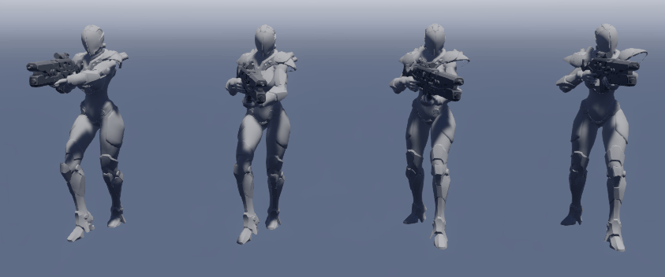
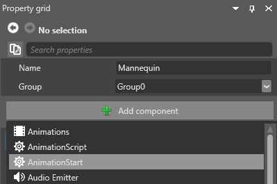
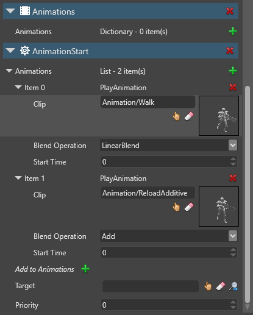

# Additive animation

Intermediate
Designer

**Additive animation** is the process of combining animations using **difference clips** (also known as **additive animation clips**).

In the example above, the leftmost animation is the *Walk* animation. The rightmost animation is the *Idle* animation. The two animations in the center are the *Walk* and *Idle* animations respectively, but have the *Reload* animation added to them. 

This means we only had to create three animations: *Walk*, *Idle*, and *Reload*. Additionally, we can add the *Reload* animation to other suitable animations (*Crouch*, *Strafe* or *Run* for example). This helps us keep the number of animations and memory budget low.

## Difference clips

A **difference clip** describes the difference between two animation clips: a **source** and a **reference**.

Take the *Reload* animation above, which we want to add to other animation clips. This is our **source** clip (S). Because the *Reload* animation mainly involves the arms, it will blend well with animations that don't involve the arms (such as idling and crouching). We can use one of these animations - let's say the *Idle* animation - as our **reference** clip (R).

Xenko calculates the difference between the source and reference clips to create the **difference clip** (D). The difference clip encodes the difference between the source and reference clips. We can express it as D = S - R.

We can use use the difference clip to blend the source and reference animations. We can also use the same difference clip to blend the source animation with **other** animations. If the animation you add it to is sufficiently similar to the original reference clip, then the animations blend effectively. For example, you could use it to add the reload animation to any animation that doesn't use the arms, such as crouching.

>![Note]
>Additive animations should use the same skinned mesh and skeleton. 

## Create a difference clip

1. In the **asset view** (at the bottom by default), click **Add asset** and select **Animations > Animation**. A browser dialog opens.

2. As we don't need a source for this animation, click **Cancel**.

    Game Studio asks if you want to create an animation without a source file. 

    

3. Click **Yes**. Game Studio adds a new empty animation asset to the asset view.

4. Give the asset a name that makes it easy to identify. For example, if you want to make a reload animation that can be used with other animations, you could name the asset *ReloadAdditive*.

5. In the ***asset view** (bottom pane by default), select the animation asset you created.

6. In the **property grid** (on the right by default), add the **Source** animation clip. This is the animation you want to apply to other animations.

    

     >[!Note]
     >Make sure you add the file that contains the animation itself (eg a model file such as .fbx), **not** the animation asset that references it. Animation files are usually saved in the **Resources** folder.

7. Under **Type**, choose **Difference Clip**.

8. Under **Reference**, specify the animation you want to use as your **reference clip**. This is the animation Xenko references to create a difference clip.

    

9. Choose the **Mode** from the drop-down menu.

    * **Animation** creates a difference clip from the entire source animation, referencing it frame by frame.
    * **FirstFrame** creates a difference clip from only the first frame of the source animation, as a still pose.

10. Next to **Skeleton**, specify a skeleton for the difference clip.

    

    This should be a skeleton that works for all the animations you want to blend with the difference clip. In most cases, you should use the same skeleton you used for the source and reference animations.

11. If you want to [Preview the animation](preview-animations.md) in the asset preview,
specify a **Preview model** suitable for the animation.

    

    >[!Note]
    >The asset preview shows only the source animation you specify in the difference clip.

## Use an additive animation

You can use additive animations with animations that use the same skeleton and skinned mesh.

1. In the **asset view** (in the bottom pane by default), click **Add asset**.

2. Select **Scripts > Animation Start**.

    

     *AnimationStart* is a startup script you can use to load animations into your model, including additive animations. For more information, see [Animation scripts](animation-scripts.md).

3. Recompile your project to apply the changes.

4. In the **scene view**, select the entity you want to animate.

    

    >[!Note]
    >To animate an entity, the entity must have a model component.

5. In the **property grid** (on the right by default), click **Add component** and choose **Animations**.

    

    Game Studio adds an animation component to the entity.

6. Click **Add component** and choose the **Animation Start** script.

    

    The script lets you customize a list of animations to be loaded into your entity.

7. In the **Animation Start** properties, next to **Animations**, click the green plus icon to add an animation to the list.

    

8. Next to **Clip**, specify the **source** animation you set in the difference clip.

    

9. Next to **Add to Animations**, click the green plus icon to add another animation to the list.

10. Expand the animation properties. Next to **Clip**, specify the **reference** animation you set in the difference clip.

    

11. Under **Blend Operation**, select **Additive**.

    

12. Repeat the steps to add as many animations as you need.

    

## See also

* [Animation index](index.md)
* [Import animations](import-animations.md)
* [Animation properties](animation-properties.md)
* [Set up animations](set-up-animations.md)
* [Preview animations](preview-animations.md)
* [Animation scripts](animation-scripts.md)
* [Procedural animation](procedural-animation.md)
* [Custom blend trees](custom-blend-trees.md)
