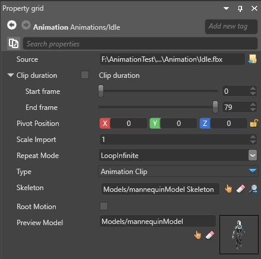

# Import 3D animations

Beginner
Designer

Xenko supports the following animation file types:

``.3ds``, ``.blend``, ``.dae``, ``.dxf``, ``.fbx``, ``.md2``, ``.md3``, ``.obj``, ``.x``

>[!Note]
>Currently, you can't import multiple animations from the same file.

[Import](import-mesn-and-skeleton.md) your animation asset and refer to its properties in the **Property grid**.

## Properties

In the **Property grid**, you can set up the following properties for the animation asset:

### Source

This is the source file used by the animation asset. If you change this here, Game Studio re-imports the animation.

### Clip duration

By default, clip durating is disabled. This means your animation starts at frame 0 and runs to the last written keyframe in the file.

However, single animation tracks sometimes include several animations. In this case, you have to split the track. To do this, enable **Clip duration** and adjust the **start** and **end** frames to match the duration of each animation.

The start and end frames are still limited by the keyframes exported in the file. For example, if you originally exported frames 20 to 40 from the animation tool, the start frame cannot be lower than 20 and the end frame cannot be higher than 40.

By default, Game Studio assumes the framerate is 30. You can change this in the **Game settings** asset properties under **Editor settings > Animation frame rate**.
 
### Pivot position

Game Studio assumes the pivot is the origin of the coordinate system local to the animation. It should be set to **(0, 0, 0)**. If your animation was shifted from the origin when exported, you can use this property to re-adjust it.

### Scale import

The scale import should be set to 1. Xenko detects the units in which your data was exported and adjusts it automatically. If there are no export settings in your animation file and the scale appears incorrect, you can use the scale import property to re-adjust it.

### Repeat mode

You can choose **PlayOnce** or **LoopInfinite**. This is just a hint for the engine. When you assign an animation asset to the model, you can specify differently. If you don't specify the mode later, Xenko uses the attribute you set here by default.
 
### Type

Xenko supports two types of clip. Regular animations default to **Animation clip** and are used with linear blending if mixed. For **Difference clip**, there are few more settings. For more information, see [**Additive animation**](additive-animation.md).

### Skeleton

If you want to use your animation with a skinned mesh, it needs a skeleton. Make sure you reference the same skeleton used by the model you want to animate. If there are missing bones or other differences between the node hierarchy of the skeleton in your animation file and the target skeleton, Xenko retargets the animation as closely as possible.

### Root motion

When root motion is enabled, main motion is applied to [TrasfromComponent](xref:SiliconStudio.Xenko.Engine.TransformComponent). If disabled, it's applied inside the skeleton nodes.
    
>[!Note]
>If there is no skeleton, the motion is always applied to [TrasfromComponent](xref:SiliconStudio.Xenko.Engine.TransformComponent).

## See also

* [3D animation](3d-animation.md)
* [Import animation assets](import-mesh-and-skeleton.md)
* [Use animation assets](set-up-animations.md)
