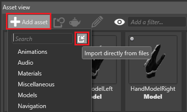
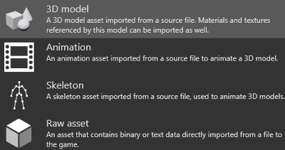
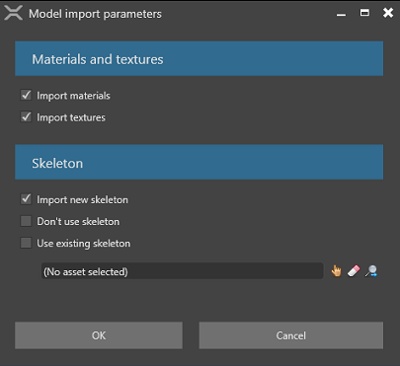
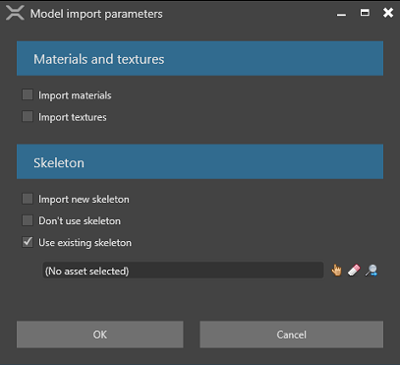

# Import animation assets
Beginner
Designer

This page explains how to add **skinned mesh and skeleton** to your Xenko project.
For information on how to create **Procedural Models** see [Create Assets](../get-started/create-assets.md) page.

>[!Note]
>Keep in mind, you have to skin your mesh correctly to the **Skeleton**, otherwise you won't be able to animate your model correctly.

Xenko supports the following **3D Model** resource files:

``.3ds``, ``.blend``, ``.dae``, ``.dxf``, ``.fbx``, ``.md2``, ``.md3``, ``.obj``, ``.x``

> [!Tip]
> If you need to import a custom file format, you can write a [custom asset](../engine/asset/create-a-custom-asset.md) compiler to support it.

Here's how you can import **mesh and skeleton** to your project.

## Import a model, an animation or a skeleton

1. Drag and drop your **Model** to **Asset View**.

    

2. Alternatively, in **Asset View**, click  and select 

    

3. In either case you will be asked what type of asset do you want to import. Each type is detailed below.

    

### Model import

By default, the importer automatically adds all files referenced by the ``.fbx`` file, but you can choose to exclude textures, materials  and/or skeleton.

>[!Note]
>Don't forget to update the screenshot because we can split materials now.

The game engine uses **Skeleton** as a basis for model **Animations**. When you import a skinned model you also have a skeleton attached to it. By default, Xenko will import both the model and the skeleton from your file, and link the model to the skeleton. You can opt to not use a skeleton for your model, in which case you won't be able to animate it. Or if you already have the skeleton asset, imported separately or together with a similar model, you can reuse an existing one.

   

### Skeleton import

Sometimes you might want to import a skeleton separately in order to create an unique asset. Simply import a model or animation file which has a skeletal definition, and choose to import only the skeleton. This can be useful if you want to create a skeleton which uses a subset of the available nodes, or has a different 

### Animation import

Choose this option if you only want to import the animation from the file. For regular [animations](import-animations.md) this step is sufficient, but there are few extra steps required to create an [additive animation](additive-animation.md)

## See also

* [3D animations overview page](animation.md)
* [Import animations](import-animations.md)
* [Set up animations](set-up-animations.md)
