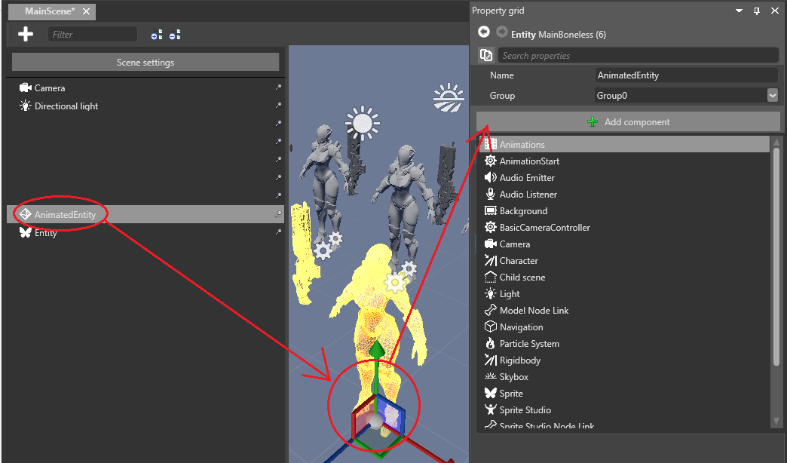
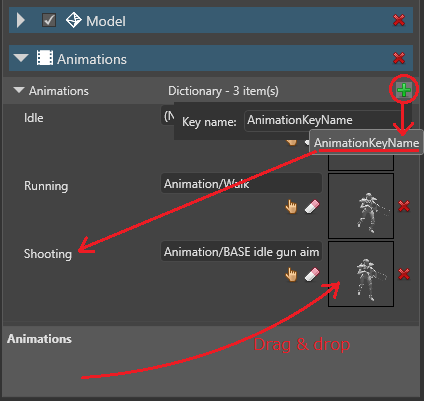
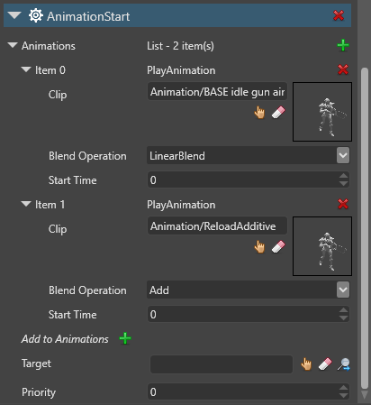

# Set up animations in Game Studio
<span class="label label-doc-level">Beginner</span>
<span class="label label-doc-audience">Designer</span>
<span class="label label-doc-audience">Programmer</span>

To set up animations for a 3D model:

1. Add [AnimationComponent](xref:SiliconStudio.Xenko.Animations.AnimationComponent) to an entity.

2. Add animations to the [AnimationComponent](xref:SiliconStudio.Xenko.Animations.AnimationComponent).

3. Create scripts to animate your models at runtime.

## Add animations to an entity

To use animations in the script, first add them to the entity in Game Studio.

1. To display an animated model, the entity needs a model component and an animation component. In the **scene view**, select the entity you want to animate. In the **property grid**, click **Add animation component** and choose `Animations`.

    

    Game Studio adds an animation component to the entity.

2. In the animation component properties, in the **Animations** field, click the green **+** button and type a name for your animation. When you play animations from scripts later, you use this name, not the name of the asset.

>[!TIP]
>We recommend you give your animation the same name as the asset.


    
3. Add all the animations you want to use on this model and assign the required animation assets for each one. They appear in alphabetical order, as shown above.

## Create a script to play the animations

Your script can be as simple as:

```
    public class SimpleAnimationScript : StartupScript
    {
        public override void Start()
        {
            Entity.Get<AnimationComponent>().Play("Walk");
        }
    }
```

This script looks for an animation component on the entity where you attach it, and plays the "Walk" animation. This means it looks for a key with the name "Walk" in the Animations dictionary under the animation component where you added your animation clips in the previous step.

### Using the pre-built AnimationStart script

Alternatively, you can use the pre-built AnimationScript asset:



Choose **Add asset > Scripts > Animation Start** and give it a name. Then recompile the project and add the script as a new component on your entity. It will appear with the name you assigned. The script offers to load one or more animations when it's run the first time, adding them to the list of playing animations of the entity.

You can edit the script and expand the properties. Refer to the Animation component API for the full list of options.

## See also
* [3D animations overview page](3d-animation.md)
* [Use 3D animations](use-3d-animation.md)
* [Custom blending trees](custom-blending-trees.md)
* [Preview animations](preview-animations.md)
