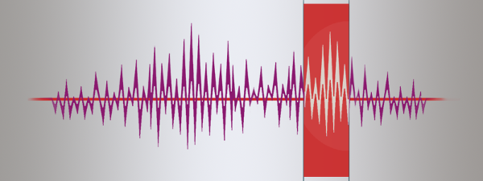

## Set Loop Points
In Xenko, you can stream the whole audio file, or play its fragments.
This way, you can pack different **Sounds** in a single file,
and then access different ranges of this audio in multiple [SoundInstance](xref="SiliconStudio.Xenko.Audio.SoundInstance") objects.
It works much the same way as accessing individual Sprites of a [Sprite Sheet](../animation/2d-animations.md).

You setup **Loop Points** inside the audio file and play the required ranges at runtime.
Use the following methods:

| Method or Property | Functionality |
|---------|-----------|
| [Sound.TotalLength](xref="SiliconStudio.Xenko.Audio.Sound.TotalLength") | Total length of the [Sound](xref="SiliconStudio.Xenko.Audio.Sound"). |
| [SoundInstance.SetRange(PlayRange range)](xref="SiliconStudio.Xenko.Audio.SoundInstance.SetRange.SiliconStudio.Xenko.Audio.PlayRange") | Set the time range inside the audio. |
| [PlayRange](xref="SiliconStudio.Xenko.Audio.PlayRange") | Time information, including range's starting point and length. |
| [SoundInstance.Position](xref="SiliconStudio.Xenko.Audio.SoundInstance.Position") | `TimeSpan` of the range (in seconds). |
| [SoundInstance.IsLooping](xref="SiliconStudio.Xenko.Audio.SoundInstance.IsLooping") | Makes the range an actual loop point. |



[Should have a schema explaining how to make nice looping effects]
|---beginning-play-once -------|loop-point-start-------------looping-part----------------loop-point-end|---------------------|end-of-track.

Code Sample:

```cs
var length = mySound.TotalLength;
//Assume sample length is 5 seconds.
var begin = TimeSpan.FromSeconds(2);
var duration = TimeSpan.FromSeconds(2);
mySoundInstance.SetRange(new PlayRange(begin, duration));
```

## Stream Custom Audio
Xenko allows you to play custom audio streams at runtime.
The streaming mechanism is completely up to you: simply create a sub-class of `DynamicSoundSource`

 you could look at `CompressedSoundSource` source code to understand how to implement that.

To have a custom `DynamicSoundSource` at runtime you can use:

Code Sample:

```
int sampleRate = 48000;
bool mono = false;
bool spatialized = false;
DynamicSoundSource myCustomSource = new MyCustomSource(...);
AudioListener listener = Audio.AudioEngine.DefaultListener;
AudioEngine audioEngine = Audio.AudioEngine;
SoundInstance myCustomInstance = new SoundInstance(audioEngine, listener, myCustomSource, sampleRate, mono, spatialized);
await myCustomInstance.ReadyToPlay();
myCustomInstance.Play();
```

## Use Custom Audio Device
Sometimes you don't want to use the default audio device, but want to access specific audio hardware.
For example, you can access _Oculus Rift_ audio device from your custom _Game Constructor_.
Use this code to play audio with the requested device at runtime.

Code Sample:

```cs
namespace OculusRenderer
{
    public class OculusGame : Game
    {
		public OculusGame()
        {
        	var deviceName = OculusOvr.GetAudioDeviceFullName();
			var deviceUuid = new AudioDevice { Name = deviceName };
			Audio.RequestedAudioDevice = deviceUuid;
        }
    }
}
```
