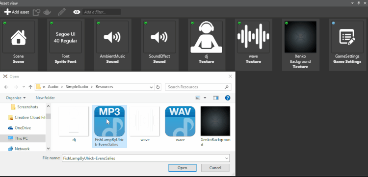

# Import audio

You can import audio files to use as assets in your project. You can import file types including .wav, .mp3, .ogg, .aac, .aiff, .flac, .m4a, .wma, and .mpc.

1. Drag and drop the audio file from Windows Explorer to the **Asset view**:

    

    Alternatively, in the **Asset view**: 
    
    1. Click  
    2. Click  (**Import audio directly from file**) and select the audio file.

2. To give the audio asset some default properties, choose a preset. (You can always change the properties in the Property grid later.)

    

    * **Sound effect**: Recommended for smaller files that you want to play directly from memory.
    * **Spatialized sound**: Recommended for [Spatialized audio](spatialized-audio.md) files that you want to play directly from memory. Note that Xenko always converts 3D spatialized sounds to mono (single-channel) sounds.
    * **Music**: Recommended for larger files that you want to stream from disk to save memory.

After you import an audio file, you can select it as an asset in the **Asset view**.

## See also
* [Global audio settings](global-audio-settings.md)