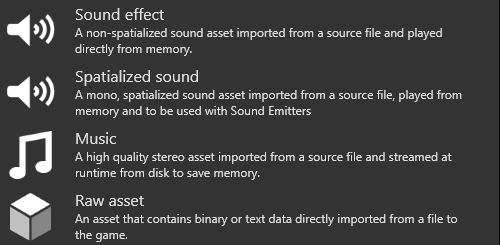

# Import and Setup Audio

Xenko allows you to import audio files of any format.
Game Engine will automatically compress **Sounds** with a top-tier open source [Opus/Celt](https://en.wikipedia.org/wiki/CELT) codec.
This technology greatly reduces CPU and GPU usage without compromising audio quality.

This is how you can import audio files in Game Studio:

**Step 1:** In **Asset View**, press .

**Step 2:** Press .

**Step 3:** Show root path to you Audio file.

**Step 4:** Select a desired file and press _Open_. Alternatively, drag and drop file directly to **Asset View**.

**Step 5:** Choose Asset type:

* _Sound Effect_: choose for smaller files that you want to play directly from memory.
* _Spatialized Sound_: choose for smaller spatialized sounds that you want to play directly from memory.
* _Music_: choose for larger files that you want to stream from disk to save memory.



As soon as you import audio file, go to **Asset View** and click on a newly created **Audio Asset**.
Then, go to **Property Grid** to adjust _Audio Properties_.

##Setup Audio Properties
In **Property Grid**, you can setup the following _Properties_:

* **Source**: here you can change a source file of your audio.
* **Sample rate**: choose how many samples per second a file should have.
Typical sample rates are 44.1 kHz (44,100 Hz), 48 kHz, 88.2 kHz, and 96 kHz.
* **Compression ratio**: bigger compression ratio optimizes memory usage, but decreases audio quality. The scale is from 1 to 40
(**1**: no compression, **40**: heavy compression.)
* **Stream from disk**: tick if you want the audio to be streamed from disk.
* **Spatialized**: tick if the audio file is a spatialized sound. For more information on **Spatialization**, see [Audio page](index.md).

> [Note!] Xenko always converts 3D spatialized sounds to Mono (Single channel) sounds.

##Play Audio
You can use Audio to play in the **Scene**, e.g. _Menu Music_ or _Game Music_.
This way the _Audio_ does not depend on any objects in the Scene.
Xenko plays it with the same volume in any point in the Scene.

You need to instantiate your _Music_ or _Sound Effect_, and then adjust its settings.

Here's a snippet that shows how you can setup  

```cs
music = SoundMusic.CreateInstance();
effect = SoundEffect.CreateInstance();
if (!IsLiveReloading)
    {
     // start ambient music
     music.IsLooped = true;
     music.Play();
    }
```

You can attach audio to any Entity in the Scene: simply add an `AudioEmitter` component to this Entity.
Keep in mind, you need at least one `AudioListenerComponent` in the Scene, otherwise sound from `AudioEmitters` will not be played.
For more information see [Play Audio](play-audio.md).


To test in-game audio, simply build your game project and start the game from Game Studio (**F5**).
You should be able to hear the audio you used in the Scene.

```cs
public override async Task Execute()
   {
    music = SoundMusic.CreateInstance();
    effect = SoundEffect.CreateInstance();
    if (!IsLiveReloading)
       {
        // start ambient music
        music.IsLooped = true;
        music.Play();

        fontColor = Color.Transparent;
        originalPositionX = RightWave.Transform.Position.X;
       }
```

```cs
public override void Start()
   {
    AudioEmitter ae = new AudioEmitter();
    AudioEmitterComponent aemc = Entity.Get<AudioEmitterComponent>();
    aemc.GetSoundController(aemc.Sounds["Audio"]).PlayAndForget();
    aemc.GetSoundController(sound).PlayAndForget();
    aemc.Sounds[""].CreateInstance().Apply3D(ae);
   }
```

**TODO: Straight forward, need to provide screenshots of the Game Studio, 
- Import workflow (quick)
- settings of the files from the property grid + preview to listen to result
- show how to setup asset to be consume audio files both by being referenced in 
	- a Script or 
	- used in a `AudioEmitterComponent`**

The most common scenario is to import sounds from the Game Studio and then reference them in Scripts or consume them directly
from an `AudioEmitterComponent`,
in this case since it's meant to be used for 3D spatialization you also will need a `AudioListenerComponent`
(one is included by default when create a new game).


