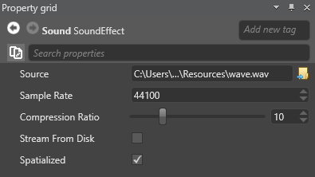

# Import and Setup Audio

Xenko allows you to import audio files of any format.
Game Engine will automatically compress **Sounds** with
a top-tier open source [Opus/Celt](https://en.wikipedia.org/wiki/CELT) codec.
This technology greatly reduces CPU and GPU usage without compromising audio quality.

##Import Audio Files
This is how you can import audio files in Game Studio:

**Step 1:** In **Asset View**, press .

**Step 2:** Press .

**Step 3:** Show root path to you Audio file.

**Step 4:** Select a desired file and press _Open_. Alternatively, drag and drop file directly to **Asset View**.

**Step 5:** Choose Asset type:

* _Sound Effect_: choose for smaller files that you want to play directly from memory.
* _Spatialized Sound_: choose for spatialized sounds that you want to play directly from the memory.
For more information on spatialization, see [Play Object-Specific Audio](play-entity-audio.md).
* _Music_: choose for larger files that you want to stream from the disk to save memory.
* _Raw Asset_.

As soon as you import audio file, click on it in **Asset View** to select.
Then, go to **Property Grid** to setup _Audio Properties_.

##Setup Audio Properties
In **Property Grid**, you can setup the following _Properties_:

* **Source**: here you can change a source file of your audio.
* **Sample rate**: choose how many samples per second a file should have.
Typical sample rates are 44.1 kHz (44,100 Hz), 48 kHz, 88.2 kHz, and 96 kHz.
* **Compression ratio**: bigger compression ratio optimizes memory usage, but decreases audio quality. The scale is from 1 to 40
(**1**: no compression, **40**: heavy compression.)
* **Stream from disk**: tick if you want the audio to be streamed from disk. Use this option for larger audio files.
* **Spatialized**: tick if the audio file is a spatialized sound. For more information on **Spatialization**, see [Play Object-Specific Audio](play-entity-audio.md).

> [Note!] Xenko always converts 3D spatialized sounds to Mono (Single channel) sounds.

* [Play Background Audio](play-background-audio.md)
* [Play Object-Specific Audio](play-entity-audio.md)
* [Advanced Features](virtual-buttons.md)

