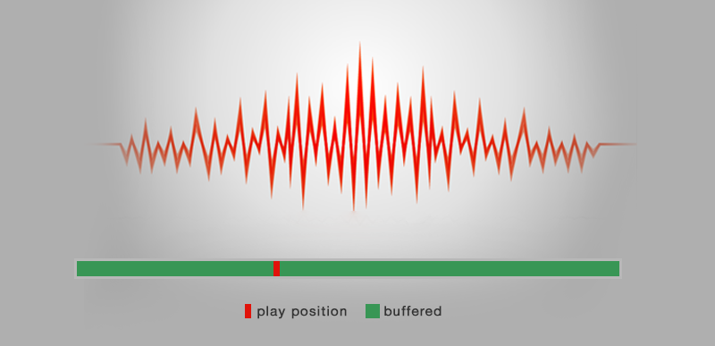

# Audio
Xenko's fully integrated audio system supports many advanced features,
e.g. steamed audio, 3D spatialized audio and low latency playback.
You can import any sound files in the project to use in your games and applications.

## Overview
You can control global sound settings of your _Game_ or _Application_
by accessing _Properties_ of [AudioEngine](xref="SiliconStudio.Xenko.Audio.AudioEngine") class:

| Property | Functionality |
|--- | --- |
| [MasterVolume](xref="SiliconStudio.Xenko.Audio.AudioEngine.MasterVolume") | Set global volume settings of your game or application. |
| [PauseAudio](xref="SiliconStudio.Xenko.Audio.AudioEngine.PauseAudio") | Pause game audio, when you need to mute all sounds. |
| [ResumeAudio](xref="SiliconStudio.Xenko.Audio.AudioEngine.ResumeAudio") | Resume all audio, when you need to enable sounds again. |

Apart from the global audio settings, you can always manage individual sounds in the **Scene**.

### Background and Object-Specific Audio
Sometimes, _Audio_ is not attached to a particular object, but affects the whole **Scene**.
The examples are:

* Menu sounds and music.
* Soundtracks.
* Pop-up warnings, etc.

[SoundInstance](xref="SiliconStudio.Xenko.Audio.SoundInstance") helps you adjust background _Audio_.
For more information, see [Play Background Audio](play-background-audio.md).

Usually, _Audio_ is attached to a particular object in a **Scene**.
In that case, you need to add `Audio Emitters` and `Audio Listeners` to the **Scene** to be able to hear the _Audio_.

[AudioEmitterSoundController](xref="SiliconStudio.Xenko.Audio.AudioEmitterSoundController") helps you adjust object-specific _Audio_.
For more information, see [Play Object-Specific Audio](play-entity-audio.md).

### Streamed and non-Streamed Audio
Xenko allows you to stay flexible when managing sounds.
Either buffer entire audio files, or stream compressed audio from disk at runtime.

The choice usually depends on the size of the audio file.
More often than not, you want to stream bigger samples and play smaller files directly from the memory:

**1) Non-Streamed Audio**: Xenko plays audio directly from the memory. This option is useful for smaller sound files.
For instance, when you need to play sound effect, e.g. explosion or shooting sound.

**2) Streamed Audio** is designed to handle larger audio files, like soundtracks, dialogs, etc.
Rather than playing the whole file directly from the memory, Xenko buffers and plays it in sequences.
As soon as the first sequence is buffered, Game Engine plays it while buffering the following sequences in parallel.

For more information, see [Play Background Audio](play-background-audio.md).

### Spatialized and non-Spatialized Audio
In Xenko, you can play **Spatialized** and **non-Spatialized** sounds.
Here's how these two sound types differ from one another:

**Non-Spatialized Audio** (**Stereo Audio**) simulates sounds that come from different directions.
Yet, stereo sound moves along a single axis (most often, _Ox axis_).
This feature greatly limits accuracy of the audio, especially for sounds that are simulated _Above_, _Below_, and _Behind_ the user.

**Spatialized Audio** (**3D Audio**) simulates sound sources that are located in a _3-dimensional Space_ around the listener.
It creates a very natural listening experience, especially for sounds that are simulated _Above_, _Below_, and _Behind_ the user.
This gives an impression the audio is coming from real-life objects, while in fact it may be coming from just two stationary speakers.

This technology is a perfect fit for VR applications, and is also widely used in conventional platform and desktop games.

**Spatialized Audio** is closer to the real-life audio than **Non-Spatialized**.
At the same time, **3D Audio** uses more CPU, as the system has to process more sound channels.
Take that into account when creating your applications in Xenko.

> [Note!] Xenko always converts 3D spatialized sounds to Mono (Single channel) sounds.

For more information, see [Play Object-Specific Audio](play-entity-audio.md).

## Topics Covered
* [Import and Setup Audio](import-setup.md): How to import and setup audio files.
* [Play Background Audio](play-background-audio.md): How to set and adjust background audio, including streamed audio.
* [Play Object-Specific Audio](play-entity-audio.md): How to set and adjust object-specific audio,
including spatialized sounds.
* [Use Audio Emitters](use-audio-emitters.md): How to setup audio emitters and use them from the scripts.
* [Advanced Audio Features](advanced-features.md): How to set loop points, stream custom audio, and use custom audio devices.

