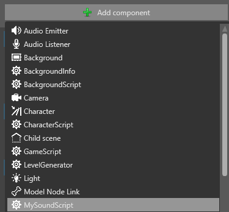
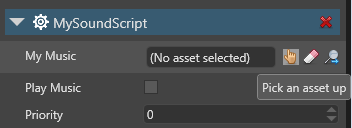
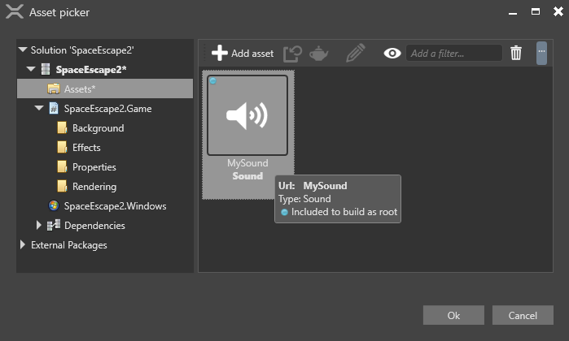

# Non-spatialized audio

**Non-spatialized audio** sounds the same regardless of the position of entities (such as the player camera). Unlike [spatialized audio](spatialized-audio.md), its _volume_, _pitch_ (_frequency_), and other parameters do not change. This is useful, for example, for background music and menu sound effects.

Non-spatialized audio requires no [audio emitters](audio-emitters.md) or [audio listeners](audio-listeners.md).

Non-spatialized audio is stereo and moves along a single axis (usually the x-axis).


* [Import and script non-spatialized audio](#Import)

To play non-spatialized audio at runtime, you need to instantiate it and adjust its settings in the code.

1. In Game Studio, [import the audio as a sound asset](import-audio.md).

2. Make sure the sound asset is included in the build as a root asset. This is indicated with a blue icon in the top-left of the asset icon in the **Asset view**. 

    To include the asset in the build as a root asset, in the **Asset view**, right-click the asset and select **Include in build as root asset**.

3. Instantiate the sound asset in your code.

Access non-spatialized audio with the [SoundInstance](xref="SiliconStudio.Xenko.Audio.SoundInstance") class. This has the following properties, which control audio settings at runtime:

| Property  | Description |
|-------    |-------|
| [IsLooping](xref="SiliconStudio.Xenko.Audio.SoundInstance.IsLooping") | Gets or sets looping of the audio. |
| [Pan](xref="SiliconStudio.Xenko.Audio.SoundInstance.Pan")       | Sets the balance between left and right speakers. By default, each speaker a value of 0.5. |
| [Pitch](xref="SiliconStudio.Xenko.Audio.SoundInstance.Pitch")     | Gets or sets the audio pitch (frequency). |
| [PlayState](xref="SiliconStudio.Xenko.Audio.SoundInstance.PlayState")	| Gets the state of the [SoundInstance](xref="SiliconStudio.Xenko.Audio.SoundInstance"). |
| [Position](xref="SiliconStudio.Xenko.Audio.SoundInstance.Position")	| Gets the current play position of the audio. |
| [Volume](xref="SiliconStudio.Xenko.Audio.SoundInstance.Volume")	| Sets the audio volume. |

For more details, see the [SoundInstance API documentation](xref="SiliconStudio.Xenko.Audio.SoundInstance").

> [!Note]
If the track is playing, Xenko ignores all additional calls to [SoundInstance.Play](xref="SiliconStudio.Xenko.Audio.SoundInstance.Play").
This works the same for [SoundInstance.Pause](xref="SiliconStudio.Xenko.Audio.SoundInstance.Pause") and [SoundInstance.Stop](xref="SiliconStudio.Xenko.Audio.SoundInstance.Stop").

### Example code

This code:

* instantiates non-spatialized audio
* sets the sound to loop
* sets the volume
* plays the sound

```
public override async Task Execute()
{
    // Load music.
    Sound musicSound = Content.Load<Sound>("MySound");
    
    // Create Sound Instance.
    SoundInstance music = SoundMusic.CreateInstance();

    if (!IsLiveReloading)
    {
      
        // Start playing ambient music.
        music.IsLooping = true;

        // Set music volume.
        music.Volume = 0.25f;

        // Play the music.
        music.Play();
    }
}
```

### Alternative: create a script with public variables

1. In your script, create a public variable for each sound asset you want to use. You can use the same properties listed above.

    For example:

```cs
public class SoundScript : SyncScript
{
    public Sound SoundMusic;
    public Sound SoundEffect;

    public SoundInstance musicInstance;
    public bool isMusicOn;

    public override void Start()
    {
        musicInstance = SoundMusic.CreateInstance();
    }

    public override void Update()
    {
        // If music is not played, but should be played, start the music.
        if (isMusicOn & musicInstance.PlayState != SoundPlayState.Playing)
        {
            musicInstance.Play();
        }

        // If music should not be played, stop the music.
        else if (!isMusicOn)
        {
            musicInstance.Stop();
        }
    }
}
```


2. In the **Scene view**, select the entity you want to add the script to:

    

3. In the **Property grid**, click **Add component**:
 
    

4. Select the script you want to add (eg `SoundScript`):

    

5. You can see the **public variables** in the script (for example Sound Music and Sound Effect).

    To tie the variables to the audio assets, drag and drop each asset from the **Asset view** to each  variable:

    

    Alternatively, click the hand icon (**Pick an asset up**):

    

    Then choose the audio asset you want to use:

    

## See also
* [Global audio settings](global-audio-settings.md)
* [Spatialized audio](spatialized-audio.md)