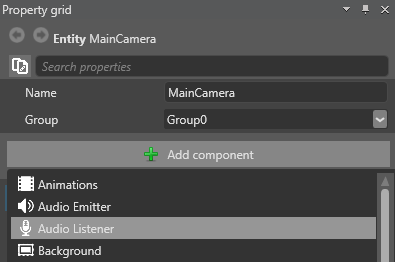

#Play Object-Specific Audio
Unlike [Background Audio](play-background-audio.md) that affects the whole Scene,
**Object-Specific Audio** is attached to **Entities**.
You can attach _Audio Components_ to any Entity, including cameras, 3D models, sprites, and more.

Object-specific Audio does not have same volume and pitch throughout the **Scene**.
These parameters vary depending on the distance to the object that emits sound.
 
Therefore, to hear _Object-Specific Audio_, you need to have:

1. `Audio Emitter` plays the sounds.
2. `Audio Listener` is able to hear **Audio** if it's close enough to the `Emitter`.

##Audio Emitters
An emitter is any **Entity** in a Scene with an [AudioEmitter](xref="SiliconStudio.Xenko.Audio.AudioEmitter") _Component_.

> [!Note] You need at least one ``AudioListenerComponent`` in the Scene,
> otherwise you will not be able to hear the audio from `AudioEmitters` at runtime.

You can access [AudioEmitters](xref="SiliconStudio.Xenko.Audio.AudioEmitter") in two ways.
With both options, you need to add `AudioEmitter` and `Script` _Components_ to a single Entity.
For more information, see [Audio Emitters](audio-emitters.md).

##Audio Listeners
A listener is any **Entity** with an [AudioListener](xref="SiliconStudio.Xenko.Audio.AudioListener") _Component_.
Usually, you attach [AudioListener](xref="SiliconStudio.Xenko.Audio.AudioListener") _Component_ to the user's camera view,
but can use it with any other Entity, too.
There can be multiple `AudioListeners` in a **Scene**.

Here's how to add an `AudioListener Component` to **Entity**:

**Step 1:**  In **Scene View**, select an Entity you want to be an _Audio Listener_.


**Step 2:** In **Property Grid**, press _Add Component_ and select `AudioListener Component`.



You don't need to setup `AudioListeners` as they only receive the sound.
All sound settings, including _Volume_ and _Pitch_ and handled entirely with `AudioEmitters'.
For more information, see [Audio Emitters](audio-emitters.md).

> [!Warning] On iOS, you can create multiple `AudioListenerComponent` objects, but only one will be used.
> This issue will be addressed in the future releases.

##Spatialized Audio
_Spatialized Sounds_ are produced by **Entities** with an `AudioEmitter Component`.
You can assign _Audio Assets_ to these _Components_, and then use **Scripts** to manage _Spatialized Audio_ at runtime.

_Spatialized Audio_ takes listener's position into account.
`Emitter` of the _Spatialized Audio_ reads receiver's position,
and than accurately simulates sounds in a 3-Dimensional space around that position.
Therefore, **Spatialized Audio** requires at least one _Audio Listener_ and one _Sound Emitter_ in the **Scene**.


Here's a snippet that shows how you can setup 3D audio:

```cs
public override void Start()
   {
    AudioEmitter ae = new AudioEmitter();
    AudioEmitterComponent aemc = Entity.Get<AudioEmitterComponent>();
    aemc.GetSoundController(aemc.Sounds["Audio"]).PlayAndForget();
    aemc.GetSoundController(sound).PlayAndForget();
    aemc.Sounds[""].CreateInstance().Apply3D(ae);
   }
```

###Doppler Effect
_Doppler Effect_ describes sound waves produced by a mobile sound source.
The frequency of the sound coming from a moving object varies depending on the observer's position:

* Sound from _Approaching_ source has _Higher_ frequency.
* Sound from _Recending_ source has _Lower_ frequency.


**Spatialized Audio** takes _Doppler Effect_ into account to create a even more natural listener's experience.

> [Note!] Xenko always converts 3D spatialized sounds to Mono (Single channel) sounds.

##Code Samples

```cs
public class EmitterScr : SyncScript
{
        
    // Music track is loaded from XenkoStudio as public variable.
    // Sounds are loaded into AudioEmmiter Component and given proper names.
    public Sound musicTrack;

    private AudioEmitterSoundController musicController;
    private AudioEmitterComponent aemc;
    public bool isMusicOn;

    public override void Start()
    {
        // Get AudioEmmiterComponent from entity with AudioEmiter Component.
        aemc = Entity.Get<AudioEmitterComponent>();

        // Make sure musicT tack is looped.
        musicController = aemc.GetSoundController(musicTrack);
        musicController.IsLooping = true;
    }

    public override void Update()
    {
        if (Input.IsKeyPressed(Keys.F1))
        {
            // Play sound each time user presses F1 key.
            aemc.GetSoundController(aemc.Sounds["HelpPopup"]).Play();
        }

        if (Input.IsMouseButtonPressed(MouseButton.Left))
        {
            // Play sound effect each time user presses mouse button.
            // Sound effects may overlay and will be cleared from memory once finished.
            aemc.GetSoundController(aemc.Sounds["SwordSwing"]).PlayAndForget();
        }

        // If music is not played, but should be played, start the music.
        if (isMusicOn & musicController.PlayState != SoundPlayState.Playing)
        {
            musicController.Play();
        }

        // If music should not be played, stop the music.
        else if (!isMusicOn)
        {
            musicController.Stop();
        }
    }
}
```

<div class="doc-relatedtopics">
* [Play Background Audio](play-background-audio.md)
* [Import and Setup Audio](import-setup.md)
* [Advanced Features](virtual-buttons.md)
</div>
