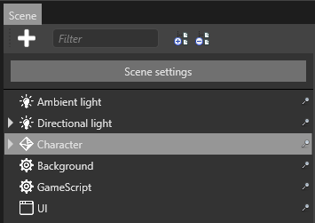

#Play Audio


## Playing spatialized sounds
**Spatialized Audio** requires at least one _Audio Receiver_ and one or multiple _Sound Emitters_.

###Audio Listeners
A receiver is any **Entity** in a Scene with an `AudioListenerComponent` component.
Usually, you attach `AudioListener Component` to the user's camera view.
This way the user can receive proper 3D sound from multiple `AudioEmitters` at runtime.

Here's how to create an `AudioListener Component`:

**Step 1:** Select an Entity you want to be an audio receiver.



**Step 2:** In **Property Grid**, press _Add Component_.

**Step 3:** Select `AudioListener Component`.


###Audio Emitters
Spatialized sounds are produced by **Entities** with an `AudioEmitter Component`.
You can assign sound to these _Components_ in Game Studio, and then use **Scripts** to manage Audio at runtime.
`AudioEmitter Component` always emits _Sounds_ from the Entity location.

**TODO: Pic of game studio Entity with a AudioEmitterComponent and some sounds in it**

To play sounds from an emitter another special type of sound instance is introduced: `AudioEmitterSoundController`.
This is because in the Scene you might have multiple listeners and so to play the sound internally the engine might create multiple `SoundInstance`.


To get the `AudioEmitterSoundController` within a script, you would write something like this:
```
AudioEmitterComponent audioEmitterComponent = Entity.Get<AudioEmitterComponent>();
AudioEmitterSoundController mySound1Controller = audioEmitterComponent["MySound1"];
AudioEmitterSoundController mySound2Controller = audioEmitterComponent["MySound2"];
```

`AudioEmitterSoundController` works similarly to `SoundInstance`, so the sounds above could be used like this:
```
mySound2Controller.IsLooping = true;
mySound2Controller.Pitch = 2.0f;
mySound2Controller.Volume = 0.5f;
mySound2Controller.Play();
```

`AudioEmitterSoundController` introduces also another special way to play sound, Play and forget.
This is very useful in the case of for example, bullets, one hit and forget sounds, etc.
With play and forget you don't have to care about stopping the sound and internally the engine will allocate and clean up resources transparently.
```
mySound2Controller.PlayAndForget();
```
Please note that when using `PlayAndForget` the property `IsLooping` has no effect, those sounds will be always stopped when they end.

##Play Audio from Scripts
