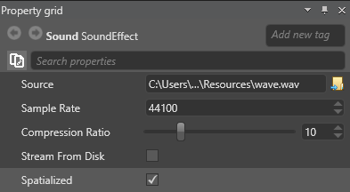

#Spatialized Audio
**Spatialized Audio** (3D Audio) is a special type of [Object-Specific Audio](entity-audio.md).
It uses all three dimensions to simulate sounds at runtime, so it's closer to real-life sound than stereo .
The difference between _Spatialized_ and _non-Spatialized_ Audio is explained [here](index.md).

If **Spatialized Audio** is enabled, Xenko tracks position of `AudioListeners` and `AudioEmitters`,
as well as their movement direction, speed, and other parameters.
System then takes all this data into account to simulate accurate sounds in a 3-Dimensional space around `AudioListener`.
This technology is a perfect fit for VR applications, and is also widely used in conventional platform and desktop games.


> [Note!] 3D Audio uses more CPU, as the system has to process more sound channels.
> Take that into account when creating your applications in Xenko.

###Import and Setup
Import _Spatialized Audio_ just like any other sounds or music.
See [Import and Setup Audio](import-setup.md) for more information on how to import and setup Audio.
When prompted to choose _Asset Type_, select _Spatialized Sound_.

> [Note!] Xenko always converts 3D spatialized audio to Mono (Single channel) sounds.

You can also change _non-Spatialized Audio_ to _Spatialized_ in **Property Grid**:

**Step 1:** In **Asset View**, select _Audio Asset_.

**Step 2:** In **Property Grid**, tick _Spatialized_: 



###Adjust Settings
Just like other _Object-Specific Audio_, **Spatialized Sounds** are produced by **Entities** with an `AudioEmitter Component`.
You can assign _Audio Assets_ to these _Components_, and then use **Scripts** to manage **Spatialized Audio** at runtime.
**Spatialized Audio** also requires at least one `Audio Listener` in the **Scene**.
For more information, see [Object-Specific Audio](entity-audio.md).

Here's a snippet that shows how you can enable _3D Audio_ from the **Script**:

```cs
public override void Start()
   {
    AudioEmitter ae = new AudioEmitter();
    AudioEmitterComponent aemc = Entity.Get<AudioEmitterComponent>();
    aemc.Sounds[""].CreateInstance().Apply3D(ae);
   }
```

You can also use all _Methods_ and _Properties_ of the
[AudioEmitterSoundController](xref="SiliconStudio.Xenko.Audio.AudioEmitterSoundController")
to adjust _Spatialized Audio_, just like any other sounds.
For more information, see [Object-Specific Audio](object-specific-audio.md).

As soon as you import **Spatialized Audio** and adjust its basic settings, you don't have to fine-tune it manually.
Integrated **Audio Engine** automatically makes all required calculations and simulates accurate _Spatialized Audio Effects_ at runtime.
_Doppler Effect_ is one of the advanced 3D Audio features supported by Xenko.
 
##Doppler Effect
_Doppler Effect_ describes sound waves produced by a mobile sound source.
The frequency (pitch) of the sound coming from a moving object varies depending on the observer's position:

* Sound from _Approaching_ source has _Higher_ frequency.
* Sound from _Recending_ source has _Lower_ frequency.


**Spatialized Audio** in Xenko takes _Doppler Effect_ into account to create a even more natural listener's experience.

<div class="doc-relatedtopics">
* [Object-Specific Audio](entity-audio.md)
* [Play Background Audio](background-audio.md)
* [Import and Setup Audio](import-setup.md)
* [Advanced Features](advanced-features.md)
</div>
