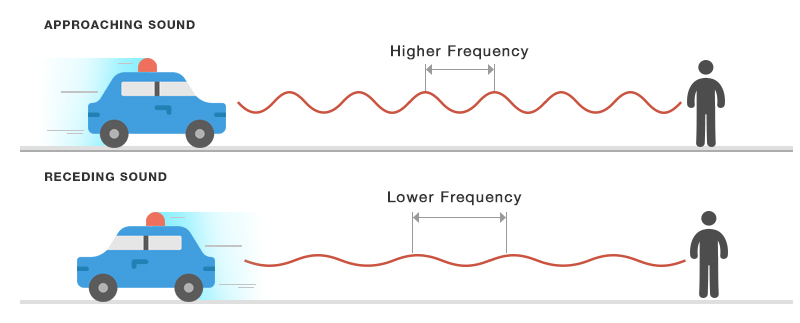

# Spatialized audio

**Spatialized audio**, also called **3D audio**, simulates three-dimensional sound around the listener.

 

For example, the frequency (pitch) of the sound coming from a moving object varies depending on the observer's position (the [Doppler effect](https://en.wikipedia.org/wiki/Doppler_effect)). Sound from an approaching source has a higher frequency than sound from a resceding source:

This simulates more realistic audio than [non-spatialized audio](non-spatialized-audio.md), especially for sounds simulated above, below, and behind the listener. 

Spacialized audio is widely used for sound effects in platform, desktop, and VR games. For example, a gun might make a gunshot sound when fired, or a character might make a footstep sound when they take a step.

> [Note!] 
Spatialized audio uses more CPU than non-spatialized audio, as it requires more sound channels.

## Enable spatialized audio
When you [import your audio asset](import-audio.md), select _Spatialized Sound_ as the asset type.

You can also set audio to spatialized in the asset's **Property grid**:

1. In **Asset View**, select _Audio Asset_.

2. In the **Property grid**, select the **Spatialized** checkbox: 

    

> [Note!] 
Xenko converts spatialized audio to mono (single-channel) audio.

## Audio emitters and audio listeners
To create spatialized audio, Xenko tracks the positions of two entities in the scene:

* **[audio emitters](audio-emitters.md)**, which emit audio
* **[audio listeners](audio-listeners.md)**, which hear the sound emitted by audio emitters

Xenko simulates sounds in 3D space around the audio listener. You must have both audio and audio listeners to hear spatialized sound in a scene.