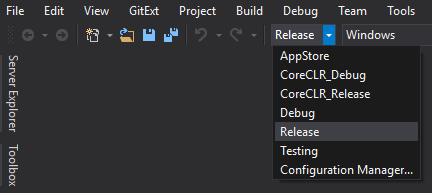
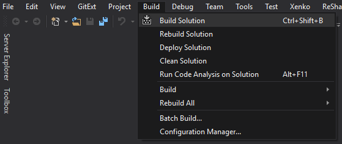

# Distribute a game

When you're ready to share your game, create a release build from Visual Studio, then distribute it.

## 1. Create a release build

1. If you've built your game in Release mode before, in your project folder (eg *MyGame/Bin/MyPlatform/Release/*), delete the *Data* folder. (This folder might contain unnecessary files, so it's simplest to build it again from scratch.)

2. Open your project in Game Studio.

3. In the toolbar, click the dropdown and select **Visual Studio**.

    

    Your project opens in Visual Studio.

4. In the Visual Studio toolbar, from the dropdown menu, select **Release**.

    

5. Under **Build**, select **Build solution**.

    

    Visual Studio creates a release build in your project bin folder (eg *MyGame/Bin/MyPlatform/Release*).

## 2. Delete unnecessary files

After you create a build, you can delete unnecessary files to make it smaller and easier to distribute.

1. In the main folder, delete all the files except the *.dll* files and the *.exe* file.

2. Delete all the folders except for *x64*, *x86*, and *Data*.

## 3. Distribute your game

After you create a release build, how you distribute it is up to you. 

Before you distribute it, you might want to rename the **Release** folder to something more descriptive (such as the title of your game).

If you just want to create a file you can share, we recommend you zip it. The simplest way to do this is on Windows to right-click the folder and select **Send to > Compressed (zipped) folder**.

This creates a zip file that other people can extract.

