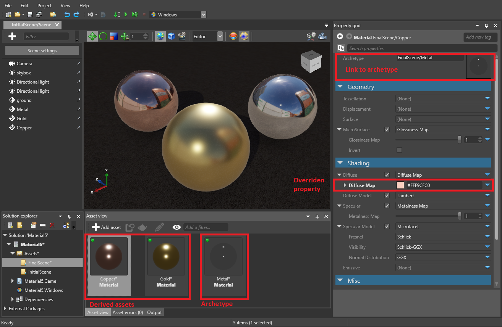
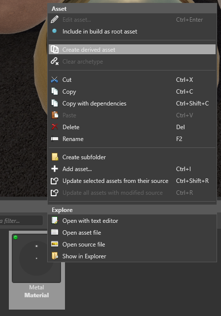
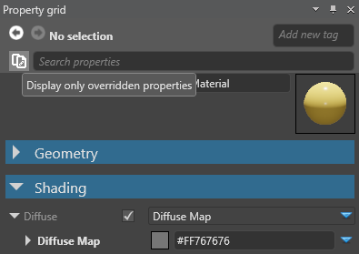
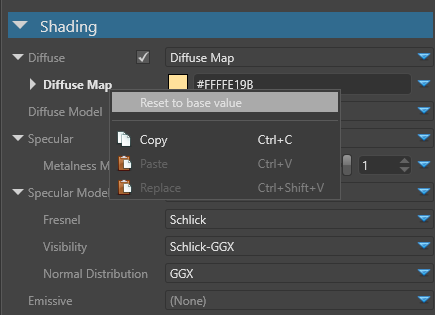

# Archetypes

<span class="label label-doc-level">Intermediate</span>
<span class="label label-doc-audience">Designer</span>

An **archetype** is a master asset that controls the properties of assets you **derive** from it. Derived assets are useful when you want to create a "remixed" version of an asset.

For example, imagine we have three sphere entities that share a material asset. The asset has properties including color, glossiness, and so on. If we change a property in the asset, it applies to all three spheres. So, for example, if we change the color property, all three spheres change color.

Now imagine we want to change the color of only *one* sphere, but keep its other properties the same. We could duplicate the material asset, change its color, and then apply the new asset to only one sphere. But if we later want to change a different property across *all* the spheres, we have to modify both assets. This is time-consuming and leaves room for mistakes.

The better approach is to derive a new asset from the archetype. The derived asset inherits properties from the archetype and lets you override individual properties where you need them. For example, we can derive the sphere's material asset and override its color. Then, if we change the glossiness of the archetype, the glossiness of all three spheres changes.



* If the property in the archetype and the derived asset is **identical**, the derived asset inherits changes from the archetype for that property.

* If the property in the archetype and the derived asset is **different**, the derived asset doesn't inherit changes from the archetype for that property.

You can derive an asset from an archetype, then in turn derive another asset from that derived asset. This way you can create different layers of assets to keep your project organized:

```cs
Archetype
    Derived asset
        Derived asset
```

## Derive an asset from an archetype

In the **Asset View**, right-click the asset you want to derive an asset from and select **Create derived asset**:



Game Studio adds a new **derived asset** to the project. This asset derives its properties from the **archetype** asset.

The derived asset's **Property Grid** displays the archetype asset under **Archetype**:


> [!Tip] 
> You can right-click the archetype asset in the Property Grid and select **Select the referenced asset** to quickly select the archetype asset.

### Overridden properties

The **Property Grid** shows which properties of the derived asset differ from the archetype. 

* **Overridden** and **unique** properties are **white**:

     

* **Identical** properties are **gray**:

     

To display only properties that differ from the **archetype**, in the **Property Grid**, select **Display only overridden properties**:

 

### Reset a property to archetype value

You can reset overridden or unique properties of a derived asset to the values in the archetype. To do this, right-click the overridden property and select **Reset to base value**.



### Clear an archetype

You can remove the link between the archetype and the derived asset. This means the derived asset won't inherit changes to the archetype; it becomes a completely independent.

To do this, in the **Asset View**, right-click the derived asset and select **Clear archetype**.


## See also

* [Introduction to assets](../get-started/introduction-to-assets.md)
* [Prefabs](prefabs.md)