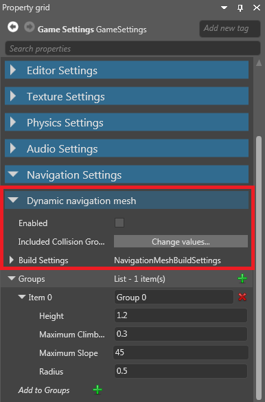
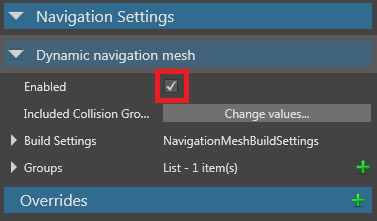

# Dynamic navigation

<span class="label label-doc-level">Beginner</span>
<span class="label label-doc-audience">Level designer</span>
<span class="label label-doc-audience">Programmer</span>

If you enable **dynamic navigation**, entities with navigation components don't need a [navigation mesh](navigation-meshes.md) asset. Instead, the entities generate navigation meshes dynamically.

> [!Note]
> Make sure that the scenes you want the entities to navigate dynamically have [navigation bounding boxes](navigation-bounding-boxes.md).

## Enable dynamic navigation

You can enable and disable dynamic navigation in the global [game settings](game-settings.md) asset.

1. On the entities you want to navigate dynamically, under the navigation component properties, next to **Navigation mesh**, make sure no navigation mesh is selected.

    

    For more information about the navigation component, see [Navigation components](navigation-components.md).

2. In the **solution explorer** (the bottom-left pane by default), select the **Assets folder**.

    

3. In the **asset view** (the bottom pane by default), select the **Game Settings** asset.

    

4. In the **property grid** (the right-hand pane by default), under **Navigation Settings**, expand **Dynamic navigation mesh**.

   

5. Select the **Enable dynamic navigation** checkbox.

    

## Dynamic navigation mesh properties

| Property                  | Description                                                    
|---------------------------|--------------
| Enabled                   | Enable dynamic navigation on navigation components that have no assigned navigation mesh
| Included collision groups | Set which collision groups dynamically-generated navigation meshes use. By default, meshes use all collision groups
| Build settings            | Advanced settings for dynamically-generated navigation meshes

## Enable and disable dynamic navigation from a script

Example code:

```cs
// Find and enable the dynamic navigation mesh system
dynamicNavigationMeshSystem = Game.GameSystems.OfType<DynamicNavigationMeshSystem>().FirstOrDefault();
dynamicNavigationMeshSystem.Enabled = true;

// This stops the dynamic navigation mesh system from automatically rebuilding in the folowing cases:
//  - loading/Unloading scenes
//  - adding/removing static collider components
//  - adding/removing navigation mesh bounding boxes
dynamicNavigationMeshSystem.AutomaticRebuild = false;

// ...

if (/* any condition that should cause the navigation mesh to update (eg open/close door) */)
{
	// Start an asynchronous rebuild of the navigation mesh
	var rebuildTask = dynamicNavigationMeshSystem.Rebuild();
	rebuildTask.ContinueWith((x) =>
	{
		if (x.Result.Success)
		{
			// The navigation mesh is successfully rebuilt
		}
	});
}
```

## See also

* [Navigation groups](navigation-groups.md)
* [Navigation meshes](navigation-meshes.md)
* [Navigation bounding boxes](navigation-bounding-boxes.md)
* [Navigation components](navigation-components.md)