# Game settings

Beginner
Programmer
Designer

You can configure the global settings of your game in the **Game Settings** asset. By default, the Game Settings asset is stored in your project's **Assets** folder.

## Edit Game Settings

1. In the **solution explorer** (the bottom-left pane by default), select the **Assets folder**.

    

2. In the **asset view** (the bottom pane by default), select the **GameSettings** asset.

    

3. In the **property grid** (the right-hand pane by default), edit the Game Settings properties.

   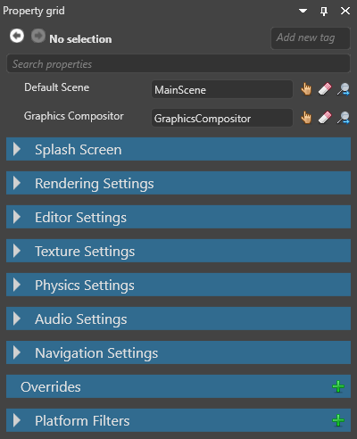

## Default scene

You can have multiple scenes in your project. The **default scene** is the scene Xenko loads at runtime.

To set the default scene:

1. In the **GameSettings** properties, next to **Default Scene**, click the **Asset picker** button.
    
    

    The **asset picker** opens.

2. Select the default scene in the asset picker and click **OK**.

For more information about scenes, see [Manage scenes](../game-studio/manage-scenes.md).

## Graphics compositor

You can have multiple graphics compositors in your project, but you can only use one at a time.

To set the graphics compositor:

1. In the **GameSettings** properties, next to **Graphics compositor**, click the **Asset picker** button.
    
    

    The **asset picker** opens.

2. Select the graphics compositor in the asset picker and click **OK**.

For more information, see [Graphics compositor](../graphics/graphics-compositor/index.md).

## Splash screen

The **splash screen** is displayed when your game starts. The default is the Xenko splash screen.

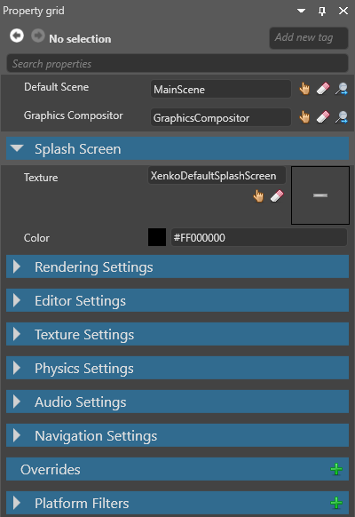

| Property | Description
|----------|------------
| Texture  | The image (eg company logo) displayed as the splash screen. By default, this is *XenkoDefaultSplashScreen*. 
| Color    | The color the splash screen fades in on top of. By default, this is black  (*#FF000000*).

For more information, see [Splash screen](/splash-screen.md).

## Rendering settings

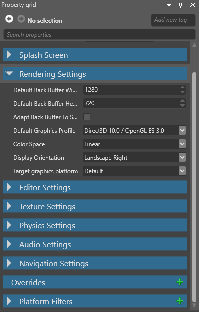

| Property                    | Description  
|-----------------------------|----------------
| Default back buffer width   | This might be overridden depending on the ratio and/or resolution of the device. On Windows, this is the window size. On Android/iOS, this is the off-screen target resolution. 
| Default back buffer height  | This might be overridden depending on the ratio and/or resolution of the device. On Windows, this is the window size. On Android/iOS, this is the off-screen target resolution. 
| Adapt back buffer to screen | If enabled, this option adapts the ratio of the back buffer to fit the screen ratio.
| Default graphics profile    | The graphics feature level required by the project.
| Color space                 | The color space (gamma or linear) used for rendering. This affects the game at runtime and how elements are displayed in Game Studio.
| Display orientation         | The display orientation of the game (default, portrait, left landscape, or right landscape).
| Target graphics platform    | The target platform Xenko builds the project for. If you set this to **Default**, Xenko chooses the most appropriate platform.

> [!Tip]
> To check which default platform your project uses, add a break point to your code (eg in a script), run the project, and check the value of the [GraphicsDevice.Platform](xref:SiliconStudio.Xenko.Graphics.GraphicsDevice.Platform) variable.

## Editor settings

The editor settings control how Game Studio displays entities in the scene editor. These settings have no effect on your game at runtime.

>[!Note]
>How Game Studio displays entities is also affected by the **Color space** setting under **Rendering settings**.

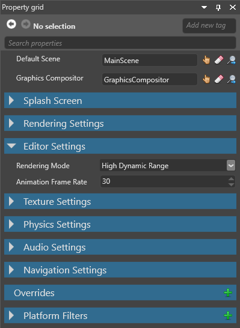

| Property            | Description    
|---------------------|--------------
| Rendering mode      | How Game Studio renders thumbnails and asset previews. 
| Animation framerate | The framerate of animations shown in Game Studio. This doesn't affect animation data. 

## Texture settings

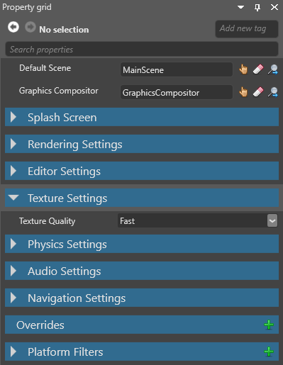

| Property        | Description  
|-----------------|--------------
| Texture quality | The texture quality when encoding textures. **Fast** uses the least CPU, but has the lowest quality. Higher settings might result in slower builds, depending on the target platform. 

## Physics settings

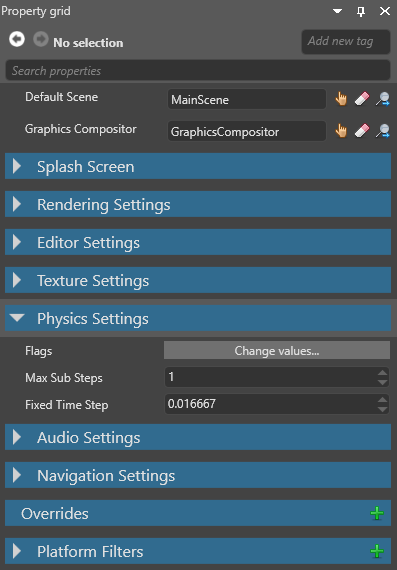

| Property        | Description         
|-----------------|----------------
| Flags           | **CollisionsOnly** disables [physics](../physics/index.md) except for collisions. For example, if this is enabled, objects aren't moved by gravity, but will still collide if you move them manually. **ContinuousCollisionDetection** prevents fast-moving entities erroneously moving through other entities. Note: other flags listed here aren't enabled yet, and will work in future versions. 
| Max sub steps   | The maximum number of simulations the the physics engine can run in a frame to compensate for slowdown.
| Fixed time step | The length in seconds of a physics simulation frame. The default is 0.016667 (one sixtieth of a second). 

## Audio settings

| Property     | Description  
|--------------|--------------
| HRTF support | Enable HRTF audio. Note that only audio emitters with HRTF enabled will produce HRTF audio. For more details, see [HRTF](../audio/hrtf.md).

For more details about audio, see [Audio](../audio/index.md).

## Navigation settings

### Dynamic navigation mesh properties

| Property                  | Description                                                    
|---------------------------|--------------
| Enabled                   | Enable dynamic navigation on navigation components that have no assigned navigation mesh
| Included collision groups | Set which collision groups dynamically-generated navigation meshes use. By default, meshes use all collision groups
| Build settings            | Advanced settings for dynamically-generated navigation meshes

For more details, see [Dynamic navigation](dynamic-navigation.md).

### Navigation group properties

| Property             | Description
|----------------------|------------
| Item                 | The name of the group.
| Height               | The height of the entities in this group. Entities can't enter areas with ceilings lower than this value.
| Maximum climb height | The maximum height that entities in this group can climb.
| Maximum slope        | The maximum incline (in degrees) that entities in this group can climb. Entities can't go up or down slopes higher than this value.
| Radius               | The larger this value, the larger the area of the navigation mesh entities use. Entities can't pass through gaps of less than twice the radius.

For more details, see [Navigation](navigation.md).

## Overrides

You can override settings for particular platforms, graphics APIs, and so on. For example, you can set different texture qualities for different platforms.

1. With the **GameSettings** asset selected, in the **property grid**, under **Overrides**, click .

    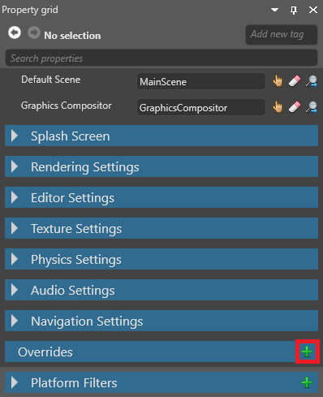

    Game Studio adds an override.

2. In the new override, next to **Platforms**, select the platforms you want the override to apply to. You can select as many as you need.

    

3. **Optional**: If you want this override to apply only to a specific GPU platform, choose it from the **Specific Filter** drop-down list.

    

    You can add GPU platforms to this list under **Platform filters** (see **Add a platform filter** below).

4. In the **Configuration** drop-down menu, select the kind of setting you want to override (**Editor**, **Texture**, **Rendering** or **Physics**).

    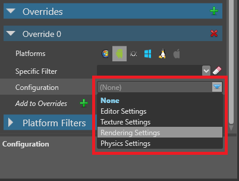

5. Set the options you want to override.

### Add a platform filter

You can choose items in the **Platform Filters** list as a specific platform filter when you set an override (see above).

1. With the **GameSettings** asset selected, in the **property grid**, expand **Platform Filters**.

    The property grid displays a list of platform filters you can use.

    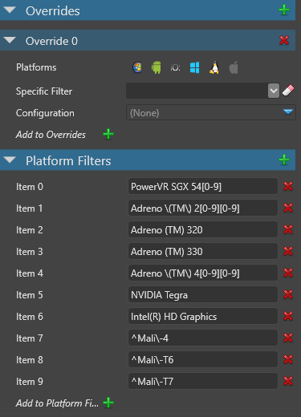

2. At the bottom of the list, click **Add to Platform Filters**.

    Game Studio adds a new empty item.

3. In the item field, type the GPU filter you want to add.

    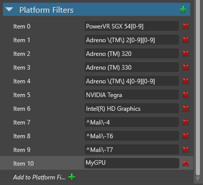

After you add a platform filter, you can select it as a **specific filter** under **Overrides**.

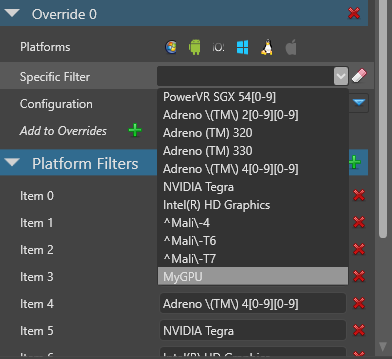

>[!Note]
>If the new filter isn't listed, remove the override and re-add it.

## See also

* [Assets](../game-studio/assets.md)