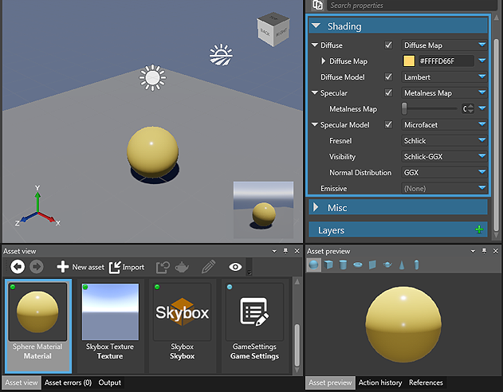
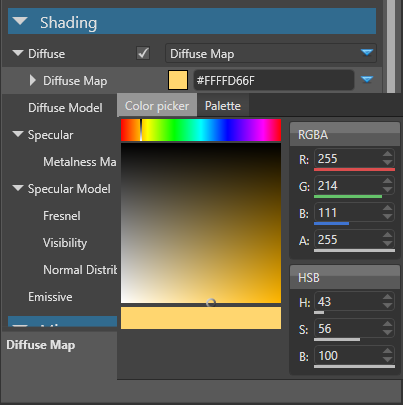
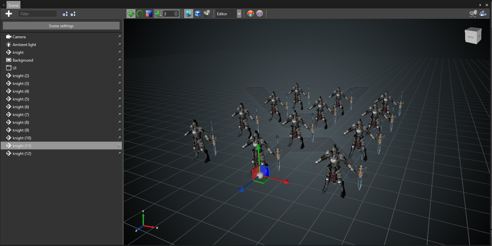
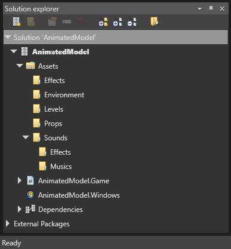
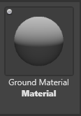
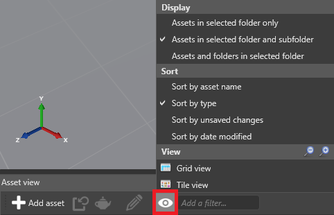
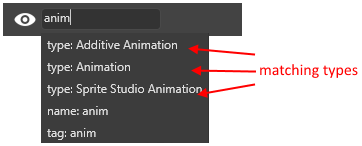

# Manage assets

Beginner

This page explains how to edit and manage your assets.

## Edit assets in the property grid

You can edit most assets using the **property grid**. By default, this is in the top-right of Game Studio.

For example, to change the color of a material asset::

 1. In the **asset view** (in the bottom by default), select the material. 
 
	

 2. In the property grid, under **Shading > Diffuse**, next to **Diffuse Map**, click the **colored box**, which displays the asset color (yellow in this example).
 
	The color picker opens.
 
	
	
 4. Select a new color for the asset.
	
	

The **asset preview** (bottom right by default) displays asset changes in real time.

The **asset view** indicates assets with unsaved changes with asterisks (*).

## Edit assets using dedicated editors

Game Studio has dedicated editors for the following asset types:

* prefabs
* scenes
* sprite sheets
* UI pages
* UI libraries
* scripts

For example, you edit scenes in the **scene editor**.

To open the dedicated editor for these types of asset:

* double-click the asset, or
* right-click the asset and select **Edit asset**, or
* select the asset and type **Ctrl + Enter**

## Organize assets

We recommend you organize your assets into subfolders by type. This makes projects much easier to manage, especially as they become large.

Assets are contained in the **Assets** folder of your project package. You can see the project in the **solution explorer** (by default shown in the bottom left).

* To create a subfolder, right-click the parent folder and select **Create subfolder**.
* To move an asset, select one or more assets in the **asset view** and drag and drop them to the folder.

> [!NOTE]
> When you move an asset, Game Studio updates all references to other assets inside the asset.

> [!TIP]
> To see the URL and type of an asset, move the mouse over the asset thumbnail.
> 
 
## Include assets in the build

By default, Game Studio doesn't include every asset when you build the game. This is because you might not need every asset at runtime (eg if the asset is incomplete).

Game Studio only includes assets which:

* you've specifically marked for inclusion (**root assets**), or 
* are **referenced** by a root asset

Whether an asset is included is indicated in the top-left of the asset thumbnail.

Color | Status
------|--------
 | Blue: The asset is a root asset and is included in the build.
 | Green: the asset is referenced by a root asset and is included in the build.
 | Gray: the asset isn't included in the build.

If you plan to load and use your asset at runtime using scripts, make sure the asset is included in the build.

To make an asset a root asset (always included in the build):
* click the **gray dot** in the top-left of the thumbnail, or
* right-click the asset and select **Include in build as root asset**

## Asset view options

To change the asset view options, click the eye icon in the asset view toolbar.

You can:

* display assets in the selected folder only, the selected folder and subfolder 
* sort assets by name, type, unsaved changes, and modification date
* switch between tile view (default) and grid view

## Filter assets

When browsing assets in the **asset view** (in the bottom by default), you can filter by name, tag, type, or a combination of all three.

The tag and name filters are "and" filters. For example, if you filter by *tag:level* and *name:knight*, the asset view only displays assets with the tag "level" **and** the name "knight".

Type filters are "or" filters. For example, if you filter by *type:animation* and *type:texture*, the asset view only displays assets that are animations **or** textures.

### Add a filter

1. In the asset view, type in the filter bar.

    Game Studio displays a list of matching filters (name, type, or tag).

    

2. * To filter by name, press Enter.

    * To filter by a tag or type, select tag or type filters in the drop-down list.

    Game Studio applies the filter and shows matching assets in the asset view. 
    
You can add multiple filters. Name filters are green, tag filters are blue, and type filters are orange.

    
### Toggle filters on and off

To toggle a filter on and off without removing it, click it. Disabled filters have darker colors.

### Remove a filter

To remove a filter, click the X icon in the filter tag.

## See also

* [Create assets](create-assets.md)
* [Manage assets](manage-assets.md)
* [Use assets](use-assets.md)