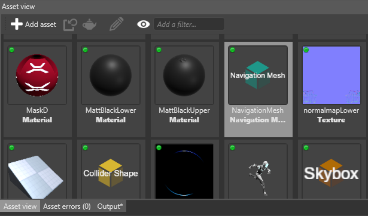
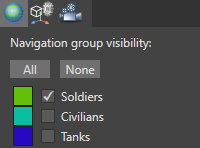
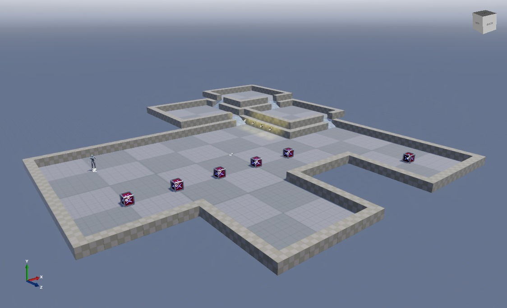

# Navigation meshes

Beginner
Level designer
Programmer

**Navigation meshes** form the area that entities with navigation components can navigate. Xenko creates a layer in the navigation mesh for each [navigation group](navigation-groups.md) you create.

Game Studio displays navigation meshes as colored overlays in your scene. The overlay shows where entities in the navigation group for that layer can move. The mesh updates in real time as you edit your scene.

<video autoplay loop class="responsive-video" poster="media/withOutlineAE.jpg">
   <source src="media/withOutlineAE.mp4" type="video/mp4">
</video>

## Create a navigation mesh

1. In the **asset view** (bottom by default), click **Add asset > Scenes > Navigation mesh**.

    

    Game Studio adds a **navigation mesh asset** to your project.

    

2. With the navigation mesh selected in the **asset view**, in the **property grid**, set the **scene** the navigation meshes in this asset apply to.

    

    For more information about scenes, see [Scenes](scenes.md).

3. Under **Selected groups**, click  (**Add a new item to the list**).

    Game Studio adds a new item to the list of groups.

    

4. Click  (**Create a new instance with the selected type**) (**Create a new instance with the selected type**) and choose a group from the drop-down menu.

    

    Xenko builds a layer in the navigation mesh for this group. For more information about groups, including how to create them, see [Navigation groups](navigation-groups.md).

5. Repeat steps 3 and 4 for as many groups as you want to use the navigation mesh.

    >[!Note]
    >If you want to create a navigation mesh for a different scene, create another navigation mesh asset and select the scene in the asset properties.

## Navigation mesh properties

| Property                  | Description                                                    
|---------------------------|--------------
| Scene                     | The scene this navigation mesh applies to
| Included collision groups | Set which collision groups the navigation mesh uses. By default, meshes use all collision groups
| Build settings            | Advanced settings for the navigation mesh
| Groups                    | The groups that use this navigation mesh

## Show or hide a navigation mesh in the scene editor

Use the **navigation visibility** menu in the scene editor toolbar.

To show or hide layers belonging to different groups, use the checkboxes. The colored boxes indicate the color of the groups displayed in the scene editor.

| Navigation mesh hidden   | Navigation mesh shown
|--------------------------| ------------
| | 

These options have no effect on runtime behavior.

## See also

* [Navigation groups](navigation-groups.md)
* [Navigation bounding boxes](navigation-bounding-boxes.md)
* [Navigation components](navigation-components.md)
* [Dynamic navigation](dynamic-navigation.md)
* [Scenes](scenes.md)