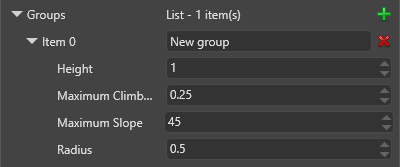
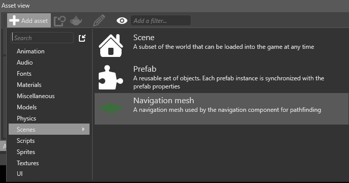
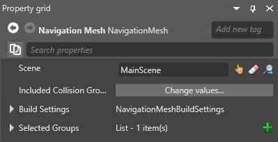
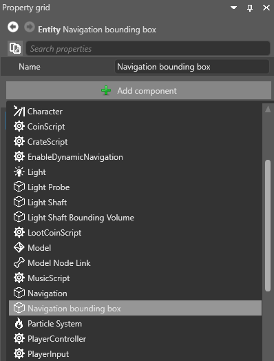
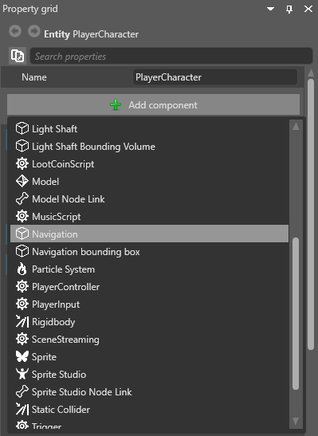
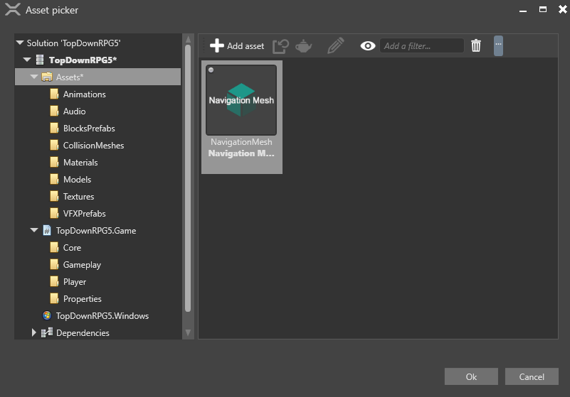

# Navigation

Beginner
Level designer
Programmer

You can use the **navigation** system to control how characters and other objects navigate scenes. The navigation system uses several elements that work together:

* navigation groups
* navigation meshes
* navigation bounding boxes
* navigation components

## 1. Create a navigation group

**Navigation groups** define different navigation properties for the entities you add to them. 

You can create different navigation groups for different kinds of entities that use navigation. For example, if your game features vehicles controlled by scripts, you might create different navigation groups for different sizes of vehicle, each with different rules: a car group, a bus group, a motorcycle group, etc.

1. In the **solution explorer** (the bottom-left pane by default), select the **Assets folder**.

    

2. In the **asset view** (the bottom pane by default), select the **GameSettings** asset.

    

3. In the **property grid** (the right-hand pane by default), expand **Navigation Settings**.

   

4. Next to **Groups**, click the green plus icon.

    Game Studio adds a new item to the list of navigation groups.

    

5. Set the properties for the navigation group. Entities you add to this group will follow the rules you set here.

### Navigation group properties

| Property             | Description
|----------------------|------------
| Item                 | The name of the group
| Height               | The height of the entities in this group. Entities can't enter areas with ceilings lower than this value.
| Maximum climb height | The maximum height that entities in this group can climb. In most cases, this should be approximately the same value as the **step height** property in the [character component](../physics/characters.md) of the entities in this group, if they have one.
| Maximum slope        | The maximum incline (in degrees) that entities in this group can climb. Entities can't go up or down slopes higher than this value. In most cases, this should be approximately the same value as the **max slope** property in the [character component](../physics/characters.md) of the entities in this group, if they have one.
| Radius               | The size of the entities in this group. The larger this value, the larger the area of the navigation mesh they use.

## 2. Add a navigation mesh

The **navigation mesh** is the area in the scene that entities can navigate.

1. In the **asset view** (bottom by default), click **Add asset > Navigation > Navigation mesh**.

    

    Game Studio adds a navigation mesh asset to your project.

    

2. With the navigation mesh selected in the **asset view**, in the **property grid**, set the **scene** the navigation mesh applies to.

    

    For more information about scenes, see [Scenes](scenes.md).

## 3. Add a navigation bounding box

The **navigation bounding box** defines the area the navigation mesh covers. You can use it to create smaller navigation areas in your scene, rather than having the mesh cover the entire scene.

1. In the scene, select the entity you want to contain the bounding box, or create a new entity.

2. With the entity selected, in the **property grid**, click **Add component** and select **Navigation bounding box**. 

    

    Game Studio adds a navigation bounding box to the entity.

3. Under the **Navigation bounding box** component properties, set the size of the bounding box using the XYZ values.

    

4. Use the entity's transform component to position the bounding box where you need it in your scene.

## 4. Add a navigation component

**Navigation components** allow entities to use the navigation mesh to find paths through your scenes.

1. Select an entity you want to use navigation, such as a non-player character.

2. In the **property grid**, click **Add component** and select **Navigation**.

    

    Game Studio adds a navigation component to the entity.

3. Under the **Navigation** component properties, next to **Navigation mesh**, select the navigation mesh you want this entity to use.

    

4. Under **Group**, select the navigation group the entity should belong to. The entity will follow the navigation rules you set in this group.

## 5. Use navigation in a script

Entities can't use navigation until you set it up with a script.

## Sample project

For an example of how to implement navigation, see the **top-down RPG** sample project included with Xenko.