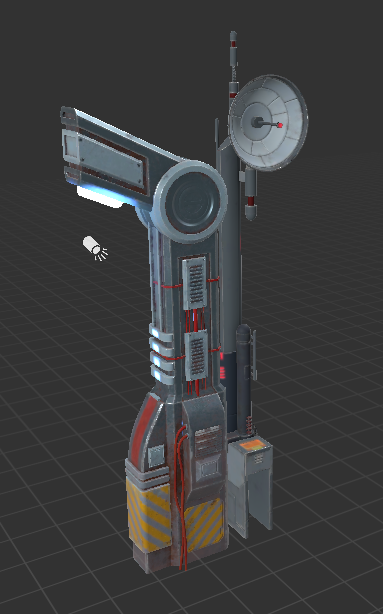
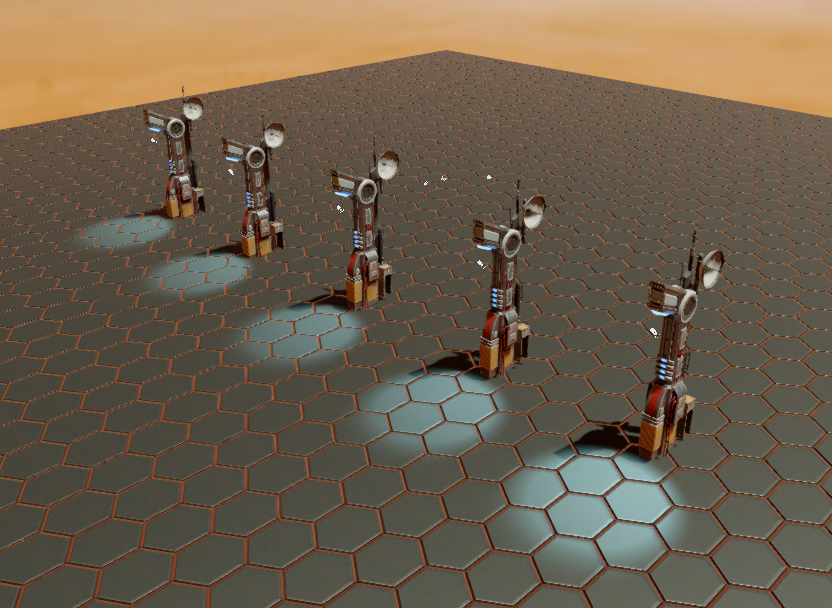
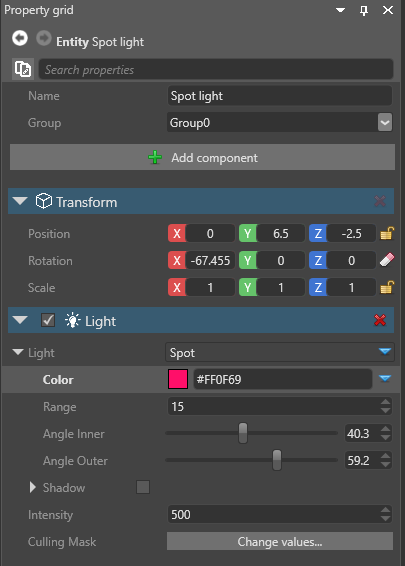
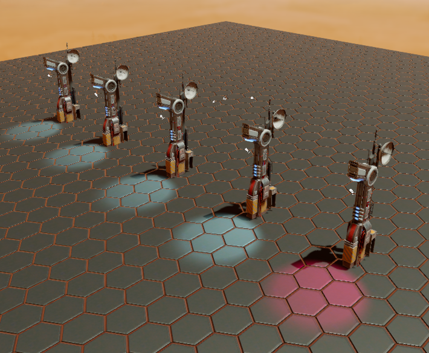
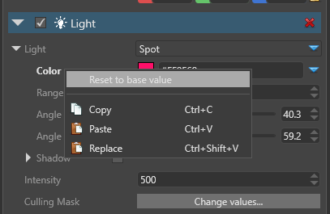

# Override prefab properties
Beginner
Programmer
Designer

When you change a property in an instance created from a prefab, it **overrides** the property in the prefab. This means you can create several instances of an object using the same base prefab, then adjust each instance to your needs.

If you then change the property in the prefab, the overridden instance doesn't change. It stays overridden until you reset the property's base value.

## Example

In this example, we have a prefab of a futuristic lamppost.

The lamppost prefab is composed of three entities: a column, a pillar, and a spot light. These are listed in the entity tree in the Prefab Editor.

Let's add five instances of the lamppost prefab to our scene.

Now let's modify one of the instances. In the Scene Editor, we select one **spot light** entity and, in the spot light component properties, change its color to red. The Properties Grid displays the modified **Color** property in **bold**. This means it's overriding the prefab property.

Now let's see what happens when we go back to the Prefab Editor and change the color of the spot light in the prefab to green.

Four of the lampposts now have a green light. The fifth is still red, as it's still using the override we set before.

## Reset the prefab value

To reset an overridden property, right-click it and select **Reset to base value**. The property returns to the value in the prefab.

