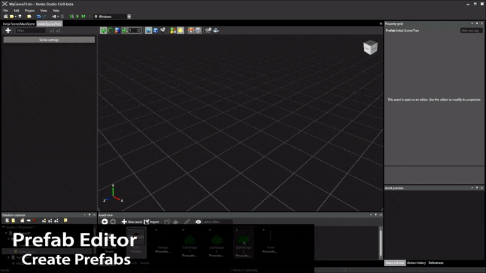

# Prefabs
Intermediate
Programmer
Designer

A **prefab** is a "master" version of an object that you can reuse wherever you need. When you change the prefab, every instance of the prefab changes too.

For example, imagine we make a simple tree object by assembling several entities. The entities contain components such as models, materials, physics colliders, and so on, which in turn reference assets. 

Now imagine we want to place several trees around the scene. We could simply duplicate the tree, but if we want to modify it later, we have to edit each one individually. This is time-consuming and leaves room for mistakes.

The better approach is to make the a tree prefab. Then we can place as many trees as we like, and when we modify the prefab, every tree is instantly updated to match. This saves lots of time.

The most common use for prefabs is to create a small piece of your scene - like a car, NPC, or item of furniture - and duplicate it as many times as you need. When you need to modify it - for example, if you want to change its model - you can change it in one place and apply the change everywhere at once.

You can make any entity or combination of entities of a prefab; they can be as simple or as complex as you need. Prefabs can even contain other prefabs (known as **nested prefabs**).

You can also override specific prefab properties in each prefab instance.

## See also

* [Create prefabs](create-prefabs.md)
* [Use prefabs](use-prefabs.md)
* [Edit prefabs](edit-prefabs.md)
* [Nested prefabs](nested-prefabs.md)
* [Override prefab properties](override-prefab-properties.md)