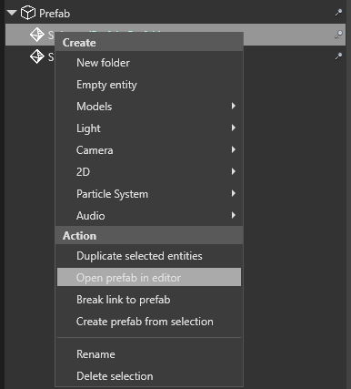
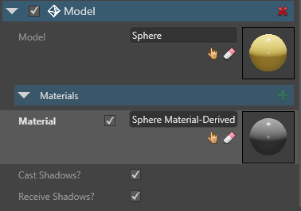
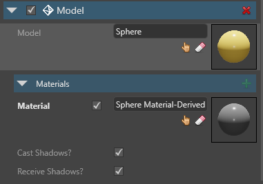

# Use Prefab Instances
<span class="label label-doc-level">Intermediate</span>
<span class="label label-doc-audience">Programmer</span>
<span class="label label-doc-audience">Designer</span>

Once you [Create a Prefab](create-and-manage-prefabs.md), you can use it in the Scene:

1. Instantiate.
2. Modify these **Instances**.
3. Reset properties to original values.
4. Break link to prefab
5. Use **Scripts** to animate **Prefab Instances** at runtime.

## Create Prefab Instances
To instantiate a **Prefab**, drag and drop it from **Asset View** to the **Scene**.

> [!Tip] To create a **Nested Prefab**, you can also drag and drop it from **Asset View** to **Prefab Editor**.

When you add a **Prefab** to a scene, you create its **Instance**.
In Scene Editor, **Prefab Instance** is displayed as **Parent Entity** and **Prefab Elements** as its **Children**.


You can re-arrange **Entities** of the **Prefab Instance** just like you do with other **Entities**:

* Create **Child** and **Parent** entities.
* Drag **Entities** to add them to the **Prefab Instance**.
* Drag **Entities** away from the **Prefab Instance** to make them independent entities.

Sometimes, you instantiate a Prefab, modify it, and then want to re-use this modified **Prefab**.
In that case, simply create a new **Prefab** from the **Prefab Instance**. You can further re-use it like a separate Prefab.

## Modify Prefab Instances
### Adjust in Scene Editor
Once you create **Prefab Instance**, customize it like any other **Entity**:

* Use transformation gizmos to _Translate_, _Rotate_ and _Scale_.
* Change **Materials** and **Textures**.
* **Add Components**, e.g. **Scripts**, **Animations**, etc.

You can customize **Prefab Instance** as a single unit, or edit any of its **Child Entities** independently.
For more information on **Entities** and their components, see [Populate a Scene](../get-started/populate-a-scene.md).

> [!Note] When you modify **Prefab Instances**, the **Prefab** itself **is unaffected**.

### Access Prefab from its Instance

You can access **Prefab** from its **Instances**.
In **Scene Editor**, right-click any child of a **Prefab Instance** and select _Open Prefab in Editor_.



### Reset Properties to Base Values
In **Property Grid**, you can see which properties of the **Prefab instance** differ from the **Prefab**: 

* **Overridden** and **unique** properties appear **white**.

     

* **Identical** properties appear **gray**.

     

In **Property Grid**, you can also press **Display only overriden properties** to see only the properties that differ from the **Prefab**:

 

You can always reset overridden or unique properties of the **Prefab Instance** to the base value of the parent **Prefab**.

To do so, right-click the property and click _Peset to base value_.


### Break Link to Prefab

You can break link between a **Prefab** and **Child Entities** of the **Prefab Instance**:

1. In **Scene Editor**, right-click any child entity of the prefab instance. You can select multiple children and break link to all of them at once.
2. Click _Break Link to Prefab_.


After you break link, the selected **Entities** of the **Prefab Instance** are no longer affected by the changes you make to the **Prefab**.

## Code Samples
Suppose you have a **Prefab** called _'MyBulletPrefab'_.
It is in the root folder of your project, and you want to instantiate that **Prefab** in your **Scene**.

Use the following code samples:

```cs
private void InstantiateBulletPrefab()
{
    // Note that "MyBulletPrefab" refers to the name and location of your prefab Asset.
    var myBulletPrefab = Asset.Load<Prefab>("MyBulletPrefab");
    
    //Instantiate a Prefab.
    var bullet = myBulletPrefab.Instantiate();

    // Add the bullet to the scene.
    SceneSystem.SceneInstance.Scene.Entities.AddRange(bullet); 

    // Change the X coordinate.
    bullet.Transform.Position.X = 20.0f;
    
    // Add the bullet to the scene.
    SceneSystem.SceneInstance.Scene.Entities.Add(bullet);
}
```
