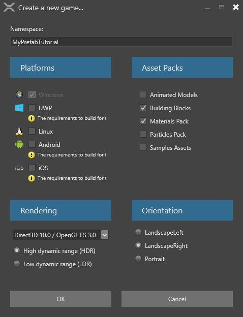

# Tutorial: Make a prefab

>[!Note]
> This tutorial assumes you know how to add entities and components. For more information about...

## 1. Set up the project

1. In the Xenko Launcher, click Start.
2. In the New/open project dialog, select **New Game** and click **Select**.

    The **Create new game** dialog opens. 
3. Specify a name for the project (eg *MyPrefabTutorial*).
4. Under **Asset Packs**, select **Building Blocks** and **Materials Packs**. We'll use these asset packs to build our prefabs.

    

5. Click **OK**.
    Game Studio launches.

# Tutorial: Make a prefab

Let's create a simple ladder prefab.

1. In the **Asset view**, click **Add asset** and select **Prefabs** -> **Prefab**.

    Game Studio adds a prefab asset to the project. 
    Right now, it has nothing in it, and has the default name **Prefab**. 
    
2. Since we're going to make a ladder prefab, let's rename the prefab **Ladder prefab**.
    
    Let's add an entity to the prefab.

3. Double-click the Ladder prefab asset. The **Prefab Editor** opens.

The Prefab Editor is similar to the Scene Editor. You can:

* add entities
* use transformation gizmos to translate, rotate and scale entities
* create parent-child relationships between entities
* add and modify entity components (scripts, materials, models, animations, etc)

4. Create an entity and add the ladder.

Right-click the entity tree and, under **Create**, select **Empty entity**.

    Game Studio adds an empty entity to the prefab.

    Let's give the entity a model component.

5. With the entity selected, in the **Property grid**, click **Add component** and select **Model**.

6. Under the **Model** component, under **Model**, click the hand icon (**Pick an asset up**).

    The **Asset picker** opens.

7. Browse to the **Models** folder, select the **Ladder0x2x0** model, and click **OK**.

Now our Ladder entity has a ladder model. The model has the default material **GridMT**, which doesn't look much like a ladder. Let's give it a more realistic material.

1. Under the **Model** component, under **Materials**, click the hand icon (**Pick an asset up**). The **Asset picker** opens.

2. Browse to **Materials** > **iron_paint**, select the **iron-paint** material and click **OK**.

Now we've created a simple ladder prefab with a model and a material. Let's see how we can use it in the scene.

1. Back in the **Scene Editor**, create an instance of the Ladder prefab by dragging it into the scene and positioning it wherever you like.

2. Duplicate the ladder instance a few times.

>[!Tip]
> To quickly duplicate an entity, select it, then hold Ctrl and move it along the X, Y, or Z axis.

