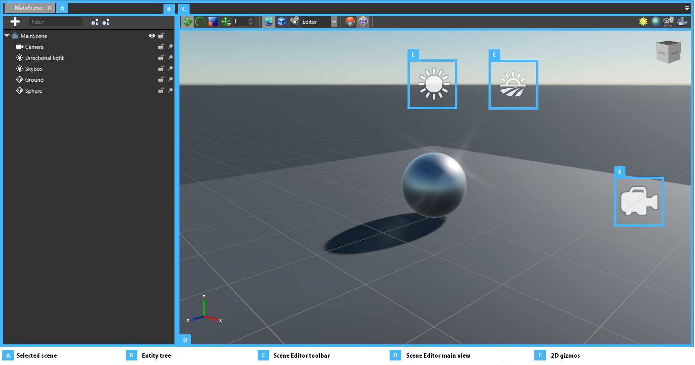

# Create and open a scene

Beginner
Level Designer

Scenes are complex assets that cannot be edited directly from the property grid.
To edit a scene use the **scene editor**, a specialized tool to edit scenes.

In this page, we will explain the basics of the scene editor and see how to create and open new scenes.

## The scene editor

After creating a new project, an initial scene is automatically created and opened in the editor.
You can see the content of your scene in the **central region** of the Game Studio.

You can find the name of the scene that you are currently editing in the scene editor tab.
This is useful when you have several scenes opened at the same time.

The **left part** of the editor shows you the **hierarchy of the entities** included in your scene.
The same entity hierarchy is applied at runtime. This panel is useful to browse, select, rename and reorganize your entities.

The **right part** of the editor shows the entities of your scene in a **visual manner**.
Entities that have a shape are naturally represented in the editor using their shape. 
For the entities that **don't have any shape**, the editor uses **2D gizmos** to represent them.
At the top of the view is the tool bar that can be used to modify entities of the scene and change display options.

## Create a new scene

As soon as you want to create another level for your game, you will need to **create a new scene**.

To create a new scene:

1. Click on the **Add Asset** button in asset view
2. Go under the *Scenes* category and select the appropriate **scene template**

The following templates are available by default in Xenko.

Template | Result
---------|--------
Empty Scene | An empty scene containing no entity and with no pre-configured rendering pipeline
Scene with HDR pipeline | A scene containing basic elements and pre-configured for HDR rendering
Scene with LDR pipeline | A scene containing basic elements and pre-configured for LDR rendering

## Open a new scene

To open your new scene, simply **double click** on new scene asset or press **Ctrl+Enter** after selecting it.

> [!TIP]
> You can open several scene editors at the same time. 
> To switch between the different scenes use the upper-left tabs.

Now that you know the basics about the scene editor, let's see in more details how to build a scene. 
First let's see how to [Populate your scene with entities](populate-a-scene.md).
