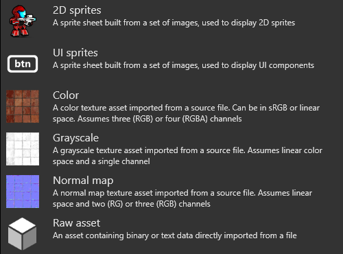

# Create assets

Beginner

There are two ways to create assets:

 * Use the **Add asset** button in the **Asset View**
 * Drag and drop **resource files** (such as image or audio files) to the **Asset view** tab
 
## Use the 'Add asset' button

 1. In the *Asset View*, click 

 2. Select the type of asset you want to create.

	
 	
	Game Studio displays a list of asset templates. These are assets configured for a specific use.
	
 3. Select the template closest to your needs.

    Game Studio adds the asset to the asset view:

	

> [!Note]
> Some assets, such as textures, require a resource file. When you add these assets, Game Studio prompts you for a resource file.

## Drag and drop resource files

1. Drag and drop a resource file from Explorer to the asset view:

	

2. After you drop the resource file, select the template closest to your needs:
   
	

3. Game Studio adds the asset to the asset view:

	

Game Studio automatically imports all dependencies in the resource files and creates corresponding assets. For example, you can add a model or animation resource file and Game Studio handles everything else.

> [!TIP]
> You can drag multiple files simultaneously. If you drop multiple files of different types at the same time, Game Studio only adds only files that match your template selection. For example, if you add an image file and a sound file, then select the Sound asset template, only the sound file is added.

> [!NOTE]
> * By dragging and dropping, you can only create assets from single resource files. You can't create assets that don't use resource files, such as prefabs, materials, or scenes.
> * When you add a resource file, Game Studio doesn't add a copy of the file to the project Resources folder. This is to stop Game Studio creating unnecessary copies and to let you manage your files how you want. To keep all your project files in one place, we recommend you **add a copy of the resource file to the project Resources folder first**, then use this copy in your project.

## What's next?

* [Learn how to manage assets](manage-assets.md)