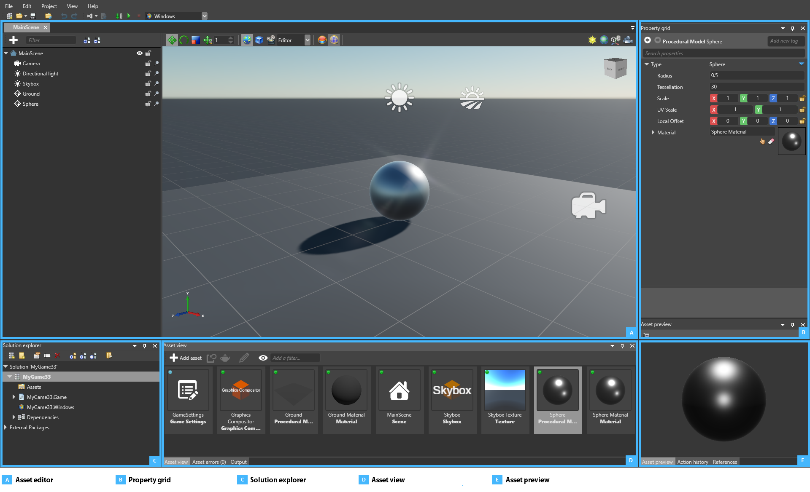
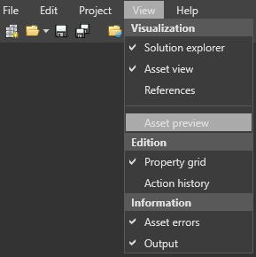

# Game Studio

Beginner

**Game Studio** is the central tool for game and application production in Xenko. In Game Studio, you can create and manage content, and configure, preview, and launch your project.

The **asset editor** (A) is used to edit assets and scenes. Some asset types, such as scenes [scenes](create-a-scene.md), have dedicated editors where you can make complex changes to the asset. To open a dedicated editor (when available), double-click the asset or right-click it and select **Edit asset**.

The **property grid** (B) displays the properties of the asset or entity you selected. You can edit the properties here.

The **solution explorer** (C) displays the hierarchy of the elements of your project, such as assets, code files, packages and dependencies. You can create folders and objects, rename them, and move them.

The **asset view** (D) displays the project assets. You can create new assets using the **New Asset** button or by dragging and dropping resource files into the asset view. You can also drag and drop assets from the asset view to the different editors or the property grid to create a new instance of the asset or add a reference to it. By default, the asset view is in the bottom center.

> [!TIP] 
> To change how assets are displayed in the asset view, click the eye icon:
> 

The **asset preview** tab (E) displays a preview of the selected asset. The preview changes based on the type of the asset you have selected. For example, you can play animations and sounds. This is a quick way to check changes to an asset when editing it in the property grid. By default, the asset preview is in the bottom right.

You can show and hide different parts of the Game Studio in the View menu.

You can also resize and move parts of the UI.