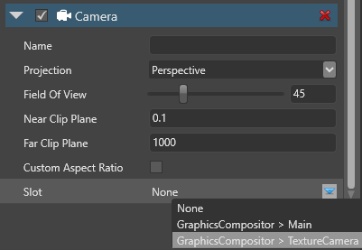

# Camera slots

**Camera slots** link the graphics compositor to the camera entities in your scene. You bind each camera to a slot, then define which slot the compositor uses. This means you can change the [root scene](../../game-studio/manage-scenes.md) or [graphics compositor](index.md) without having to assign new cameras each time.

You can create as many camera slots as you need, but you don't have to create a different camera slot for each camera in your scene. In fact, you can have fewer slots than cameras, and just change which cameras use each slot. The best practice is to disable the camera components on cameras you don't want to render.

> [!Note]
> Each camera slot must have a camera assigned to it. If you have an unused camera slot, delete it.
>
> You can't assign a single camera to more than one slot. If you need to do this, duplicate the camera entity and assign it to a different slot.

> If multiple enabled cameras in your scene use the same camera slot, the result is undefined.

## Create a camera slot

In the graphics compositor editor, on the left, under **Camera slots**, click .


> [!Tip]
> To name a camera slot, double-click it in the list and type a new name.

## Bind a camera to a camera slot

1. In your scene, select the **entity** with the camera component you want to bind.

2. In the **property grid** (on the right by default), in the **Camera** component properties, under **Slot**, select the slot you want to bind the camera to.

    > [!Note]
    > The drop-down menu lists camera slots from the graphics compositor selected in the [game settings](../../game-studio/game-settings.md).

    

The graphics compositor matches enabled cameras to their appropriate slots each frame.

## Create a camera and assign a camera slot from a script

Use:

```cs
var camera = new CameraComponent();
 camera.Slot = SceneSystem.GraphicsCompositor.Cameras[0].ToSlotId();
```

> [!Note]
> Must sure you:
>
> * always have at least one enabled camera
>
> * don't have two cameras enabled and assigned to the same slot at the same time 

## See also

* [Graphics compositor](index.md)
* [Game Studio - Game settings](../../game-studio/game-settings.md)
* [Game Studio - Manage scenes](../../game-studio/manage-scenes.md)