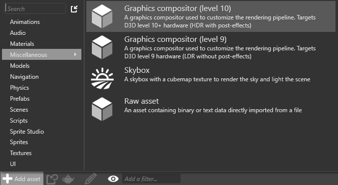
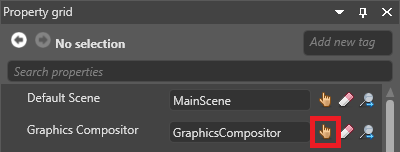
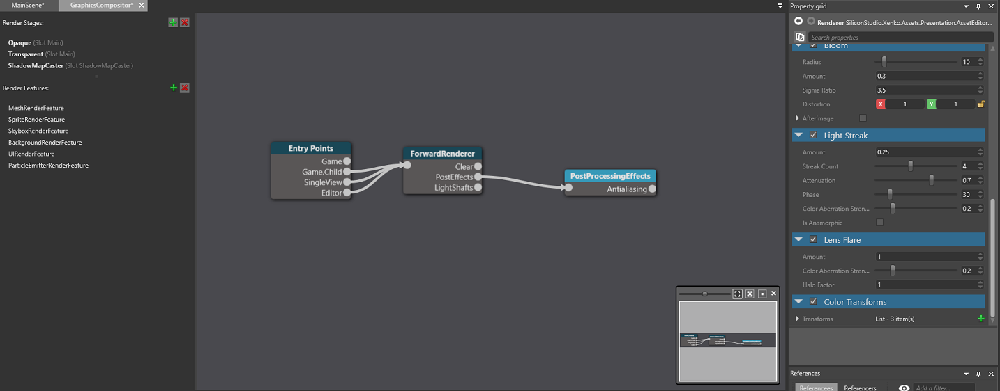

# Graphics compositor

Advanced
Programmer

>[!Note]
>This page requires a basic understanding of graphics pipelines.

The **graphics compositor** organizes how [scenes](../../game-studio/scenes.md) are rendered. You can use it to customize almost every part of the rendering pipeline. For example, you can:

- use one or multiple cameras
- filter entities in the scene
- render to one or more render targets, with different viewports
- render to a texture used by a material (eg a rear-view mirror)
- set HDR or LDR rendering
- apply post effects on a render target, selected before/after rendering a camera
- clear a render target or clear only the depth buffer (eg to always render on top of a render target in a FPS game, or render the UI)
- manipulate the compositor from scripts (or any animation system) in the scene to modify the composition, enable effects, etc

## Create a graphics compositor

Xenko includes a graphics compositor by default when you create a project.

If you need to create a graphics compositor, in the **asset view**, click **Add asset** and select **Misc > Graphics compositor**.

You can choose:

* Level 9 (HDR with post effects)
* Level 10 (LDR with no post effects)

These aren't different kinds of graphics compositor, but rather presets you can customize as you need.

## Set the graphics compositor

You can have multiple graphics compositors in your project, but you can only use one compositor at a time. At runtime, Xenko uses the graphics compositor you specify in [Game Settings](../../game-studio/game-settings.md).

You can change which graphics compositor your game uses at runtime in a script. 

## Open the graphics compositor editor

>[!Note]
>The graphics compositor editor is an experimental feature. It will be improved in future versions.

In the **asset view** (in the bottom pane by default), double-click the **Graphics Compositor** asset.

The Graphics Compositor editor opens.

## Entry points

In the **Entry Points** node, you set up the entry points for your rendering pipeline. There are three entry points:

* **Game**, to render your game
* **Editor**, to render the Game Studio editor
* **Single view** (referred to as **Utility** in the property grid), to render other things, such as light probes and skyboxes

Each entry point can use a separate rendering pipeline. For example, the game and editor might share the same forward renderer and post effects while your single view uses a separate forward renderer.

### Connect an entry point to a renderer

1. Select the **Entry point** node.

2. In the **property grid**, next to the entry point you want to connect (**Editor**, **Game** or **Utility**), select the renderer you want to connect to.

    

For information about the different renderers, see [Scene renders](scene-renderers.md).

