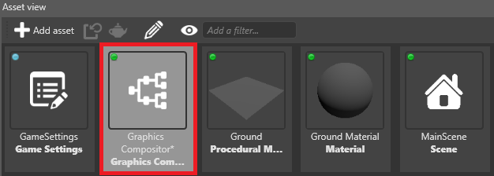
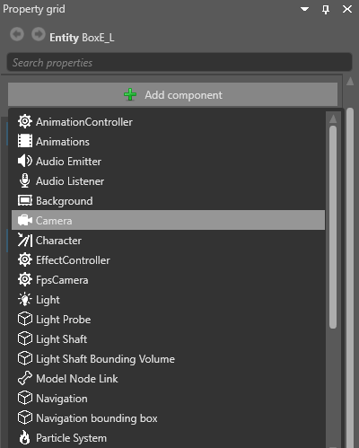
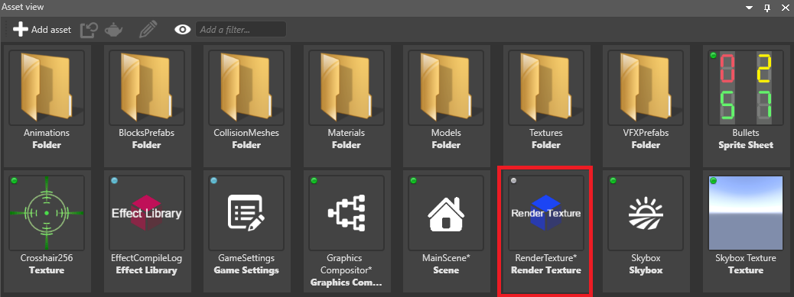
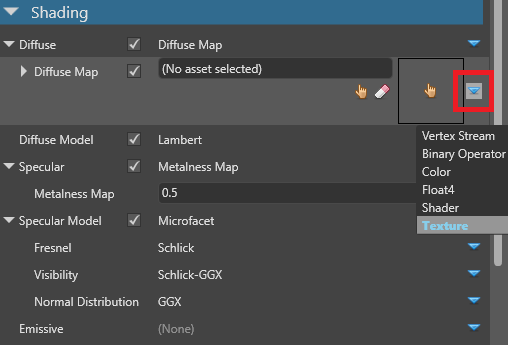
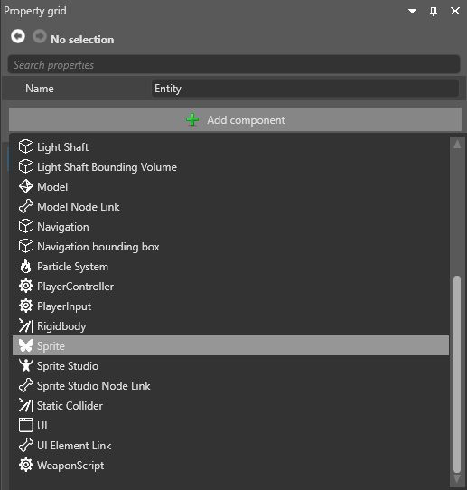
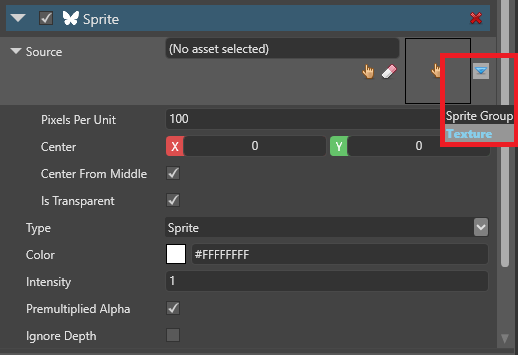
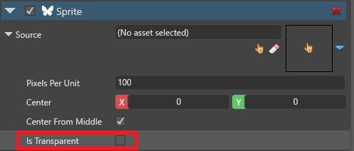

# Render to a texture

You can render to textures in your scene instead of directly to the screen. You can use this, for example, to display part of your scene on a TV screen in the same scene, such as security camera footage.

## 1. Create a camera slot

Camera slots link the graphics compositor to the cameras in your scene. For more information, see [Camera slots](camera-slots.md).

1. In the **asset view** (in the bottom pane by default), double-click the **Graphics Compositor** asset.

    

    The graphics compositor editor opens.

    

2. On the left, under **Camera slots**, click the **green plus** icon to create a camera slot.

    

    > [!Tip]
    > To name a camera slot, double-click it in the list and type a new name.

## 2. Create a camera and bind it to the slot

1. In your scene, add a camera component to the entity you want to be your camera.

    

2. Position the entity so the camera captures the area of the scene you want to render to a texture.

3. In the **property grid** (on the right by default), in the **Camera** component properties, under **Slot**, select the slot you created in the previous step.

    

4. Position your camera so it captures the area of the scene you want to render to a texture.

## 3. Create a render target texture

The render target texture displays the camera output.

In the **asset view**, click **Add asset** and select **Texture** > **Render target**.

Game Studio adds a **render target** texture to your project assets.

 

## 4. Use a render target texture

Use the render target texture in the scene where you want to display the camera output. This page suggests two examples.

### Use the render target texture in a material

1. In the material properties, under **Shading**, next to **Diffuse map**, click the **blue arrow** button and select **Texture**.

    

2. Click the **hand** icon (**pick asset up**) to open the asset picker.

3. In the asset picker, select the **Render texture** asset and click **OK**.

    

### Use the render target texture in a sprite component

1. Create an entity and position it where you want to display the texture.

2. With the entity selected, in the **Property grid**, click **Add component** and add a **sprite** component.

    

3. In the sprite component properties, next to **Source**, click the **blue arrow** button and select **Texture**.

    

4. Click the **hand** icon (**pick asset up**) to open the asset picker.

5. In the asset picker, select the **Render texture** asset and click **OK**.

    

6. Under the **Source** properties, clear the **Is transparent** checkbox.

    

## 5. Set up the graphics compositor

> [!Note]
> There are several ways to implement this in the graphics compositor. This page explains one method.

1. In the graphics compositor, select the **Entry points** node.

    

2. In the **property grid** on the right, next to **Game renderer**, click the blue arrow and select **

...

3. Select **SceneRendererCollection**.

4. 

## Sample

For an example of rendering to a camera in a project, see the **Animation** sample included with Xenko.