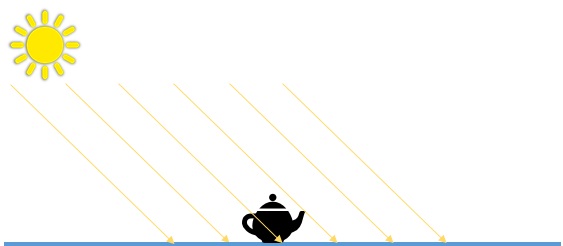
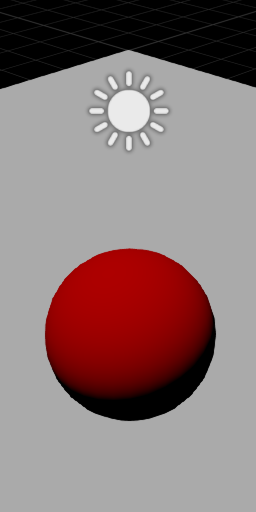
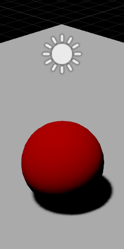
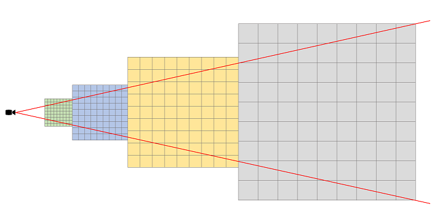
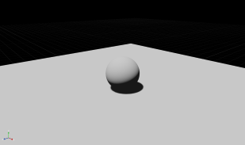

# Directional lights

A **directional light** comes uniformly from one direction. This is often used for simulating distant lights such as the sun.

 

Game Studio shows directional lights with the following icon:

 

When you select a directional light, the gizmo displays the light's main direction:

 

## Properties

 

| Property     | Description                                                                                                         |
| ------------ | ------------------------------------------------------------------------------------------------------------------- |
| Type         | Directional                                                                                                         |
| Color        | The color of the directional light. Note that currently, the light supports an RGB color. Future versions of Xenko will also support temperature colors.
| Shadow      | Documented in the section below
|Intensity| The intensity of the light. The color is multiplied by this value before being sent to the shader. Note that currently this value has no units. This will change in future versions                                      |
| Culling Mask | Defines which entity groups are affected by this light. By default, all groups are affected                        |

## Shadows

Shadows bring significant information and realism to a scene.

| Shadows **off**                                          | Shadows **on**                                               |
| -------------------------------------------------------- | ------------------------------------------------------------ |
|   |   |

In the case of directional lights, shadow effects can spawn across a large view range. This means they require special treatment to improve their realism.

### Cascades

The technique used for directional light shadows is **cascaded shadow mapping**. This consists of rendering depth of occluder's objects from the point of view of the light to a texture, then rendering the scene, taking the occluder information into account.

The cascade term implies that multiple textures are used to slice the depth range from the camera's point of view, allocating more pixels for the viewspace closer to the camera.

 

If the debug property is set on the shadow, you can visualize the cascades. In the following example, we have a directional light configured with four cascades:

| Cascades Debug Off                                                   | Cascades Debug On                                                    |
| -------------------------------------------------------------------- | -------------------------------------------------------------------- |
|   |   |

The colors shows the selected cascade texture for each distance range (Green:0, Blue:1, Purple: 2, Red: 3).

### Properties

| Property            | Description                                                                                                                                                                                                                       |
| ------------------- | --------------------------------------------------------------------------------------------------------------------------------------------------------------------------------------------------------------------------------- |
| Filter              | Filtering produces **soft shadows** instead of **hard shadows**. Currently, the implemented technique is PCF (Percentage Closer Filtering). Other techniques will be implemented in future versions
| Size                | The size of the shadow map texture. Values are **extra large**, **large**, **medium**, **small** and **extra small**. See [shadow map atlas size calculation](shadow-optimization.md) for more information. For a directional light, this value is by default **large**, as a directional light has more visual impact than a range limited light                                                                                            |
| Cascade Count       | The number of cascades used for slicing the range of depth covered by the light. Values are 1, 2 or 4 cascades, though a typical scene would use 4 cascades.                                                                      |
| Stabilization mode  | Defines the technique used to lower the effect of shadow map flickering. Values are **none**, **Projection Snapping** and **View Snapping**.          Shadow map flickering is a result of the potential aliasing introduced by the shadow map technique, Whenever a texel from the point-of-view of the light covers more space than a texel from the camera's point of view.   Projection snapping tries to snap the projection matrix of the light to snap it on a texel dependent on the resolution of the shadow map texture.  View snapping tries to snap the target of the view matrix of the light (center of the camera view cascade frustum).  Both projection and view snapping force the shadow matrix to cover a larger region, increasing the aliasing of the shadow map texture.   Note that when using depth range camera is set to automatic, the stabilization mode is ignored                                                                                                                                   |
| Depth Range         | Defines how is calculated the visible depth range from the camera point-of-view. This directly affects how near and how far cascades splits occur                                                                                |
| Automatic           | If enabled, the visible depth range is read back from the actual depth buffer and the min and max view distance is calculated automatically                                                                                      |
| Guard Distance      | A guard distance in meters per rendering frame that is added to ensure that when the camera is moving, the visible depth range is still valid. This property is only valid for the automatic depth range mode.  For example, if the game is running at 60FPS and the guard distance is 1m, it means that the camera shouldn't move faster than 1m per 1/60s                                                                                     |
| Manual Min Distance | The minimum depth in meters, valid when the automatic mode is disabled                                                                                                                                                  |
| Manual Max Distance | The maximum depth in meters, valid when the automatic mode is disabled                                                                                                                                                  |
| Blend Cascades      | Determines whether to smooth the transition between cascades from the point of view. If set to false, there's no transition when the shadow is rendered with a different cascade                                                |
| Partition mode      | Determines how cascades split distance is determined.   **Manual**: the split is defined manually for each cascade, in percentage of the visible depth range. A value of 0.1 for a cascade means that the cascade is rendered on the distance 0.1 * (VisibleDepthMax - VisibleDepthMin)   **Logarithmic**: the split is automatically calculated using a logarithmic scale   The PSSM factor lets you blend from a pure logarithmic scale (0.0f) to a pure uniform scale (1.0f)                                                                                            |
| Bias Parameters     | Used to avoid some artifacts of the shadow map technique                                                                                                                                                     |
| Depth Bias          | The amount of depth to add to the sampling depth to avoid the phenomenon of shadow acne                                                                                                                                          |
| Normal Offset Scale | A factor multiplied by the depth bias toward the normal                                                                                                                                                                           |
| Debug               | For debugging purposes. If set to true, the shadow map displays a color per cascade                                                                                                                                           |

 

 

 

