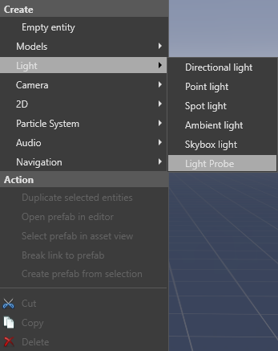

## Light probes

**Light probes** sample areas of lighting in your scene. Xenko then interpolates the lighting between the samples taken by light probes.

**Light probes** are a cheap way to simulate the effect of light bouncing off surfaces and illuminating other surfaces...

## How light probes work

Each time you click the button, it "bounces" light again, simulating the effect of light bouncing back and forth between surfaces and building an increasingly realistic capture around the light probe. You can click the bounce button as many times as you want without slowing performance. However, this has diminishing returns; after a few bounces, the changes become unnoticeable. Five or six bounces should be sufficient.

## Create a light probe

Light probes are entities.

* Right-click the scene or entity tree and select 

## Create and place light probes

Game Studio displays light probes in the scene editor as 

You can place them in the same way as other entities.

## Where to place light probes

To preserve CPU, we recommend you use as few light probes as possible, positioning them to create maximum effect with the minimum number of probes.

Generally, you should place light probes where the lighting in your scene changes abruptly, such as at the edges of shadowy areas or between areas of different color. You usually don't need light probes in areas without major lighting changes, such as across dark areas.