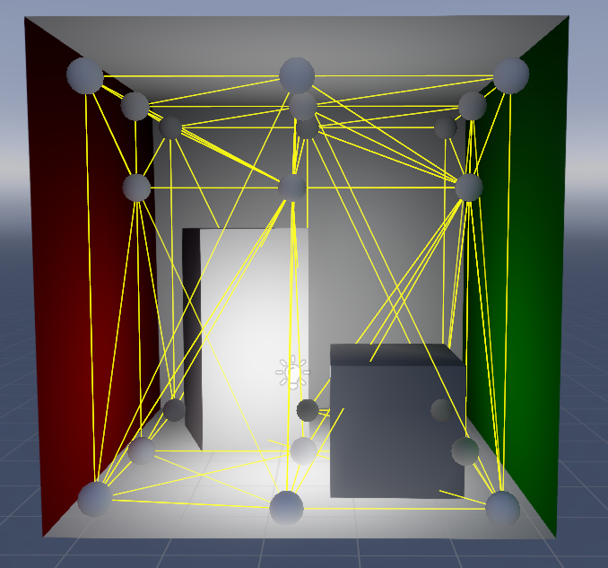
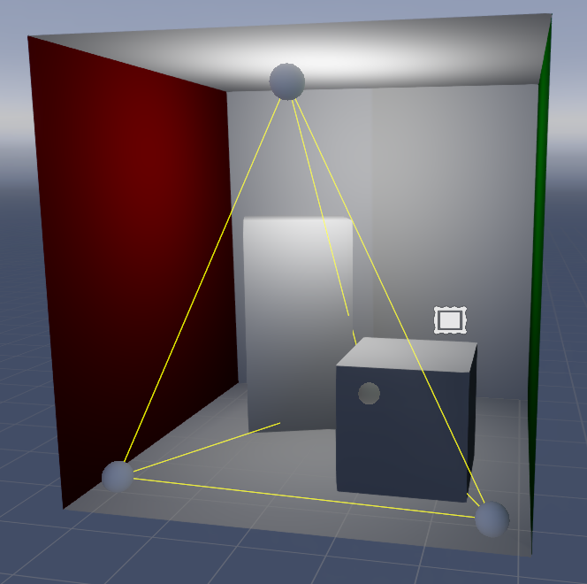

# Light probes

**Light probes** simulate the effect of light bouncing off surfaces and illuminating other surfaces in your scene.

Light probes create areas in which light is reflected between surfaces. The screenshot below shows a [point light](point-lights.md) surrounded by light probes.

The light from the point light bounces off surfaces in and around the light probe area, and is reflected onto other surfaces. For example, in the screenshot below, notice how the red of the wall is reflected on the other objects.

Light probes affect all objects in the area they cover, including static and dynamic objects. You don't need to enable any extra options on the entities that light probes affect.

## 1. Create a light probe

Right-click the scene or entity tree and select **Light > Light probe**.

Alternatively, create an empty entity and add a **Light probe component** in the property grid.

Game Studio adds a light probe to the scene. 

Light probes appear as spheres in the scene editor. Before you capture a light bounce for the the first time, they have a completely black surface.

>[!Tip]
>You can quickly duplicate light probes just like other entities. To do this, select a light probe, hold Ctrl, and move it with the mouse.

## 2. Place light probes

Light probes must be placed in a way that creates a **3D volume**. Light is reflected in this area. This means:

* you need at least four light probes in the scene - enough to create the four points of a tetrahedron, as below:

    

* you can't place light probes on a single (ie 2D) plane. For example, the probes in this screenshot won't work, as they are on a flat plane and create no volume:

    

A typical strategy is to place light probes in a grid across your scene covering a general area, as in the screenshots below:

## 3. Capture light bounces

In the scene editor toolbar, click the **new light bounce** button. This:

* clears existing light bounces
* generates a new light bounce

>[!Tip]
>If you change the light sources in your scene, click **new light bounce** again to remove the old lighting and capture the new lighting.

After you create the first light bounce, click the **generate additional light bounce** button. This bounces the light again, simulating the effect of light bouncing back and forth between surfaces multiple times, and increasing the realism of the light bounces.

You can click the bounce button as many times as you want without affecting performance. However, this has diminishing returns; after a few bounces, the changes become unnoticeable. Three or four bounces should be enough.

## Show and hide light probes

To change the visibility of the light probes in the scene editor, under the **gizmo options** in the scene editor toolbar, use the **Light probes** checkbox.

You can still see the effect of the light probes in the scene editor.

## Show and hide light probe grid

To change the visibility of the light probe grid in the scene editor, under the gizmo options in the scene editor toolbar, use the **Light probe grid** checkbox.

