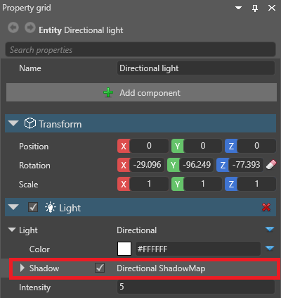
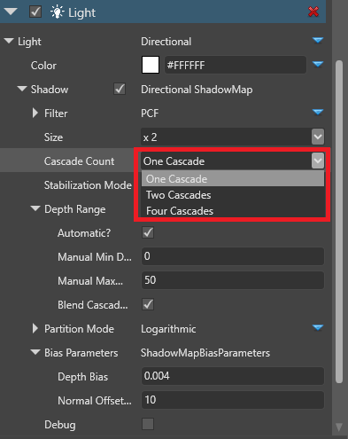
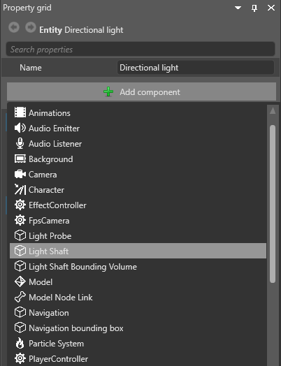
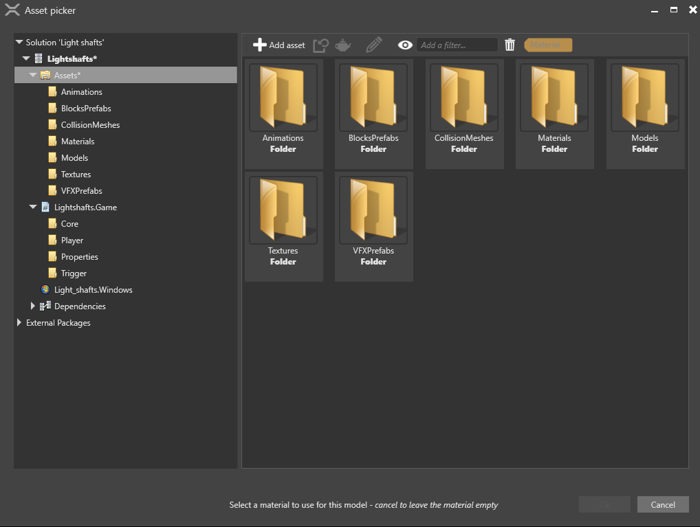
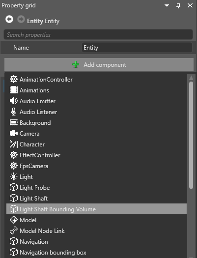

# Light shafts

**Light shafts**, also called **god rays** or **volumetric lights**, simulate visible rays (crepucular rays) originating from a light source. You create them with three components used together, **lights**, **light shafts**, and **light shaft bounding volumes**.

Only [directional lights](directional-lights.md) can cast light shafts.

## 1. Enable light shafts in the graphics compositor

1. In the **asset view** (in the bottom pane by default), double-click the **Graphics Compositor** asset.

    

    The graphics compositor editor opens.

    

2. Select the **forward renderer** node.

3. In the **property grid** (on the right by default), next to **Light shafts**, click  and select **LightShafts**.

Light shafts are now ready to be used in your scene.

## 2. Add a light shaft component

1. In your scene, select the entity with the **directional light** you want to cast light shafts.

    For more information about how to use directional lights, including how to add them as a component, see [directional lights](directional-lights.md).

2. In the **property grid**, in the **Light** component properties, make sure the **Shadow** checkbox is selected.

    

3. Expand **Shadow** and set the **cascade count** to **one cascade**.

    

    > ![Note]
    > Light shafts can only be used with directional lights. The directional lights must use a single shadow cascade.

4. Click **add component** and select **light shaft**.

    

    Game Studio adds a light shaft component to the entity.

## 3. Add a light shaft bounding volume

The **light shaft bounding volume** defines the area in which directional lights cast light shafts.

1. In the **asset view**, click **Add asset**. 

2. Under **Models**, select a model in the shape you want the volume to be (eg a cube).

    

    The **asset picker** opens.

    

3. You don't need a material for the model, so click **Cancel** to create a model without a material.

4. In the scene, create an empty **entity**. It doesn't matter where.

5. With the entity selected, in the **property grid**, click **Add component** and select **light shaft bounding volume**.

    

6. In the **light shaft bounding volume** component properties, next to **light shaft**, click [!Hand icon](~/manual/game-studio/media/hand-icon.png) (**Pick an asset up**).