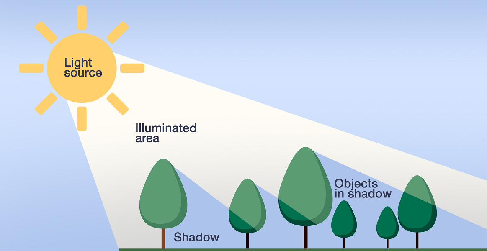

# Shadows

<span class="label label-doc-level">Beginner</span>
<span class="label label-doc-audience">Designer</span>
<span class="label label-doc-audience">Artist</span>

Shadows bring significant information and realism to a scene.

| Shadows **off**                                          | Shadows **on**                                               |
| -------------------------------------------------------- | ------------------------------------------------------------ |
|   |  

Only [directional lights](directional-lights.md), [point lights](point-lights.md), and [spot lights](spot-lights.md) can cast shadows.

## Shadow maps

Xenko uses **shadow mapping** to render shadows. To understand shadow maps, imagine a camera in the center of the sun, so you're looking down from the sun's perspective.



Everything the sun sees is in light. Everything hidden from the sun (ie behind **occluders**) is in shadow.

From this perspective, Xenko creates a **shadow map** for each light that creates shadows. This tells us how far every visible pixel is from the light. When Xenko renders the scene, it checks the position of each pixel in the shadow map to learn if it can be "seen" by the light. If the light can see the pixel, Xenko illuminates it. If it can't, the pixel is in shadow.

In the case of directional lights, shadow effects can spawn across a large view range. This means they require special treatment to improve their realism. For more information, see the [Directional lights](directional-lights.md) page.

Each light in your scene that casts a shadow uses a region of the shadow map atlas texture. The size of each region depends on several factors:

* The `shadowMapSizeFactor` based on the `LightShadowMap.Size` property:

| Shadow size | Shadow importance factor             
| ----------- | ---------------------- 
| XLarge      | 2.0 
| Large       | 1.0 (default for directional lights)
| Medium      | 0.5 (default for spot lights) 
| Small       | 0.25 (default for omni lights)
| XSmall      | 0.125      

* The projected size of the light in screen-space (`lightSize`)
  * For directional lights, the lightSize is equal to the max (screenWidth, screenHeight)
  * For spot lights, the lightSize is equal to the projection of the projected sphere at target spot light cone
* The `ShadowMapBaseSize` equals `1024`.

The final size of the shadow map is calculated like this:

```cs
// Calculate the size factor
var shadowMapSizeFinalFactor = shadowImportanceFactor * shadowMapSizeFactor;
// Multiply the light projected size by the size factor
var shadowMapSize = NextPowerOfTwo(lightSize * shadowSizeFinalFactor);
// Clamp to a maximum size
shadowMapSize = min(shadowMapSize, ShadowMapBaseSize  * shadowSizeFinalFactor);
```

## See also

* [Point lights](point-lights.md)
* [Directional lights](directional-lights.md)
* [Spot lights](spot-lights.md)