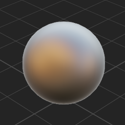
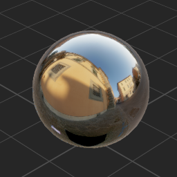
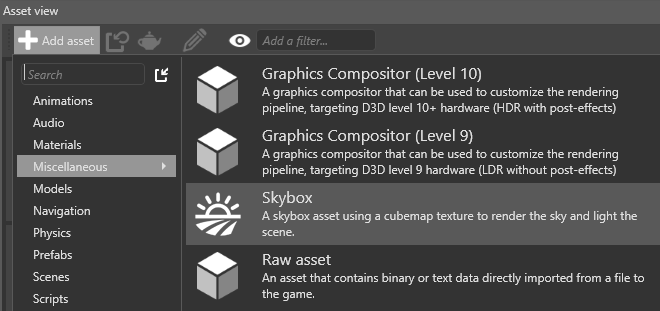
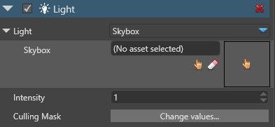
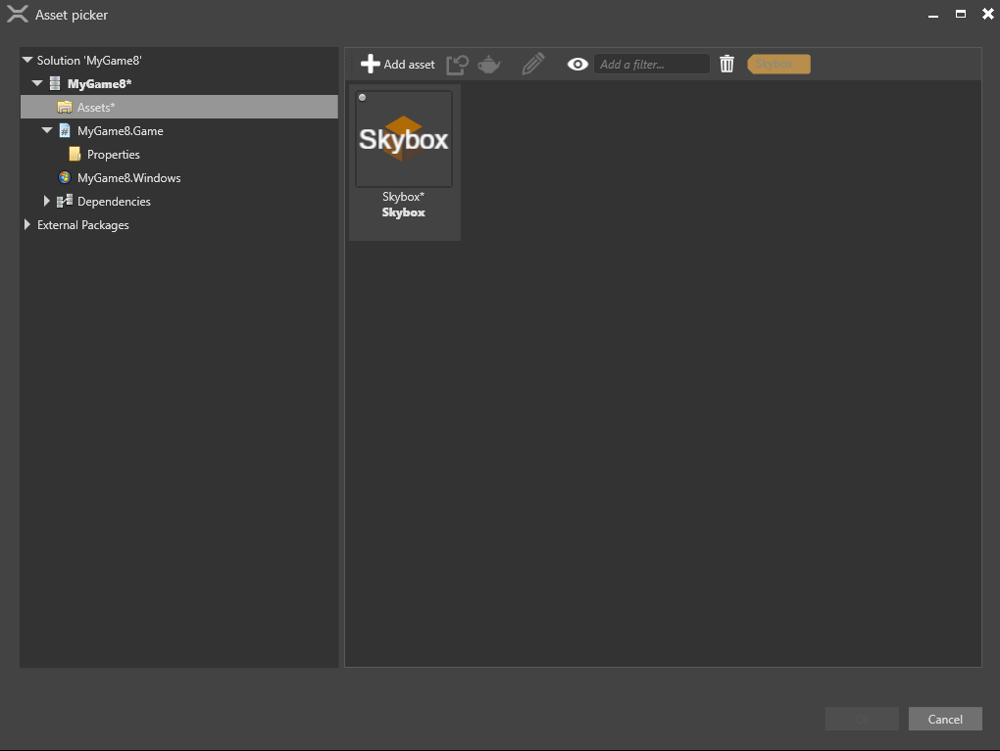
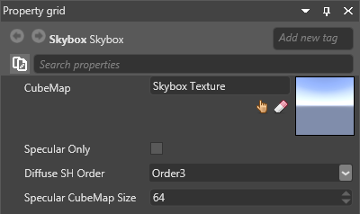
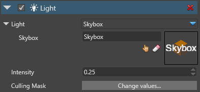

# Skybox lights

<span class="label label-doc-level">Beginner</span>
<span class="label label-doc-audience">Designer</span>
<span class="label label-doc-audience">Programmer</span>

A skybox light is an [ambient light](ambient-lights.md) emitted by a [skybox](../skyboxes.md). Xenko analyzes the skybox cubemap and generates lighting using [image-based lighting (Wikipedia)](https://en.wikipedia.org/wiki/Image-based_lighting).


You don't need to actually display the skybox in the scene to use it as a light source. For example, you might not want to use the skybox to light the scene if the sky is only partly visible from an interior location (eg through windows of a room). As ambient lights aren't affected by shadows, they light every part of the scene, including interior spaces.

## How skyboxes light the scene

These images show the difference between ambient and skybox lighting on two pure diffuse [materials](../materials/index.md):

| Ambient lighting                                     | Skybox lighting     
| ---------------------------------------------------- | -------------------------------
|   |   |                                                           |                        
These images show the effect of skybox lighting on a material with different metal and gloss properties:

| Material Plastic    | Metal 100% Gloss 50%                                                                                    | Metal 100% Gloss 100%                                                                                      |
----------------------------------------------------------- | ---------------------------------------------------------------------------------- | -------------------------------------------------------------------------------------------------- | ---------------------------------------------------------------------------------------------------- |
   |   |   |

Notice how the skybox texture colours are reflected.

## Set up a skybox light

To use a skybox as a light, you need to add a skybox asset, then select it in a [Light component](xref:SiliconStudio.Xenko.Engine.LightComponent).

1. In the **Asset view**, click 

2. Select **Miscellaneous** > **Skybox**.

    

    The **Asset picker** opens.

3. Choose a skybox texture (`.dds` file) from the project assets and click **OK**.
    
    

	Game Studio adds the skybox asset with the texture you specified.

4. Select the entity you want to be the skybox light.

5. In the **Properties grid** (on the right by default), click **Add component** and select [Light](xref:SiliconStudio.Xenko.Engine.LightComponent).

    

6. In the **Light** component properties, under **Light**, select **Skybox**.

    

7. Click the hand icon to open the **Asset picker**.

	

8. Select the skybox asset you want to use as a light source and click **OK**.

	

The [Light component](xref:SiliconStudio.Xenko.Engine.LightComponent) uses the skybox asset to light the scene.

## Skybox asset properties

When you use a skybox as a light, Xenko uses it both in compressed form ([spherical harmonics (Wikipedia)](https://en.wikipedia.org/wiki/Spherical_harmonics)) and as a texture to light different kinds of material. You can control the detail of both in the skybox asset properties.



| Property     | Description                                                                                                                                                                                    |
| ------------ | ---------------------------------------------------------------------------------------------------------------------------------------------------------------------------------------------- |
| Cube Map |  The cubemap asset used for the skybox 
| Specular Only      |  Use the skybox only for specular lighting
| Diffuse SH Order  | The level of detail of the compressed skybox, used for diffuse lighting (dull materials). `Order5` is more detailed than `Order3` |
| Specular Cubemap Size | The texture size used for specular lighting. Larger textures have more detail. |

## Skybox light properties

 

| Property     | Description   |
| ------------ | ---------------------------------------------------------------------------------------------------------------------------------------------------------------------------------------------- |
| Intensity    | The light intensity |
| Culling Mask | Which entity groups are affected by the light. By default, all groups are affected                                                                                                   |

## Example code

The following code changes the skybox light and its intensity:

```cs
public Skybox skybox;
public void ChangeSkyboxParameters()
{
    // Get the light component from an entity
	var light = Entity.Get<LightComponent>();

	// Get the Skybox Light settings from the light component
	var skyboxLight = light.Type as LightSkybox;

	// Replace the existing skybox
	skyboxLight.Skybox = skybox;

	// Change the skybox light intensity
	light.Intensity = 1.5f;
}
```

## See also

* [Skyboxes](../skyboxes.md)
