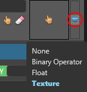
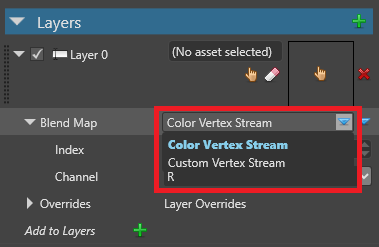
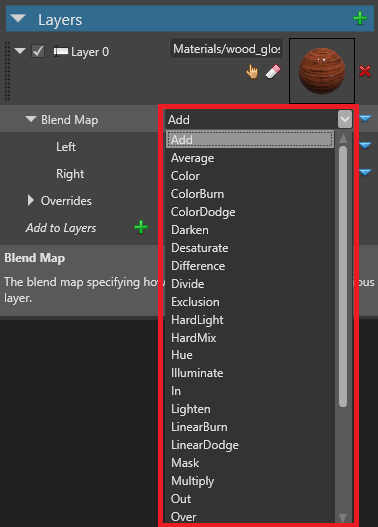
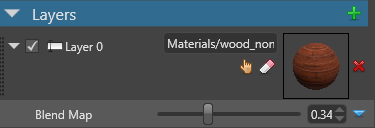
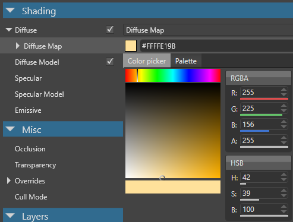

# Material maps

Intermediate
Artist
Programmer

**Material maps** calculate how materials are rendered. They can use two kinds of values: color (RGB) values or scalar (single float) values. 

You can use material maps for several purposes, including blend maps (for combining [material layers](material-layers.md)), gloss maps, and diffuse maps.

Material maps can fetch values using one of several providers:

* **Vertex stream**: a value taken from mesh attributes
* **Binary operator**: a combination of any other two providers
* **Float4 / Float**: a constant value
* **Color**: a hex color value
* **Shader**: a value provided by a ComputeColor shader. This lets you use procedural values
* **Texture**: a value sampled from a texture

To select the provider the map uses, use the drop-down menu:

 

## Vertex stream

This provider takes a value from an attribute of the mesh of the model you apply the material to.

It has two modes: **Color Vertex Stream** and **Custom Vertex Stream**. To switch between them, with **Vertex Stream** selected as the provider, click the drop-down menu and choose the mode you want to use.

### Color vertex stream

Takes a color value from the mesh.

| Property | Description                                      
| -------- | -----------
| Index | The index in the named stream  
| Channel  | The channel (RGBA) to sample from the stream

### Custom vertex stream

Takes a value from the mesh channel you specify.

| Property | Description                                      
| -------- | -----------
| Name | Semantic name of the channel to read data from 
| Channel  | The channel (RGBA) to sample from the stream

## Binary operator

Perform a binary operation from two color/scalar value providers. You can nest as many material maps inside binary operators as you need (including further binary operators).

To choose how the operation works, select from the drop-down menu. The operations are similar to options when blending layers in Photoshop.

`Result = LeftColor  <operator> RightColor`

| Property | Description                                      
| -------- | -----------
| Operator | A binary operator (eg add, multiply, etc)     
| Left     | The left color/scalar used in the operation  
| Right    | The right color/scalar used in the operation 

## Float4 / Float

Provided directly as a constant value over the whole material. 

In the case of RGB values, you control the RGBA value with the X, Y, Z and W values (*Float4*).

In the case of scalar values, you control the value with a slider (*Float*).

## Color

A value provided from a color hex value. Only available for material maps that use RGB values.

## Shader

A value provided by a ComputeColor shader. This lets you use procedural values.

For an example of a ComputeColor shader, see [Particle materials](../../particles/tutorials/particle-materials.md).

## Texture

Sample the color/scalar from a texture. 

The images below demonstrate how the texture changes the way Xenko blends materials.

| Property           | Description               
| ------------------ | --------------- 
| Texture            | A reference to a texture
| Channel            | The channel (R, G, B, A) used to extract the scalar value. Only valid for scalar textures
| Texcoord Index     | The texture coordinates (u,v) to use from the mesh with this texture
| Filtering          | The sampling method (eg Linear, Point, Anisotropic, etc) 
| Address Mode U / V |  Defines how (u,v) coordinates are addressed    **Wrap**: Tiles (u,v) at integer junctions. For example, if u ranges from 0.0 to 3.0, the texture repeats three times on the U axis   **Mirror**: Flips (u,v) at integer junctions. For example, if u ranges from 0.0 to 1.0, the texture is displayed as expected; but from 1.0 to 2.0, the texture is mirrored     **Clamp**: Clamps (u,v) to the range (0.0, 1.0)                                                                                  
| Scale | A scale applied to (u,v) 
| Offset  | An offset applied to (u,v)

## See also

- [Material attributes](material-attributes.md)
- [Material layers](material-layers.md)
- [Materials for developers](materials-for-developers.md)