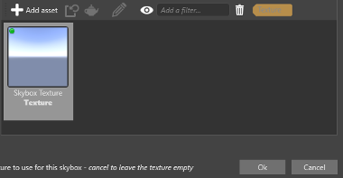
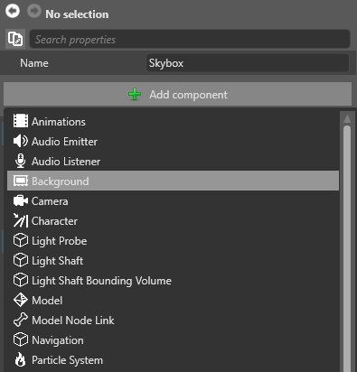
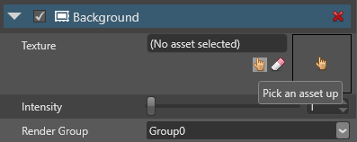

# Skyboxes
<span class="label label-doc-level">Beginner</span>
<span class="label label-doc-audience">Designer</span>
<span class="label label-doc-audience">Programmer</span>

**Skyboxes** are backgrounds that create the illusion of space and distance. Typical skybox backgrounds include skies, clouds, mountains, and other scenery.

To create a skybox, Xenko encloses the scene in a cube and maps a texture, called a **cubemap**, on the cube's inner faces. This simulates three-dimensional surroundings that appear spacious. Skyboxes are pre-rendered, so require little GPU and CPU. You can also [use skyboxes to light a scene](lights-and-shadows/skybox-lights.md).


> [!Note]
> Currently, Xenko doesn't support skydomes.

## Cubemaps

Cubemaps are composed of six images, one for each face of the skybox cube. Xenko uses cubemaps with the extension `.dds`.

Currently, Game Studio can't convert image files to `.dds` files. Use another application to create a cubemap from separate image files, such as:

* [Nvidia conversion tool](https://developer.nvidia.com/nvidia-texture-tools-adobe-photoshop)
* [ATI conversion tool](http://developer.amd.com/tools-and-sdks/archive/games-cgi/cubemapgen)

### Add a cubemap to a project

* In the **Asset view**, click , select **Textures** > **Texture**, and browse to the `.dds` file.

    

* Alternatively, drag and drop a `.dds` file from **Windows Explorer** to the **Asset view**, then select **Texture**.

    

The cubemap is now available as an asset in your project. You can use the cubemap asset in your skybox asset.

## Add a skybox to a project

1. In the **Asset view**, click 

2. Select **Miscellaneous**, and choose **Skybox**.

    

    The **Asset picker** opens.

3. Choose a skybox texture (`.dds` file) from the project assets and click **OK**.
    
    

The skybox asset properties affect how the skybox lights the scene. For information about these properties, see [Skybox lights](lights-and-shadows/skybox-lights.md).

## Use a skybox

To use a skybox, add it to a **background component**.

Xenko includes an entity with a background component in the project by default. Only one skybox can be active in a scene at a time. If there are multiple skyboxes, Xenko only loads the first only.

You can add background component to as many entities as you need. You might want to include more than one background, for example, if you want to switch skyboxes at runtime.

To add a skybox to an entity:

1. In the **Scene view**, select the entity you want to add the component to.

    This can be an empty entity. Its position in the scene doesn't matter.

2. In the **Property grid**, click **Add component** and select **Background**.

    

3. Under **texture**, specify the skybox asset you want to use.

    

Xenko displays the skybox in the scene.

## Use a skybox as a light source

You can set the skybox as the light type in a [Light component](xref:SiliconStudio.Xenko.Engine.LightComponent). Xenko analyzes the skybox texture and generates lighting using [image-based lighting (Wikipedia)](https://en.wikipedia.org/wiki/Image-based_lighting). For more information, see [Skybox lights](lights-and-shadows/skybox-lights.md).

## Example code

The following code changes the skybox background:

```cs
public Texture cubemapTexture;
public void ChangeBackgroundParameters()
{
    // Get the background component from an entity
	var background = directionalLight.Get<BackgroundComponent>();

	// Replace the existing background
	background.Texture = cubemapTexture;

	// Change the background intensity
	background.Intensity = 1.5f;
}
``

## See also
* [Skybox lights](lights-and-shadows/skybox-lights.md)
* [Lighting and shadows](lights-and-shadows/index.md)