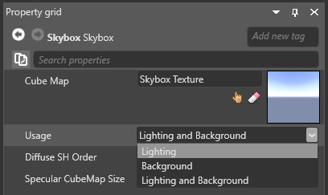
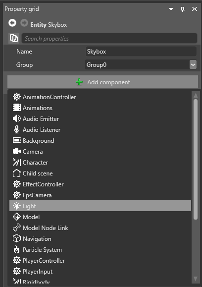

# Skyboxes
<span class="label label-doc-level">Beginner</span>
<span class="label label-doc-audience">Designer</span>
<span class="label label-doc-audience">Programmer</span>

**Skyboxes** are backgrounds that create the illusion of space and distance. Typical skybox backgrounds include skies, clouds, mountains, and other scenery.

To create a skybox, Xenko encloses the scene in a cube and maps a texture, called a **cubemap**, on the cube's inner faces. This simulates three-dimensional surroundings that appear spacious. Skyboxes are pre-rendered, so require little GPU and CPU. You can also use skyboxes to light a scene.


> [!Note]
> Currently, Xenko doesn't support skydomes.

## Cubemaps

Cubemaps are composed of six images, one for each face of the skybox cube. Xenko uses cubemaps with the extension `.dds`.

Currently, Game Studio can't convert image files to `.dds` files. Use another application to create a cubemap from separate image files, such as:
* [Nvidia conversion tool](https://developer.nvidia.com/nvidia-texture-tools-adobe-photoshop)
* [ATI conversion tool](http://developer.amd.com/tools-and-sdks/archive/games-cgi/cubemapgen)

### Add a cubemap asset to a project

* In the **Asset view**, click , select **Textures** > **Texture**, and browse to the `.dds` file.

    

* Alternatively, drag and drop a `.dds` file from **Windows Explorer** to the **Asset view**, then select **Texture**.

    

The cubemap is now available as an asset in your project. You can use the cubemap asset in your skybox asset.

## Add a skybox asset to a project

1. In the **Asset view**, click 
2. Select **Miscellaneous**, and choose **Skybox**.

    

    The **Asset picker** opens.

3. Choose a skybox texture (`.dds` file) from the project assets and click **OK**.
    
    

## Add a skybox component to an entity

Xenko includes an entity with a [Skybox component](xref:SiliconStudio.Xenko.Engine.SkyboxComponent) in the project by default. Only one skybox can be active in a scene at a time. If there are multiple skyboxes, Xenko loads the first. 

You can create more than one skybox by adding [Skybox components](xref:SiliconStudio.Xenko.Engine.SkyboxComponent) to as many entities as you need. For example, you might want to include more than one skybox if you want to switch between them at runtime.

To add a [Skybox component](xref:SiliconStudio.Xenko.Engine.SkyboxComponent) to an entity:

1. In the **Scene view**, select the entity you want to add the component to.

    This can be an empty entity. Its position in the scene doesn't matter.

2. In the **Property grid**, click **Add component** and select **Skybox component**.

    

3. Specify the **skybox asset** you want to use.

    

You can add a [Skybox component](xref:SiliconStudio.Xenko.Engine.SkyboxComponent) to as many entities as you need. For example, you might want to include more than one skybox if you want to switch between them at runtime.

You can modify the following [Skybox component](xref:SiliconStudio.Xenko.Engine.SkyboxComponent) settings:

* [Background](xref:SiliconStudio.Xenko.Engine.SkyboxComponent.Background): how to display the skybox.
* [Intensity](xref:SiliconStudio.Xenko.Engine.SkyboxComponent.Intensity): the skybox background radiation intensity, from 0 (none) to 100 (maximum).

## Light the scene with a skybox

You can use a skybox to light the scene. Xenko analyzes the skybox and generates lighting using [image-based lighting (Wikipedia)](https://en.wikipedia.org/wiki/Image-based_lighting).

1. Select the skybox asset.

2. In the **Properties grid**, under **Usage**, you can choose whether the skybox is used for lighting, a background image, or both:

    

    * **Lighting and Background** (default): The skybox is used for both lighting and the background.
    * **Lighting**: The skybox is only used for lighting, and isn't visible at runtime.
    * **Background**: The skybox is only used as a background image, with no lighting.

    To use the skybox for lighting, choose **Lighting** or **Lighting and background**.

3. Select the entity that has the [Skybox component](xref:SiliconStudio.Xenko.Engine.SkyboxComponent).

4. In the entity **Properties grid**, click **Add component** and select [Light](xref:SiliconStudio.Xenko.Engine.LightComponent).

    

4. In the **Light** component properties, under **Usage**, select **Skybox**.

    

The [Light](xref:SiliconStudio.Xenko.Engine.LightComponent) uses the skybox asset to light the scene.

>[!Note]
>The **Intensity** properties in the Skybox and Light components are linked. To calculate the Light component [intensity](xref:SiliconStudio.Xenko.Engine.LightComponent.Intensity), Xenko multiplies it by the Skybox component [intensity](xref:SiliconStudio.Xenko.Engine.SkyboxComponent.Intensity).

## Example code

```cs
public Skybox skybox;
public void ChangeSkyboxParameters()
{
    //Add a Skybox component to an entity:
    var skyboxComponent = Entity.Get<SkyboxComponent>();

    //Replace the existing skybox:
    skyboxComponent.Skybox = skybox;
    
    //Change the skybox light intensity:
    skyboxComponent.Intensity = 1.5f;

    //Change the skybox background to Color:
    skyboxComponent.Background = SkyboxBackground.Color;
}
```

## See also
* [Lighting and shadows](lighting-and-shadows/index.md)