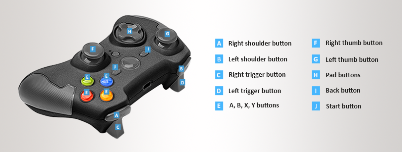

#Gamepads

<span class="label label-doc-level">Beginner</span>
<span class="label label-doc-audience">Programmer</span>

**Gamepads** are popular console input devices, e.g. Xbox Elite Wireless Controller and PS4 DualShock.
Some players use gamepads instead of usual keyboard/mouse even on desktops.

Each **Gamepad** brand has unique buttons and features. Therefore, it's important to understand how to handle gamepad input and what limitations **Xenko** has with regards to different gamepad types.

##Check Gamepad Availability

Before handling gamepad input, check whether a gamepad is available in the system:

* Use [Input.HasGamePad](xref="SiliconStudio.Xenko.Input.InputManager.HasGamePad") to know if there is a gamepad available in the system.
* Use [Input.GamePadCount](xref="SiliconStudio.Xenko.Input.InputManager.GamePadCount") to know how many gamepads are currently available.
* Use [GamePadState.IsConnected](xref="SiliconStudio.Xenko.Input.GamePadState.IsConnected") to know if the current gamepad has been disconnected.

> [!Note] 
> Currently Xenko does not support gamepad plugged at run-time. This feature will be added in the future releases.

##Gamepad Buttons

Below is an image of the Xbox Elite Wireless Controller.
The image show gamepad buttons with their equivalent names in Xenko.



Gamepads have **three types of buttons**:
1. **Digital** buttons have only three states: _Pressed_, _Down_, _Released_. 
These are digital buttons: _Pad buttons_, _Start_, _Back_, _A_, _B_, _X_ and _Y_.
2. **Analog** buttons return a value between 0 and 1 that indicates how hard a user is pressing the button. 
Right and Left **Triggers** are analog buttons. 
3. **Thumb sticks** combine functionality of **Analog** and **Digital** buttons:
    * When a user **presses** a stick, it is considered a **digital** button.
    * When a user **rotates** a stick, it is considered an **analog** stick. It returns a value between -1 and 1 in each axis indicating the current direction of the thumb.

## Handle Gamepad Input

### Digital Buttons

You can query the **states and state changes of digital buttons** with the following methods:

| Method | Functionality |
|----|----|
| [IsPadButtonDown(index, button)](xref="SiliconStudio.Xenko.Input.InputManager.IsPadButtonDown.System.Int32") | Checks whether the button is in the _down_ state. |
| [IsPadButtonPressed(index, button)](xref="SiliconStudio.Xenko.Input.InputManager.IsPadButtonPressed.System.Int32") | Checks whether the user _pressed_ the button since the previous update. |
| [IsPadButtonReleased(index, button)](xref="SiliconStudio.Xenko.Input.InputManager.IsPadButtonReleased.System.Int32") | Checks whether the user _released_ the button since the previous update. |

_Index (integer)_: The index of the gamepad that you want to check.

_Button (GamePadButton)_: The gamepad button that you want to check.

You can also get the state of digital buttons using the [GamePadState.Buttons](xref="SiliconStudio.Xenko.Input.GamePadState.Buttons") field.

> [!Note] ``Buttons`` field is a bitmask that uses binary system.
> Depending on the bitmask value you can determine which buttons are _Up_ or _Down_.

### Analog Buttons

To query values of analog buttons, you should **first get the current state of gamepad** using 
[GetGamePad(index)](xref="SiliconStudio.Xenko.Input.InputManager.GetGamePad.System.Int32").

_Index (integer)_: The index of the gamepad that you want to check.

> [!WARNING]
> The value returned by ``GetGamePad`` is the state of the gamepad at the **current** update.
> You cannot reuse this value for the next updates and have to query it again in every update.

To get the values of **Triggers** and **Thumbs' Rotations**, use the following fields of 
[GamePadState](xref="SiliconStudio.Xenko.Input.GamePadState"):

| Field | Description |
|----|----|
| [LeftThumb](xref="SiliconStudio.Xenko.Input.GamePadState.LeftThumb) | Left thumb stick x-axis/y-axis value in the range [-1.0f, 1.0f] for both axis. |
| [LeftTrigger](xref="SiliconStudio.Xenko.Input.GamePadState.LeftTrigger) | Left trigger analog control value in the range [0, 1.0f] for a single axis. |
| [RightThumb](xref="SiliconStudio.Xenko.Input.GamePadState.RightThumb) | Right thumb stick x-axis/y-axis value in the range [-1.0f, 1.0f] for both axis. |
| [RightTrigger](xref="SiliconStudio.Xenko.Input.GamePadState.RightTrigger) | Right trigger analog control value in the range [0, 1.0f] for a single axis. |

### Gamepad Vibration

You can set the vibration level of gamepads using 
[SetGamePadVibration](xref="SiliconStudio.Xenko.Input.InputManager.SetGamePadVibration.System.Int32.System.Single.System.Single").

> [!Note] Currently, you cannot control gamepad vibration in Xenko.
> This feature will be added in the future releases.

##Gamepad Limitations

Currently, Xenko doesn't distinguish between **Gamepads** of different brands. Such approach implies certain limitations.
For instance, PS4 DualShock controller has a touchpad, but you can't use this touchpad as an **Input Source** in Xenko.
This issue will be addressed in the future releases of the Game Engine.

##Code Sample

```
public class TestScript : SyncScript
{
	public override void Update()
	{   
		//Check if a gamepad is available.
		if (Input.HasGamePad)
		{
			//Get a number of plugged-in gamepads.
			int gamepadCount = Input.GamePadCount;
			
			// Check each gamepad's status.
			for (int i = 0; i < gamepadCount; i++)
			{
				//Get analog sticks' position (Thumbs)
				Vector2 speed = Input.GetGamePad(i).LeftThumb;
				Vector2 direction = Input.GetGamePad(i).RightThumb;

				//Get digital buttons's status.
				if (Input.IsPadButtonDown(i, GamePadButton.X))
				{
					// Perform a repetitive action (for example: shoot).
				}
				if (Input.IsPadButtonPressed(i, GamePadButton.A))
				{
					// Perform a one-time action (for example: use med-kit). 
					// The action is triggered only once, even if player holds the button down.
				}
			}
		}
	}
}
```

<div class="doc-relatedtopics">
* [Keyboard](keyboard.md)
* [Virtual Buttons](virtual-buttons.md)
</div>
