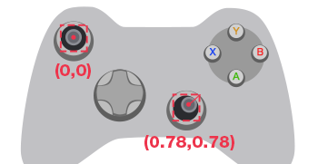
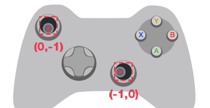
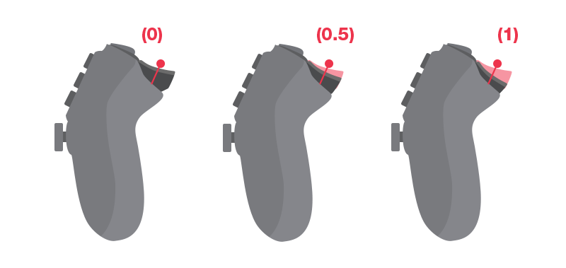

# Gamepads

<span class="label label-doc-level">Beginner</span>
<span class="label label-doc-audience">Programmer</span>

**Gamepads**, such as the Xbox Elite Wireless Controller and the PS4 DualShock, are popular input devices for consoles and desktop.

## Buttons

Below is an image of the Xbox Elite Wireless Controller.
The image shows the Xbox Elite Wireless Controller with its button their equivalent names in Xenko.


Gamepads have three **types of buttons**:

* **Digital** buttons have three states: _pressed_, _down_, and _released_. 
These are digital buttons: _Pad buttons_, _Start_, _Back_, _A_, _B_, _X_ and _Y_.
* **Analog** buttons return a value between 0 and 1 that indicates how hard the user presses the button. 
The right and left **Triggers** are analog buttons. 
* **Thumb sticks** combine functionality of analog and digital buttons:
    * When a user **presses** a stick, it's considered a **digital** button.
    * When a user **rotates** a stick, it's considered an **analog** stick. It returns a value between -1 and 1 in each axis indicating the current direction of the thumb.

## Handle gamepad input

### Check gamepad availability

Before handling gamepad input:

* Use [Input.HasGamePad](xref="SiliconStudio.Xenko.Input.InputManager.HasGamePad") to check if there is a gamepad available in the system.
* Use [Input.GamePadCount](xref="SiliconStudio.Xenko.Input.InputManager.GamePadCount") to check how many gamepads are available.
* Use [GamePadState.IsConnected](xref="SiliconStudio.Xenko.Input.GamePadState.IsConnected") to check if the current gamepad has been disconnected.

> [!Note] 
> Xenko doesn't support gamepads plugged in at runtime. This feature will be added in a future release.

### Digital buttons

You can query the **states and state changes of digital buttons** with the following methods:

| Method | Functionality |
|----|----|
| [IsPadButtonDown(index, button)](xref="SiliconStudio.Xenko.Input.InputManager.IsPadButtonDown.System.Int32") | Checks whether the button is in the _down_ state. |
| [IsPadButtonPressed(index, button)](xref="SiliconStudio.Xenko.Input.InputManager.IsPadButtonPressed.System.Int32") | Checks whether the user has _pressed_ the button since the previous update. |
| [IsPadButtonReleased(index, button)](xref="SiliconStudio.Xenko.Input.InputManager.IsPadButtonReleased.System.Int32") | Checks whether the user has _released_ the button since the previous update. |

_Index (integer)_: The index of the gamepad you want to check.

_Button (GamePadButton)_: The gamepad button you want to check.

You can also get the state of digital buttons using the [GamePadState.Buttons](xref="SiliconStudio.Xenko.Input.GamePadState.Buttons").

> [!Note] The ``Buttons`` field is a bitmask that uses binary system.
> Depending on the bitmask value, you can determine which buttons are _Up_ or _Down_.

### Analog buttons

To query values of analog buttons, **first get the current state of gamepad** using 
[GetGamePad(index)](xref="SiliconStudio.Xenko.Input.InputManager.GetGamePad.System.Int32").

_Index (integer)_: The index of the gamepad that you want to check.

> [!WARNING]
> The value returned by ``GetGamePad`` is the state of the gamepad at the **current** update.
> You can't reuse this value for the next updates. You have to query it again in every update.

To get the values of **triggers** and **thumbstick rotations**, use these 
[GamePadState](xref="SiliconStudio.Xenko.Input.GamePadState") fields:

| Field | Description |
|----|----|
| [LeftThumb](xref="SiliconStudio.Xenko.Input.GamePadState.LeftThumb) | Left thumbstick X-axis/Y-axis value in the range [-1.0f, 1.0f] for both axes. |
| [RightThumb](xref="SiliconStudio.Xenko.Input.GamePadState.RightThumb) | Right thumbstick X-axis/Y-axis value in the range [-1.0f, 1.0f] for both axes. |
| [LeftTrigger](xref="SiliconStudio.Xenko.Input.GamePadState.LeftTrigger) | Left trigger analog control value in the range [0, 1.0f] for a single axes. |
| [RightTrigger](xref="SiliconStudio.Xenko.Input.GamePadState.RightTrigger) | Right trigger analog control value in the range [0, 1.0f] for a single axis. |

Thumbsticks move along the X and Y axes in all four directions. Their positions read as follows:




Triggers move along the X axis. Their positions reads as follows:



### Vibration

You can set the vibration level of gamepads using 
[SetGamePadVibration](xref="SiliconStudio.Xenko.Input.InputManager.SetGamePadVibration.System.Int32.System.Single.System.Single").

> [!Note] 
> You can't control gamepad vibration in Xenko. This feature will be added in a future release.

## Limitations

Xenko doesn't distinguish between gamepads of different brands. For example, the PS4 DualShock controller has a touchpad, but you can't use this touchpad as an input source in Xenko. This feature will be added in a future release.

## Example code

```
public class TestScript : SyncScript
{
	public override void Update()
	{   
		//Check if a gamepad is available
		if (Input.HasGamePad)
		{
			//Get a number of plugged-in gamepads
			int gamepadCount = Input.GamePadCount;
			
			// Check each gamepad's status.
			for (int i = 0; i < gamepadCount; i++)
			{
				//Get analog thumbstick positions
				Vector2 speed = Input.GetGamePad(i).LeftThumb;
				Vector2 direction = Input.GetGamePad(i).RightThumb;

				//Get digital buttons' status
				if (Input.IsPadButtonDown(i, GamePadButton.X))
				{
					// Perform a repetitive action (for example: shoot).
				}
				if (Input.IsPadButtonPressed(i, GamePadButton.A))
				{
					// Perform a one-time action (for example: use med-kit)
					// The action is triggered only once, even if the user holds the button down.
				}
			}
		}
	}
}
```
## See also
* [Keyboard](keyboard.md)
* [Virtual Buttons](virtual-buttons.md)