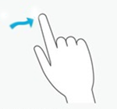
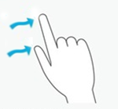
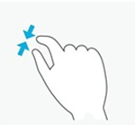
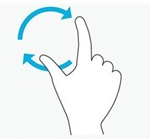
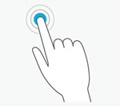

# Gestures 

<span class="label label-doc-level">Intermediate</span>
<span class="label label-doc-audience">Level Programmer</span>

Gestures are special patterns of [Pointers](pointers.md). The system is able to recognize these patterns and trigger certain events that correspond to these patterns.
For instance, in a strategy game you can drag and drop a unit to the battlefield with a **Drag** gesture.

> [!Note] **Input System** uses normalized values.
> All lengths, speeds and error margins of configuration files must use normalized values.

##Learn Gestures

Gestures can be single- or multi-finger. Access gestures via the ``GestureConfig`` classes. Each gesture has its own associated config class.

Currently, Xenko supports the following gesture types:

* Discrete gestures (_Flick_, _LongPress_, _Tap_) trigger a single event.

* Continuous gestures (_Drag_, _Composite_) trigger a series of events every time an end-user changes the direction of the gesture.
This way, a gesture can trigger certain complex actions in mobile games.

You can get the current state of gesture (_Began_, _Changed_, _Ended_, _Occurred_) by in the ``Input.GestureEvent.State`` field
of the gesture event.

> [!Note] _Discrete_ gesture always has a state **Occurred**.

> [!Note] _Continuous_ gesture always starts with **Began** action, then followed by 0 or more **Changed** actions
> and ends with **Ended** action.

You can restrict *Drag* and *Flick* gestures to *vertical* and *horizontal* shapes.
In that case, the gesture event is triggered only if the gesture is close enough to the indicated shape.

For more information on gesture shapes see [API reference](http://doc.xenko.com/latest/api/SiliconStudio.Xenko.Input.GestureShape.html#SiliconStudio_Xenko_Input_GestureShape).

##Recognize Gestures

By default, the **Input System** does not recognize **Gestures**. Manage gesture recognition:

1. To activate a particular gesture recognition, add its configuration to ``Input.ActivatedGestures`` collection.
2. Set gesture parameters, like the length of the **Tap** or the required distance of a **Drag**.
3. To stop all gesture recognition, simply clear ``Input.ActivatedGestures`` collection.

> [!Note] Once you activate a gesture for recognition and set its parameters, you can no longer modify these parameters.
To change gesture parameters, you have to delete the previous entry from the ``Input.ActivatedGestures`` collection and create a new entry with new parameters.

When the system detects a gesture, it adds ``Input.GestureEvent`` to the list of gesture events.
Each gesture has its own associated gesture event class.

``Input.GestureEvent.Type`` field of the ``Input.GestureEvent`` gesture event collection indicates which gesture has been recognized.
You can then cast the base gesture event into the gesture-specific event type to have gesture-type-specific information about the event.

The system can detect several gestures simultaneously, so the event list can contain more than one item in a given update.
The list is cleared every update, so you don't need to clear it manually. All **Gesture Events** not analyzed during a frame turn are lost.

##Use Gestures

###Drag Gesture

 

**Type** : Continuous

**Configuration class**: ``Input.GestureConfigDrag``

**Event class**: ``Input.GestureEventDrag``

**Action description**: A user touched the screen, performed a translation and withdraw his/her finger(s).

**Comments**: The number of fingers on the screen cannot vary during the gesture.
You can modify ``Input.GestureConfigDrag.MinimumDragDistance`` field if the gesture must be triggered for smaller drags. 

###Flick Gesture 

 

**Type** : Discrete

**Configuration class**: ``Input.GestureConfigFlick``

**Event class**: ``Input.GestureEventFlick``

**Action description**: A user touched the screen, performed a quick straight translation and withdraw his/her finger(s).

**Comments**: The number of fingers on the screen cannot vary during the gesture.
You can modify ``Input.GestureConfigFlick.MinimumFlickLength`` field to constrain a flick to have a minimum length. 

###Long Press Gesture 

 

**Type** : Discrete

**Configuration class**: ``Input.GestureConfigLongPress``

**Event class**: ``Input.GestureEventLongPress``

**Action description**: A user touched the screen and maintained the pressure without moving his fingers for a certain period of time (default time is 1 second).

**Comments**: The numbers of fingers on the screen cannot vary during the gesture.
You can modify ``Input.GestureConfigLongPress.RequiredPressTime`` field to change the required press time. 

###Composite Gesture 

   

**Type** : Continuous

**Configuration class**: ``Input.GestureConfigComposite``

**Event class**: ``Input.GestureEventComposite``

**Action description**: A user touched the screen with two fingers, and moved them independently.

**Comments**: This gesture requires exactly two fingers on the screen.
**Composite Gesture** is triggered when the system detects one of the three basic actions:
* _Translation_: user translates two fingers together in the same direction.
* _Scale_: user moves two fingers closer or further from each other.
* _Rotation_: user turns two fingers around the middle point.

###Tap Gesture 

 

 **Type** : Discrete

**Configuration class**: ``Input.GestureConfigTap``

**Event class**: ``Input.GestureEventTap``

**Action description**:The user touched the screen, and removed his/her fingers quickly without moving.

**Comments**: The number of fingers on the screen cannot vary during the gesture.
You can modify ``Input.GestureConfigTap.RequiredNumberOfTaps`` field to manage the required number of taps to detect.

> [Note!] To distinguish single taps from multi-taps, the system uses latency in tap events.
> You can set ``Input.GestureConfigTap.MaximumTimeBetweenTaps`` field to **0** to avoid this latency.

##Code Samples

###Activate/Desactivate Gestures Recognitions

```cs
var singleTapConfig = new GestureConfigTap(); // create the configuration of the gesture you want to recognize
Input.ActivatedGestures.Add(singleTapConfig); // start the tap gesture recognition
 
var doubleTapConfig = new GestureConfigTap(2, 1); // create the configuration of the gesture you want to recognize
Input.ActivatedGestures.Add(doubleTapConfig ); // start the double tap gesture recognition
 
 // ...
 
Input.ActivatedGestures.Remove(singleTapConfig); // stop the tap gesture recognition
 
// ...
Input.ActivatedGestures.Clear(); // stop all remaining gesture recognitions
```

###Set Gesture Configuration
Each configuration class has a parameterless constructor that corresponds to the default gesture configuration.
Special constructors have also been implemented for parameters that you may modify frequently.

Other parameters correspond to the fields that we don't recommend to modify to keep a good coherency of the system. 
Yet, those fields can, too, be modified by accessing the corresponding properties.

```cs
var singleTapConfig = new GestureConfigTap(); // default config for the gesture.
var doubleTapConfig = new GestureConfigTap(2, 2); // personalize the gesture config by using the dedicated constructor.
var noLatencyTap = new GestureConfigTap() { MaximumTimeBetweenTaps= TimeSpan.Zero }; // personalize the gesture config by directly accessing the desired property (be sure you know, what you are doing, as this action may break the input system coherency in some cases).
```
 

You can access the recognized gestures via the ``Input.GestureEvents`` collection.
The collection is automatically cleared every update.

**Code:** Access Gesture events

```cs
var currentFrameGestureEvents = Input.GestureEvents;
```


Use the ``Input.GestureEvent.Type`` field to identity the gesture type and then cast it to the appropriate event type to have extra info about the event. 

**Code:** Identify the gesture type

```cs
foreach( var gestureEvent in Input.GestureEvents)
{
   	if (gestureEvent.Type != GestureType.Tap) // determine if the event is from a tap gesture
		continue;
   
	GestureEventTap  tapEvent = (GestureEventTap) gestureEvent; // cast the specific tap event class
    log.Info("Tap position: {0}.", tapEvent.TapPosition); // access tap event specific field
}
```
 

Use ``Input.GestureEvent.State`` field to learn gesture event state.

**Code:** Identify the event state

```cs
switch(compositeGestureEvent.State)
{
case GestureState.Began:
	image.ComputePreview();
	break;
case GestureState.Changed:
	image.TransformPreview(compositeGestureEvent.TotalScale, compositionGestureEvent.TotalRotation);
	break;
case GestureState.Ended:
	image.TransformRealImage(compositeGestureEvent.TotalScale, compositionGestureEvent.TotalRotation);
	break;
default:
	break;
}
```

Now, you know how to handle **Gestures** in your game. For information on how to handle other input devices, see [Input overview page](index.md).
