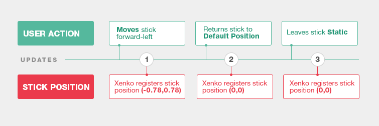

# Input

Beginner
Programmer

Users interact with games and applications using **input devices** such as gamepads, mice, and keyboards. Every interactive application must support at least one input device.

Xenko handles input entirely via scripts. There are low-level and high-level APIs to handle different input types:

* **Low-level** APIs are close to hardware, so they have lower latency. These allow fast processing of the input from [pointers](pointers.md), [keyboards](keyboard.md), [mice](mice.md), [gamepads](gamepads.md), and some [sensors](sensors.md).
* **High-level** APIs interpret input for you, so they have higher latency. These APIs are used for [gestures](gestures.md) and some [sensors](sensors.md).
* There are also **special APIs** for some [sensors](sensors.md) and [virtual buttons](virtual-buttons.md).

## Handle input
Handle input with the [InputManager](xref="SiliconStudio.Xenko.Input.InputManager') class. You can access this class from a script with the `Input` property.

To check whether a particular input device is available, use the corresponding [Input](xref="SiliconStudio.Xenko.Input.InputManager") property. For example, to check if a mouse is connected, use [Input.HasMouse](xref="SiliconStudio.Xenko.Input.InputManager.HasMouse").

After you check device availability, there are four ways to handle input in Xenko.

### Query state
You can query the state of digital keys and buttons (ie _Up_ or _Down_) and the numeric values of analog buttons and sensors. For example, [KeyDown](xref="SiliconStudio.Xenko.Input.InputManager.KeyDown") gets a list of the keys that were in the state _Down_ in the last update.

Sometimes a user performs more than one action between updates. If there's no state change between the updates (the end result is the same), Xenko registers no action:

### Query a state change
You can query the change of state of buttons and keys since the previous update.
In this case, you don't get the list of all buttons and keys, but have to query each button and key separately.

* For digital buttons and keys, query if the button or key was _Pressed_, _Down_ or _Released_ in the last update.

    

* For mouse positions and mouse wheel scrolling, query _Delta Values_ since the previous update:

    

Sometimes a user performs several actions between two updates. If there's no state change between two updates (the end result is the same), Xenko registers no action.

### Query the list of events
For pointers, gestures, and keyboards, you can query all the events that happened in the last update.

> [!Note] Even if a user performs several actions between two updates, Xenko registers all these events.

### Use virtual buttons
You can use **virtual buttons** to associate input to actions rather than physical keys, then let the user define their own keys. For more information, see [virtual buttons](virtual-buttons.md).