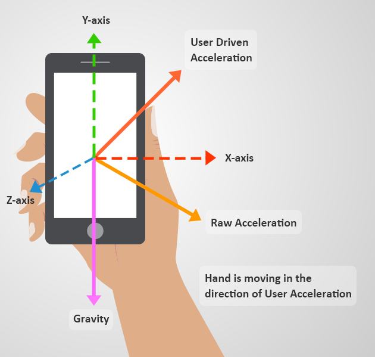
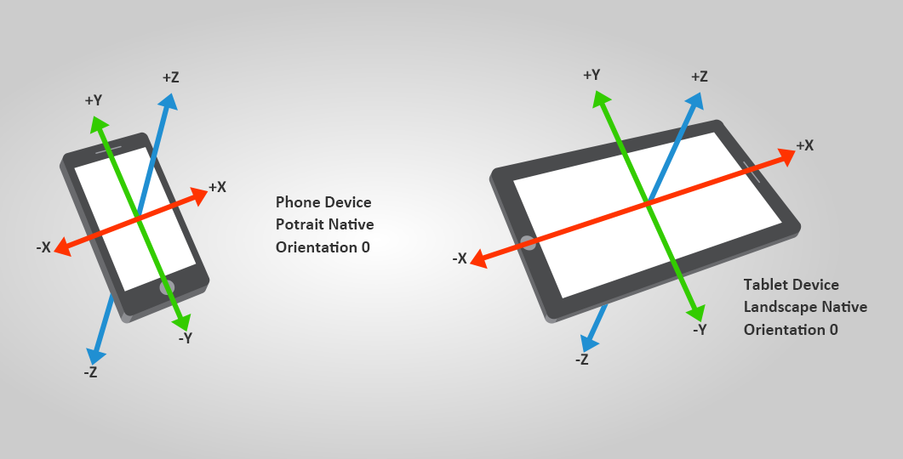
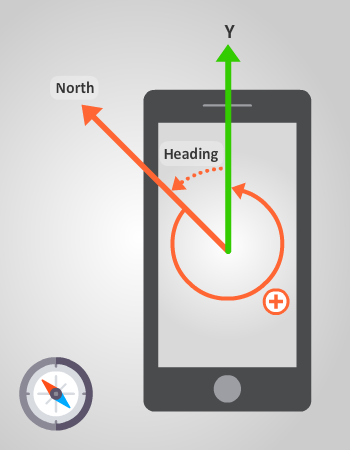

# Sensors

<span class="label label-doc-level">Intermediate</span>
<span class="label label-doc-audience">Programmer</span>

You can use various **sensors**, such as gyroscopes and accelerometers, as input devices in your project. Sensors are often used in mobile games.

Use the [input manager](xref:SiliconStudio.Xenko.Input.InputManager) to access sensors and:

* check if a sensor is supported by Xenko
* disable a sensor
* retrieve sensor data

Xenko can receive data from six types of sensor: _Orientation_, _Accelerometer_, _UserAcceleration_, _Gravity_, _Compass_ and _Gyroscope_. They inherit from [SensorBase](xref:SiliconStudio.Xenko.Input.SensorBase), which provides base functionalities such as enabling or testing the availability of the sensor.

Xenko creates a default instance for each sensor type. You can access each instance from the [input manager](xref:SiliconStudio.Xenko.Input.InputManager).

Sensors are state-based. Each sensor instance is automatically updated every frame, and contains the value of the sensor just before the update.

To access a sensor, use (for example):

```
var accelerometer = Input.Accelerometer;
```

## Check if a sensor is available

Before you get the value of a sensor, first check that the sensor is available in the device. To do this, use the [SensorBase.IsSupported](xref:SiliconStudio.Xenko.Input.SensorBase.IsSupported). For example:
```
var hasCompass = Input.Compass.IsSupported;
```

> [!Note]
> If a sensor isn't natively supported by the device, Xenko will try to emulate it using the device's other sensors.

## Enable a sensor

By default, Xenko disables all available sensors, as retrieving and updating sensor data takes significant CPU time.

To enable a sensor, set [SensorBase.IsEnabled](xref:SiliconStudio.Xenko.Input.SensorBase.IsEnabled)
to ```True```. When you don't need the sensor, disable it by setting the property to ```False```.

## Use the orientation sensor

The **orientation sensor** indicates the **orientation of the device** with respect to gravity and the Earth's north pole. The orientation is null when the device's Y-axis is aligned with the magnetic north pole and the Z-axis with the gravity. You can use orientation data to control various actions in a game.


Use [Input.Orientation](xref:SiliconStudio.Xenko.Input.InputManager.Orientation) to get the current orientation of the device.

| Property        | Description                                     | Declaration                                 |
|-----------------|-------------------------------------------------|---------------------------------------------|
| [Roll](xref:SiliconStudio.Xenko.Input.OrientationSensor.Roll) | The rotation around the X-axis. | ```public float Roll { get; }``` |
| [Pitch](xref:SiliconStudio.Xenko.Input.OrientationSensor.Pitch)           | The rotation around the Y-axis.                    | ```public float Pitch { get; }```           |
| [Yaw](xref:SiliconStudio.Xenko.Input.OrientationSensor.Yaw)             | The rotation around the Z-axis.                    | ```public float Yaw { get; }``` |
| [Rotation Matrix](xref:SiliconStudio.Xenko.Input.OrientationSensor.RotationMatrix) | The device rotation.  | ```public Matrix RotationMatrix { get; }``` |
| [Quaternion](xref:SiliconStudio.Xenko.Input.OrientationSensor.Quaternion) | The device orientation and rotation. |  ```public Quaternion Quaternion { get; }``` |

For example:

```
  var orientation = Input.Orientation.Quaternion;
```

> [!Note]
> Xenko provides the orientation under the pitch/yaw/roll, rotation matrix, or quaternion forms. We recommend the quaternion form as it doesn't suffer from [gimbal lock](https://en.wikipedia.org/wiki/Gimbal_lock).

## Motion sensors
**Motion sensors** measure **acceleration forces** such as tilts, shakes, and swing. Xenko supports three types of motion sensor:

* **Accelerometer**: measures the **raw acceleration**
* **Gravity**: measures gravity only
* **UserAcceleration**: measures only the acceleration applied by the user

The sensors use the physic relation ```Accelerometer = Gravity + UserAcceleration```.



Motion sensors have a single field that specifies the current **acceleration vector** on the device. Xenko measures the acceleration in **meters per second squared**.

This image shows the **coordinate basis** Xenko uses to measure acceleration on smartphones and tablets:



### Use the accelerometer

The **accelerometer** measures the raw acceleration applied to the device. This includes **gravity** and **user acceleration**.

> [!NOTE]
> When the user isn't applying force, the **device acceleration** is equal to its **gravity**.

To get the raw acceleration, use [Accelerometer.Acceleration](xref:SiliconStudio.Xenko.Input.AccelerometerSensor.Acceleration). For example:
```
var acceleration = Input.Accelerometer.Acceleration;
```

### Use the user acceleration sensor
The **user acceleration sensor** is similar to the accelerometer, but measures the acceleration applied **only** by a user (without gravitational acceleration). 

To get the user acceleration, use [UserAcceleration.Acceleration](xref:SiliconStudio.Xenko.Input.UserAccelerationSensor.Acceleration). For example:
```                       
var userAcceleration = Input.UserAcceleration.Acceleration;
```

### Use the gravity sensor
The gravity sensor gives a 3D vector indicating the direction and magnitude of gravity (meters per second squared) acting on the device.

To get the gravity vector, use [GravitySensor](xref:SiliconStudio.Xenko.Input.GravitySensor). For example:

```
 var gravityVector = Input.Gravity.Vector;
```

### Use the compass sensor

The **compass** indicates measures the angle between the top of the device and the **North Pole**. This is useful, for example, to rotate and align digital maps.



To get this angle, use [CompassSensor.Heading](xref:SiliconStudio.Xenko.Input.CompassSensor.Heading). For example:

```
var heading = Input.Compass.Heading;
```

### Use the gyroscope

The gyroscope measures the **rotation speed** of the device (**radians per second**).


To get the rotation speed, use [GyroscopeSensor.RotationRate](xref:SiliconStudio.Xenko.Input.GyroscopeSensor.RotationRate). For example:

```
  var rotationRate = Input.Gyroscope.RotationRate; 
  var rotationSpeedX =  rotationRate.X;
  var rotationSpeedY =  rotationRate.Y;
  var rotationSpeedZ =  rotationRate.Z;
```

## Example code

```
public class SensorScript : AsyncScript
{
	public override async Task Execute()
	{
		// Check availability of the sensor
		if(!Input.Accelerometer.IsSupported)
			return;
			
		// Activate the sensor
		Input.Accelerometer.IsEnabled = true;
				
		while (Game.IsRunning)
		{
			// read current acceleration
			var accel = Input.Accelerometer.Acceleration;
			
			// perform require works...
			
			away Script.NextFrame();
		}		
		// Disable the sensor after use
		Input.Accelerometer.IsEnabled = false;
	}
}
```

## See also
* [Gestures](gestures.md)
* [Pointers](pointers.md)
* [Input overview](index.md)