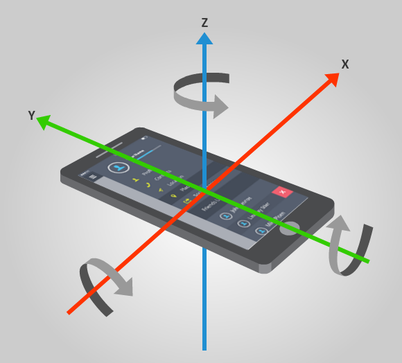

#Sensors

<span class="label label-doc-level">Intermediate</span>
<span class="label label-doc-audience">Programmer</span>

Xenko supports various sensors that you can use as **Input Devices** in your games. 
Sensors provide functionalities that are often used in racing, arcade, and many other mobile games.

Use [Input](xref="SiliconStudio.Xenko.Input.InputManager") base class to access sensors, and:

* Check if a particular sensor is supported by Xenko.
* Disable a particular sensor.
* Retrieve the data provided by a particular sensor.

##Overview

Xenko provides **6 built-in sensors**: _Orientation_, _Accelerometer_, _UserAcceleration_, _Gravity_, _Compass_ and _Gyroscope_ sensors.
They all inherit from [SensorBase](xref="SiliconStudio.Xenko.Input.SensorBase"), **which provides base functionalities** such as 
enabling or testing the availability of the sensor.

**A default instance** is created by Xenko for each sensor type. You can access it from the [Input](xref="SiliconStudio.Xenko.InputManager") base class.

Sensors are state-based. Each sensor instance is **automatically updated** every frame, and it contains the value of the sensor just before the update.

**Access Sensor**

```
var accelerometer = Input.Accelerometer;
```

##Check Availability

Before reading sensor input, you should **first check sensor availability** in the system.
Use the [SensorBase.IsSupported](xref="SiliconStudio.Xenko.Input.SensorBase.IsSupported") to determine
if the corresponding sensor is supported and available on the current system.

> [!Note]
> When a sensor type is not natively supported by the system, Xenko will **try to emulate** it from other sensor inputs when possible.

**Check availability of the sensor**
```
var hasCompass = Input.Compass.IsSupported;
```

##Enable a Sensor

By default Xenko disables all available sensors, as retrieving and updating sensor data **takes some CPU time**.

To use a sensor, you should **first enable it** by setting [SensorBase.IsEnabled](xref="SiliconStudio.Xenko.Input.SensorBase.IsEnabled")
to ```True```. When you don't need sensor input, you should **turn it off** by setting the property to ```False```.

##Use Orientation Sensor

The **Orientation sensor** indicates the **orientation of the device** with respect to gravity and the Earth's magnetic North Pole. 
This means that the orientation of the device is considered as null when the Y-axis of the device is aligned with magnetic North pole
and the Z-axis with the gravity. You can use orientation data to control various actions in a game.

The following image displays how orientation sensor works on smartphones:


Use [Input.Orientation](xref="SiliconStudio.Xenko.Input.InputManager.Orientation") to get the current orientation of the system.

| Property        | Description                                     | Declaration                                 |
|-----------------|-------------------------------------------------|---------------------------------------------|
| [Roll](xref="SiliconStudio.Xenko.Input.OrientationSensor.Roll") | Rotation around the Ox axis. | ```public float Roll { get; }``` |
| [Pitch](xref="SiliconStudio.Xenko.Input.OrientationSensor.Pitch")           | Rotation around the Oy axis.                    | ```public float Pitch { get; }```           |
| [Yaw](xref="SiliconStudio.Xenko.Input.OrientationSensor.Yaw")             | Rotation around the Oz axis.                    | ```public float Yaw { get; }``` |
| [Rotation Matrix](xref="SiliconStudio.Xenko.Input.OrientationSensor.RotationMatrix") | Current rotation of the device.  | ```public Matrix RotationMatrix { get; }``` |
| [Quaternion](xref="SiliconStudio.Xenko.Input.OrientationSensor.Quaternion") | Current orientation and rotation of the device. |  ```public Quaternion Quaternion { get; }``` |

> [!Note]
> For convenience, Xenko provides the system orientation under the Pitch/Yaw/Roll, Rotation Matrix, or Quaternion forms.
> You can use the form that best fits your needs, but we recommend to use the quaternion form when possible. This form does 
> not suffer from Gimbal lock problem.

**Access orientation of the device**

```
  var orientation = Input.Orientation.Quaternion;
```

##Use Motion Sensors
**Motion sensors** measure the **acceleration forces** applied on the device.
Using motion sensors you can detect actions such as tilts, shakes, and swing. 

Xenko Supports three types of **motion sensors**:

* **Accelerometer** sensor: measures the **raw acceleration** applied on the device.
* **Gravity** sensor: measures only the **gravity force**.
* **UserAcceleration** sensor: measures only the **acceleration applied by the user** on the device.

The three motion sensors utilize the following **physic relation**: 

```Accelerometer = Gravity + UserAcceleration``` 

The below image illustrates this relation:


Motion sensors possess a single field that specifies current **acceleration vector** applied on the device.
In Xenko, the accelerations are measured in **meters per second squared**.

The below image shows the **coordinate basis** used to measure the acceleration on smartphones and tablets. 


###Use Accelerometer Sensor

**Accelerometer** measures the raw acceleration applied on the device. This includes **gravity** and **user acceleration**.

Use [Accelerometer.Acceleration](xref="SiliconStudio.Xenko.Input.AccelerometerSensor.Acceleration") to get the **current acceleration**
applied on the device. 

> [!TIP]
> When the end-user does not apply any force to the device, the **device acceleration** equals to **gravity**.

**Access device raw acceleration**
```
var acceleration = Input.Accelerometer.Acceleration;
```

###Use Gravity Sensor

[GravitySensor](xref="SiliconStudio.Xenko.Input.GravitySensor") measures the gravity force applied on a device.

The gravity sensor gives a three-dimensional vector indicating the direction and magnitude of gravity (meters per second squared).
The following code shows how to get an instance of the gravity sensor:

```
 var gravityVector = Input.Gravity.Vector;
```

###Use User Acceleration Sensor
**User Acceleration Sensor** is similar to Accelerometer, but it measures the acceleration applied **only** by a user
(without gravitational acceleration).

Use [UserAcceleration.Acceleration](xref="SiliconStudio.Xenko.Input.InputManager.UserAccelerationSensor") to get user acceleration value.

**Access user acceleration**
```                       
var userAcceleration = Input.UserAcceleration.Acceleration;
```

##Use Compass Sensor

**Compass** indicates the direction to the magnetic **North Pole** and **bearings** to it. 
You can use compass to auto-rotate and align digital maps.

The following image displays the compass sensor of a smartphone.


The compass measures the **angle** between the **top of the device** and the **North Pole**.
Use [CompassSensor.Heading](xref="SiliconStudio.Xenko.Input.CompassSensor.Heading") to get this angle (in radian).

**Access compass heading**
```
var heading = Input.Compass.Heading;
```

##Use Gyroscope

The gyroscope sensor measures the **rotation speed** of the device (**radians per second**).

The following image displays the orientation of the rotation axis used by the Gyroscope sensor.



Use [GyroscopeSensor.RotationRate](xref="SiliconStudio.Xenko.Input.GyroscopeSensor.RotationRate") to get the **current rotation speed** of the device.

**Access the current rotation speed**
```
  var rotationRate = Input.Gyroscope.RotationRate; 
  var rotationSpeedX =  rotationRate.X;
  var rotationSpeedY =  rotationRate.Y;
  var rotationSpeedZ =  rotationRate.Z;
```

## Code Sample

```
public class SensorScript : AsyncScript
{
	public override async Task Execute()
	{
		// Check availability of the sensor
		if(!Input.Accelerometer.IsSupported)
			return;
			
		// Activate the sensor
		Input.Accelerometer.IsEnabled = true;
				
		while (Game.IsRunning)
		{
			// read current acceleration
			var accel = Input.Accelerometer.Acceleration;
			
			// perform require works...
			
			away Script.NextFrame();
		}		
		// Disable the sensor after use
		Input.Accelerometer.IsEnabled = false;
	}
}
```

<div class="doc-relatedtopics">
* [Gestures](gestures.md)
* [Pointers](pointers.md)
</div>
