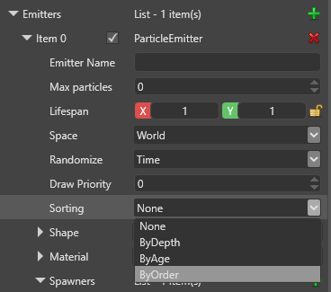
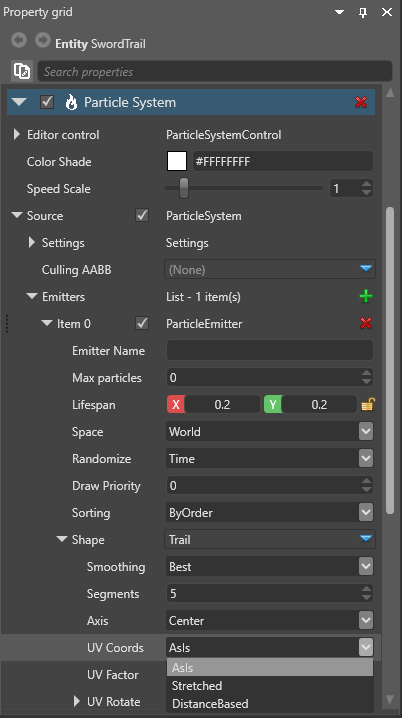

# Ribbons and trails

**Ribbons and trails** are particle shape builders which build the mesh data as a strip connecting all particles, rather than individual quads.

In this diagram, several particles (represented as red dots) are rendered as individual quads (blue rectangles):

In the diagram below, a "strip" is created by connecting the particles and rendering the quad between the adjacent particles.

## Ribbons vs trails

Both ribbons and trails generate a flat surface which follows an axis connecting adjacent particles in a line. This line defines one of the axes of the surface.

The difference between ribbons and trails is in the second axis used to build the shape. In case of ribbons, the second axis is positioned in camera space, facing the ribbon towards the camera at all times. This gives the illusion of volume to the ribbon, but the shape is not stable in 3D, as it changes when the camera moves.

Trails read an extra attribute, **Direction**, from the particle data and use it as a second axis for the surface. This **fixes the surface in 3D space**, so trails don't change with the camera position. 

The gif below shows the different behavior of ribbons (red) and trails (yellow) when viewed from different camera angles. Note how the ribbon doesn't change as the camera moves.

## Order particles

Ribbons and trails usually need the particles to be sorted into an order to work as expected.

This diagram shows how unordered particles in a strip connect:

Rather than the particles connecting in order, the strip erratically jumps between particles. This is the same problem alpha-blended quads have when they are not properly sorted.

To sort the particles, under **Particle System > Source > Emitters**, change the **Sorting** property.

To create trail and ribbon effects, you usually sort the particles by **age** or **spawn order** (the order in which they are emitted).

If your particles have the same **lifespan** property, and you emit no more than one particle per frame (at 30 or less particles per second that's usually the case), you can sort them by age.

However, if you spawn several particles per second or your particles vary in lifespan, sorting by age doesn't provide a consistent order, as the sorting parameter changes between frames.

In such cases you want to sort the particles by order. Order is an new particle attribute, but it's not included by default. Adding a new Initializer, *Spawn Order*, add the required attribute to the particle system and the particles can now be sorted by order.

Sorting by depth might work in niche cases, but this doesn't preserve the order between different frames. We don't recommend it for most situations.

## Texture coordinates

Unlike billboards, which are individual quads, ribbons and trails have a single surface across all particles. To define how textures are mapped across the surface, under **Particle System > Source > Emitters > Shape**, change the **UV Coords** property.

 - **AsIs**: The texture is mapped per segment, essentially copying the same quad stretched between every two particles. This is sometimes useful when combined with flipbook animations (in the Material settings).

    
 
 - **Stretched** - the texture is stretched between the first and last particle of the trail or ribbon. The **UV Factor** property defines how many times the texture appears across the entire trail or ribbon (1 = once).

     

 - **DistanceBased** - the texture is repeated based on the actual world length of the ribbon or trail rather than the number of particles. The attribute **UV Factor** defines the distance in meters after which the texture repeats, with 1 indicating a repeat step of 1 meter.

     

## Smooth ribbons and trails

You can add extra segments between adjacent particles to smooth the lines between particles. To do this, under **Particle System > Source > Emitters > Shape**, change the **Smoothing** property.

 * **None** - No smoothing means there is only one segment joining two particles. This creates a sharp-angled trail or ribbon.

    
 
 * **Fast** - This uses [Catmull-Rom interpolation (Wikipedia)](https://en.wikipedia.org/wiki/Centripetal_Catmull%E2%80%93Rom_spline) to add extra segments between particles. You can set the number of segments with the **Segments** property.

     
 
 * **Best** - The Best setting generally creates the smoothest effect, but requires more CPU. It calculates a circumcircle around every three sequential particles along the control axis, then adds extra control points on the circle, keeping the segments in an arc. For the first and the last segment, there is only one arc to be followed, but for mid-sections, two different arcs from two different circles overlap; Xenko interpolates the control points from the first arc and the second as the point approaches the second particle. You can set the number of segments between every two particles with the **Segments** property.

    

This video shows the difference between the three smoothing methods. Note that the rightmost trail (using the **Best** method) has a more circular shape, closer to the actual path of the sword swing.

## Sample project

For an example of a project that uses ribbons and trails, try the **Ribbon Particles Sample** included with Xenko.