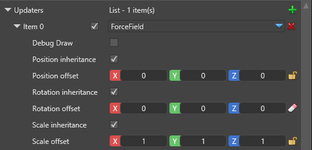
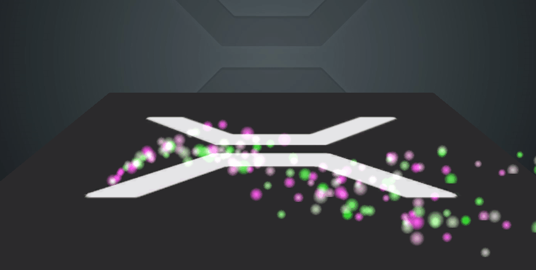
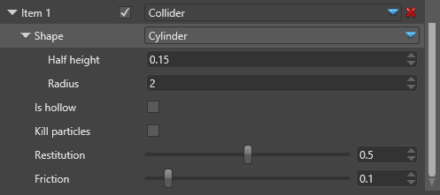
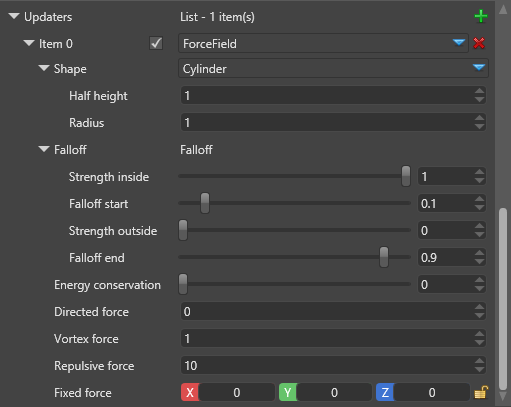
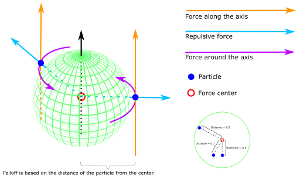
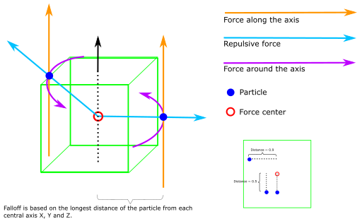
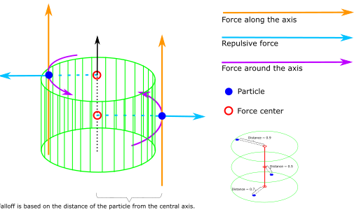
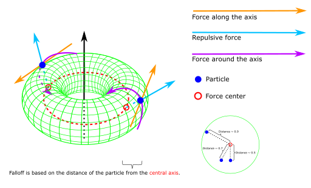

# Particle updaters

After a particle spawns, it can change over time before it disappears. **Updaters** act on all living particles over time, changing attributes such as position, velocity, color, and so on.

For example, a gravity force updates the particle's velocity at a constant rate, accelerating it toward the ground.

Xenko features several built-in updaters. The [custom particles](tutorials/custom-particles.md) sample demonstrates how you can add your own updaters to the engine.

## Common properties

Several properties are common across many updaters.

 

| Property                    | Description                                                                                             |
|-----------------------------|---------------------------------------------------------------------------------------------------------|
| Debug Draw                  | A debug wireframe shape will be drawn to show the boundaries for this updater. This feature only works for the editor and is ignored when you run your game.        |
| Position inheritance        | If checked, this module will inherit the particle system component's position, as defined in the Transform field. |
| Position offset             | Additional translation of the module. If it inherits the parent's position, this is applied on top of the inherited one. |
| Rotation inheritance        | If checked, this module will inherit the particle system component's rotation, as defined in the Transform field. |
| Rotation offset             | Additional rotation of the module. If it inherits the parent's rotation, this is applied on top of the inherited one. |
| Scale inheritance           | If checked, this module will inherit the particle system component's uniform scale, as defined in the Transform field. |
| Scale offset                | Additional scaling of the module. If it inherits the parent's scale, this is applied on top of the inherited one. |

## Collider

 

A collider is an updater which changes the particle's position and velocity when it collides with a predefined shape.

 

| Property              | Description                                                                                                                      |
| --------------------- | -------------------------------------------------------------------------------------------------------------------              |
| Shape                 | The shape against which the particles will collide, which can be sphere, cylinder, box or a torus.                               |
| Is hollow             | If unchecked, the shape is solid and the particles will bounce off it, staying outside. If checked, the shape is hollow, like a container, and the particles will be restricted to the inside volume only.                |
| Kill Particles        | If checked, the particles will be killed immediately when they first collide with the shape.                                     |
| Restitution           | The coefficient of restitution is the speed the particle retains in comparison to its speed before the collision. In this updater we use restitution as a *vertical only* speed. It doesn't affect the speed along the surface.                    |
| Friction              | The amount of horizontal speed the particle loses on collision with the shape. It only affects the speed along the surface, and doesn't change the height at which the particle will bounce.                    |

## Force Field

 

The force field is defined by a bounding shape and several force vectors which operate on the particles based on their relative position to the bounding shape.

 

| Property              | Description                                                                                                                      |
| --------------------- | -------------------------------------------------------------------------------------------------------------------              |
| Shape                 | The bounding shape which can be sphere, cylinder, box or a torus.                                                                |
| Falloff               | The falloff is a simple linear function which dictates the intensity of the force applied on particles. It is based on the particle's distance from its center. Strength inside is how much of the magnitude should apply when the particle is within *falloff start* distance from the center. Strength outside is how much of the magnitude should apply when the particle more than *falloff end* away from the center. Both values are relative to the bounding shape's sizes and values in-between are interpolated between the two magnitudes. Values in the center can still be 0, making the force only work *outside* the bounding shape.                                    |
| Energy Conservation   | What part of the force energy should be conserved by the particles. Energy which is conserved is stored as particle velocity and results in gradually increasing speed. Energy which is not conserved directly applies to the particle's position and is lost when the force vanishes.                   |
| Directed Force        | Vector force which moves the particle along the field's central axis (normally upwards)                                          |
| Vortex Force          | The force which moves the particle around the field's central axis using the right-hand rule for rotation                     |
| Repulsive Force       | The force which moves the particle away from the field's center or towards it, if negative.                                   |
| Fixed Force           | The force which moves the particle along a fixed non-rotating and non-scaling axis.                                           |

### Falloff

The falloff is the change in the forces' strength based on the distance pf the particle from the shape's center.

The falloff is a function of the relative distance, where distance of 0 is the center, 1 is the shape's boundaries, and more than 1 means the particle is outside the shape.

Particles closer than falloff start are always affected with the coefficient Strength Inside.

Particles farther than falloff end are always affected with the coefficient Strength Outside.

Coefficient for particles in between changes linearly, as shown below:

 

For example, if the bounding shape is a sphere with a radius 10m, particles within 1m from its center (0.1 x 10m) will be moved with full strength. After the 1m distance the strength linearly decreases until it reaches zero at 9m distance (0.9 x 10m). After that point, the forces don't affect the particle.

### Bounding shapes

#### Sphere

 

Image license: <a rel="license" href="http://creativecommons.org/licenses/by-sa/4.0/">CC-BY-SA 4.0</a>, sphere image from the <a href="https://commons.wikimedia.org/wiki/File:Sphere_wireframe_10deg_6r.svg">"Sphere wireframe" work</a> by <a href="https://commons.wikimedia.org/wiki/User:Geek3">Geek3</a> under <a href="http://creativecommons.org/licenses/by-sa/3.0/">CC-BY-SA 3.0</a>

When the bounding shape is a sphere, the falloff distance is based on the radial distance of the particle from the sphere's center. If the sphere is scaled to an ellipsoid, this distance is also scaled. The distance is relative to the radius, with 1.0 being the sphere's surface.

The directed force vector is parallel to the sphere's local Y axis.

The repulsive force vector is pointing out from the center to the particle.

The vortex force vector goes around the sphere's Y axis at the particle's position (using the right-hand rule for rotation).

#### Box

 

When the bounding shape is a box, the falloff distance is the longest of the three distances on the X, Y and Z axes. The distance is relative to the box's sizes, with 1.0 being the box's surface.

The directed force vector is parallel to the box's local Y axis.

The repulsive force vector is pointing out from the center to the particle.

The vortex force vector goes around the box's Y axis at the particle's position (using the right-hand rule for rotation).

#### Cylinder

 

When the bounding shape is a cylinder, the falloff distance is based on the radial distance of the particle from the cylinder's local Y axis. Particle's height (position on the Y axis) is ignored unless the particle is outside the cylinder, in which case the distance is always 1.

The directed force vector is parallel to the cylinder's local Y axis.

The repulsive force vector is pointing out from the cylinder's local Y axis to the particle. As such the repulsive force is always horizontal.

The vortex force vector goes around the cylinder's Y axis at the particle's position (using the right-hand rule for rotation).

#### Torus

 

Image license: <a href="https://gnu.org/licenses/fdl.html">GFDL</a>, <a rel="license" href="http://creativecommons.org/licenses/by-sa/4.0/">CC-BY-SA 4.0</a>, torus image from the <a href="https://commons.wikimedia.org/wiki/File:Simple_Torus.svg">"A simple Torus" work</a> by Yassine Mrabet under GFDL, <a href="http://creativecommons.org/licenses/by-sa/3.0/">CC-BY-SA 3.0</a>

When the bounding shape is a torus, the field's nature changes completely. The falloff distance is based on the radial distance of the particle from the torus's inner circle (axis of revolution, shown in red), choosing a point on the circle closest to the particle.

The directed force vector is tangent to the axis of revolution at the point closest to the particle.

The repulsive force vector points out from the axis to the particle.

The vortex force vector goes around the directed force vector using the particle's position relative to the axis (using the right-hand rule for rotation).

While the math is a little complicated, using the torus force field isn't. We encourage you to try it out for better understanding.

## Gravity

The gravity updater is a simplified force which affects all particles regardless of their position, with a constant force vector which doesn't scale or rotate.

It's editable, so it can be used in projects with different scales and behavior.

 

The gravity force ignores most properties such as offset and inheritance, and only uses the following attributes:

| Property                   | Description                                                                         |
| -------------------------- | ----------------------------------------------------------------------------------- |
| Gravitational Acceleration | The gravity force vector which defines the acceleration for all affected particles. The default value matches the average gravity on Earth.          |

## Direction from Speed

This is a post-updater, meaning it resolves after updaters which are not post-updaters, even if they appear later in the list.

Direction from Speed doesn't have any properties and simply updates the particle's direction to match its speed. It uses the difference between the positions of the particle from the last frame and it is not directly dependant on velocity. This means even if the particle's own velocity is 0 and it's only moved by external forces, Direction from Speed will resolve correctly.

Direction isn't normalized vector and changed its magnitude to match the delta distance. It overwrites any previous Direction parameters, such as from an Initializer.

## Color Animation

This is a post-updater, meaning it resolves after updaters which are not post-updaters, even if they appear later in the list.

Color animation updates the particle's Color field by sampling a curve over the particle's normalized lifetime (0 to 1). You can set a secondary curve in which case the particles will have slightly varied colors.

Color animation overwrites any previous Color parameters, such as Initial Color.

The curve values are currently given as Vector4, corresponding to RGBA with standard values between 0 and 1. Values above 1 are valid for RGB only (not Alpha) and can be used for HDR rendering.

## Rotation Animation

This is a post-updater, meaning it resolves after updaters which are not post-updaters, even if they appear later in the list.

This is strictly a single axis rotation, used for billboarded particles!

Rotation animation updates the particle's Rotation field by sampling a curve over the particle's normalized lifetime (0 to 1). You can set a secondary curve in which case the particles will have slightly varied rotations.

Rotation animation overwrites any previous Rotation parameters, such as Initial Rotation. If you need additive kind of animation check if the Shape Builder supports it (found in the Shape Builder's properties). Additive animations are not preserved in particle fields and do not persist, but can be applied in addition to any fields the particles already have.

## Size Animation

This is a post-updater, meaning it resolves after updaters which are not post-updaters, even if they appear later in the list.

This is strictly an uniform size!

Size animation updates the particle's Size field by sampling a curve over the particle's normalized lifetime (0 to 1). You can set a secondary curve in which case the particles will have slightly varied sizes.

Size animation overwrites any previous Size parameters, such as Initial Size. If you need additive kind of animation check if the Shape Builder supports it (found in the Shape Builder's properties). Additive animations are not preserved in particle fields and do not persist, but can be applied in addition to any fields the particles already have.

* [Create particles](create-particles.md)
* [Emitters](emitters.md)
* [Shapes](shapes.md)
* [Materials](materials.md)
* [Spawners](spawners.md)
* [Initializers](initializers.md)