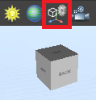
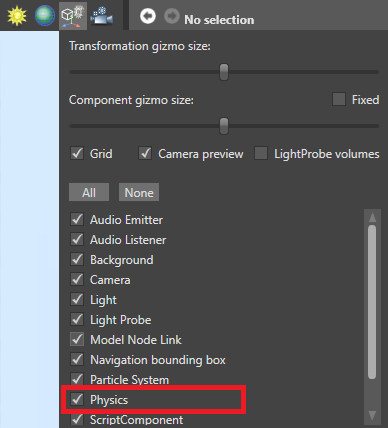
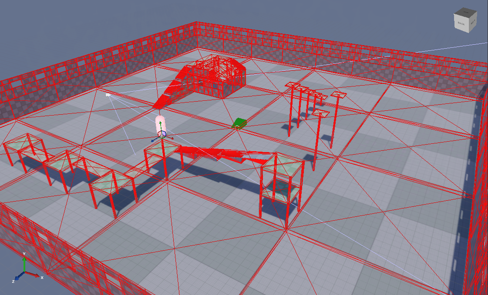

# Colliders

Beginner
Designer

To use physics in your project, add a **collider** component to an entity. Colliders are entities that can bump into one another.

There are three types of collider:

* [static colliders](static-colliders.md) don't move
* [rigid bodies](rigid-bodies.md) are moved around by forces such as collision and gravity
* [characters](characters.md) are controlled by user input

You can also: 

* set the [shape of collider components](collider-shapes.md)
* make [triggers](triggers.md), and use them to script events when objects pass through them
* constrict collider movement with [constraints](constraints.md)

## How colliders interract

Physics colliders interact according to the table below.

* "Collisions" refers to collision information and events only. 

* "Dynamic" means both collision information and events, plus dynamic response (ie the colliders bump into each other instead of passing through each other).

|   | Kinematic objects   | Kinematic triggers   | Rigid body colliders   | Rigid body triggers   | Static colliders        | Static triggers   
|---|-------------|---------------------|-------------|---------------------|----------|------------------
| Kinematic objects        | Collisions           | Collisions  | Collisions and dynamic| Collisions   | Collisions    | Collisions     
| Kinematic triggers | Collisions           | Collisions   |Collisions           | Collisions     | Collisions     | Collisions   
| Rigid body colliders          | Collisions and dynamic     | Collisions     | Collisions and dynamic     | Collisions     | Collisions and dynamic| Collisions
| Rigid body triggers | Collisions         | Collisions  | Collisions | Collisions     | Collisions     | Collisions
| Static colliders| Collisions| Collisions| Collisions and dynamic | Collisions   | Nothing   | Nothing
|Static triggers     | Collisions     | Collisions     | Collisions     | Collisions    | Nothing    | Nothing

For example, rigid body colliders dynamically collide with static colliders (ie bump into them). However, no objects dynamically collide with triggers. The collision is detected in the code, but the object will pass through.

## Show colliders in the scene editor

By default, colliders are invisible in the scene editor. To show them:

1. In the Game Studio toolbar, in the top right, click the **Display gizmo options** icon.

   

2. Select **Physics**.

    

The scene editor displays collider shapes.

## Show colliders at runtime

You can make colliders visible at runtime, which is useful for debugging problems with physics. To do this, use:

``
this.GetSimulation().ColliderShapesRendering = true;
``

To show or hide collider shapes at runtime with a keyboard shortcut, use the **DebugPhysicsShapes** script.

1. In the **Asset view**, click **Add asset**.
2. Select **Scripts** > **Debug Physics Shapes**.
3. Add the **Debug Physics Shapes** script as a component to an entity in the scene.

The script binds the collider shape visibility to **Left Shift + Left Ctrl + P**, so you can turn it on and off at runtime. You can edit the script to bind a different key combination.

> [!Note]
> Collider shapes for infinite planes are always invisible.

## See also

* [Collider shapes](collider-shapes.md)
* [Static colliders](static-colliders.md)
* [Rigid bodies](rigid-bodies.md)
* [Kinematic rigid bodies](kinematic-rigid-bodies.md)
* [Simulation](simulation.md)
* [Physics tutorials](tutorials.md)