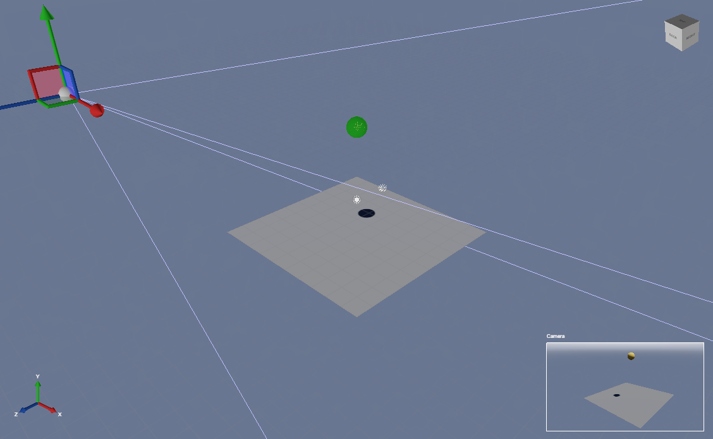

# Create a bouncing ball

This page will show you how to create a bouncing ball.

1. Start a **New Game** project.
   The Game Studio starts, and you are presented with the plane and sphere project. First we're going to enable physics for both objects.

2. Select the ground object.

3. Click **Add component** in the **Property grid**.

4. Select **Static Collider**.

5. In the **Property view**, under **Static Collider**, click **+** next to the **Collider Shapes** header, and select **Infinite plane**.

6. Next we add a Rigid Body collider to the sphere. Select the sphere in the Scene editor window.

7. Click **Add component** in the **Property grid**.

8. Select **Rigidbody**

9. In the **Property view**, under **Rigidbody**, click **+** next to the **Collider Shapes** header, and select **Sphere**.

10. Under **Rigidbody** set the **Mass** property to 80.

11. Move the sphere up, by setting it's position to _X: 0, Y: 6, Z: 0_

12. Select the Camera in the Scene editor and change it's position to _X: -12, Y: 7, Z: 9_ and it's rotation to _X: -20, Y: -50, Z: 0_

We have made sure that both the ground and the sphere can interact with each other, moved the sphere up a bit, for a bigger collision impact, and changed the camera position and rotation to have a good overview of the whole scene.

Now run the game to see what how the Rigidbody interacts with the static collider.

_Initial setup of our scene_

When running the game you'll see that the sphere starts falling because of gravity, and the static collider (the ground) will stop it. However you won't see any bounce effect.

To create the bounce effect we have to set the **Restitution** property of both physics objects. The restitution coefficient says how much energy remains after collision for the objects to rebound from one another, creating the effect of 'bouncyness'. If this coefficient is set to 0, no energy remains, and the objects stop moving after a head-on collision, where a value of 1 means no energy is lost, and the objects move away from each other after collision with the same speed as they collided.

The **Restitution** property should typically be 0 < **Restitution** < 1 for real-world collisions.

1. Select the sphere in the Scene editor

2. Under **Rigidbody** set the **Restitution** property to 0.8

3. Select the plane in the Scene editor

4. Under **Static Collider** set the **Restitution** property to 0.5

Run the game again to check how the **Restitution** value has changed the behaviour of the collision between the sphere and the ground.
